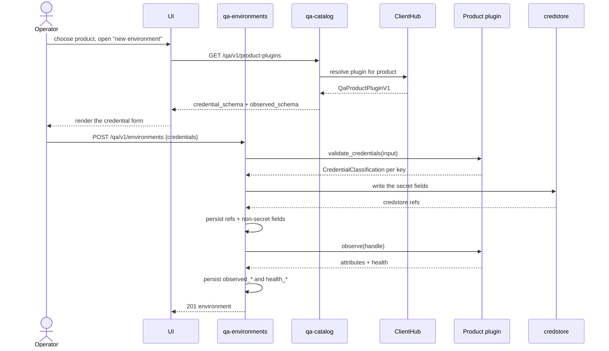
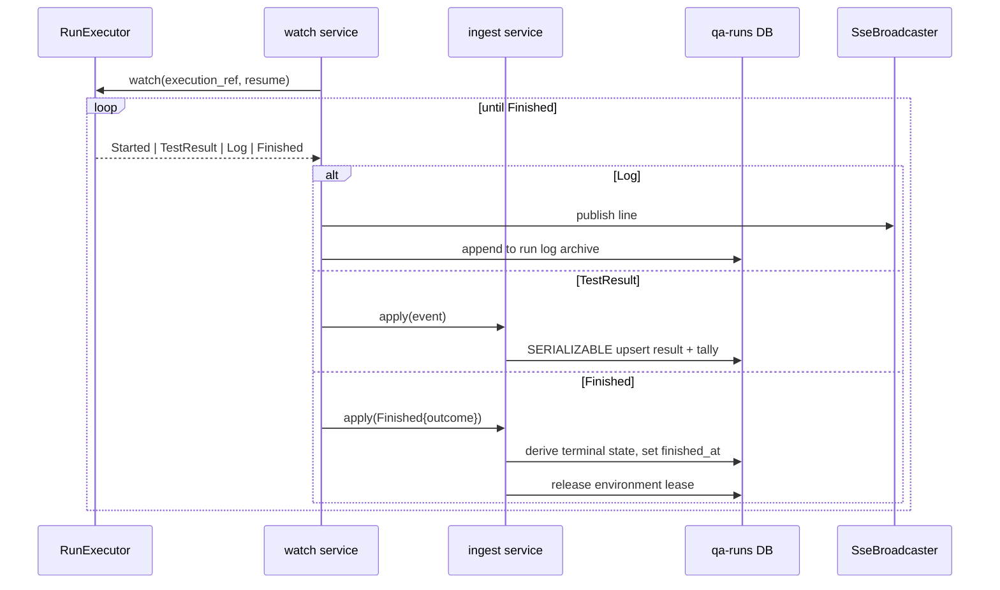
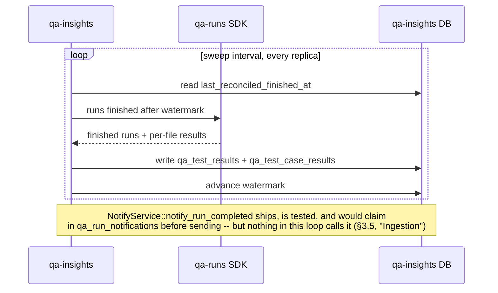
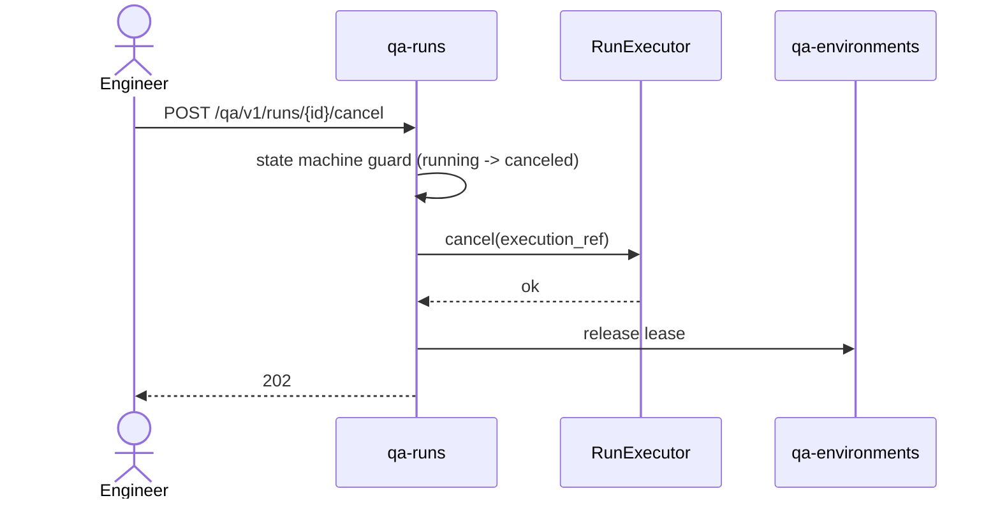

# Technical Design — QA Platform

- [ ] `p1` - **ID**: `cpt-cf-qa-design-subsystem`

<!-- toc -->

- [1. Architecture Overview](#1-architecture-overview)
  - [1.1 Architectural Vision](#11-architectural-vision)
  - [1.2 Architecture Drivers](#12-architecture-drivers)
  - [1.3 Architecture Layers](#13-architecture-layers)
- [2. Principles & Constraints](#2-principles--constraints)
  - [2.1 Design Principles](#21-design-principles)
  - [2.2 Constraints](#22-constraints)
- [3. Technical Architecture](#3-technical-architecture)
  - [3.1 Domain Model](#31-domain-model)
  - [3.2 qa-environments](#32-qa-environments)
  - [3.3 qa-catalog](#33-qa-catalog)
  - [3.4 qa-runs](#34-qa-runs)
  - [3.5 qa-insights](#35-qa-insights)
  - [3.6 qa-platform-ui](#36-qa-platform-ui)
  - [3.7 Product SDK, Product Plugins, Connectors](#37-product-sdk-product-plugins-connectors)
  - [3.8 Database Schemas & Tables](#38-database-schemas--tables)
  - [3.9 Interactions & Sequences](#39-interactions--sequences)
  - [3.10 Authorization Surface](#310-authorization-surface)
  - [3.11 Observability](#311-observability)
  - [3.12 Deployment Topology](#312-deployment-topology)
  - [3.13 Configuration](#313-configuration)
- [4. Traceability](#4-traceability)

<!-- /toc -->

## 1. Architecture Overview

### 1.1 Architectural Vision

QA Platform is the test-management control plane for Virtuozzo products. An operator registers an
**environment** (a running instance of a product), points the platform at a **test repository**,
and launches **runs** against that environment; results arrive as typed events, are persisted per
test file and per test case, and are read back as **analytics**.

The subsystem is four ToolKit gears under `gears/qa-platform/`, each a standard DDD-light crate
pair (an SDK crate carrying the client trait and models, an implementation crate with `api` /
`domain` / `infra` layers), registered through ToolKit inventory discovery and talking to one
another only through SDK clients resolved from `ClientHub`:

| Gear | Question it answers | Owns |
|------|--------------------|------|
| `qa-environments` | *where does a test run?* | environments, their credentials, observation and health, leases, variables |
| `qa-catalog` | *what is there to run?* | products, test repositories and their branches, plans, custom plans, SSH keys, test bundles |
| `qa-runs` | *run it* | runs, the per-environment queue, schedules, dispatch, execution, log streaming, result ingestion |
| `qa-insights` | *what happened?* | historical results per file and per case, dashboards, analytics, JIRA correlation, notifications |

A fifth deliverable, `qa-platform-ui`, is a React SPA served by nginx, and a Helm chart deploys the
whole set — gears, UI, Postgres, Keycloak and the Argo integration — onto a Kubernetes cluster.

Two ideas carry most of the architecture.

**Everything product-specific lives behind one trait.** The platform itself knows nothing about any
particular Virtuozzo product. `QaProductPluginV1` (in `qa-product-sdk`) declares the credential form
an operator fills in, the facts an observation of a live environment yields, what a run needs in
order to reach that environment, and the runner shape to launch. A product plugin is a gear with a
GTS identity that registers in `ClientHub` and is resolved per product through
`qa_products.plugin_instance_id`. Adding a product is adding a crate, not editing the core. Two
plugins ship: **VHP**, whose environment is a Kubernetes cluster read through `qa-connector-k8s`,
and **VHI**, whose environment is a management node reached over SSH and driven through the
`vinfra` CLI via `qa-connector-ssh`.

**Execution is a port, not a dependency.** `qa-runs` owns run state in its own database from the
moment a run is created; nothing reconstructs business state from an execution engine's objects or
from log text. Backends sit behind the internal `RunExecutor` port (`start` / `watch` / `cancel` /
`list_active`) and report into the database as typed events. Two adapters exist: a deterministic
in-memory `MockRunExecutor`, which is the default, and `ArgoRunExecutor`, which submits Argo
`Workflow` objects and is compiled only under the non-default `argo` cargo feature. A default build
of every qa-platform **gear** therefore has no Kubernetes dependency in its tree. `qa-environments`
carries a second, independently-switched Kubernetes-touching adapter — the runner-`Secret` writer —
behind its own non-default `runner-secret` feature (not `argo`; the two gears toggle the same target
cluster independently). `qa-connector-k8s`, the transport library the VHP plugin links, carries
`kube`/`k8s-openapi` **unconditionally**: it is the one crate in the subsystem not covered by a
feature gate, because it is not a gear and is linked only by the plugins that need a cluster. §2.2
states the boundary precisely.

### 1.2 Architecture Drivers

#### Functional Drivers

| Requirement | Phase | Design Response |
|-------------|-------|-----------------|
| `cpt-cf-qa-fr-catalog-repos` | `p1` | `qa-catalog` `repos` service; `gix` clone/fetch in `infra/git`; branch cache in `qa_repo_branches`; `POST /qa/v1/test-repos/{id}/sync` |
| `cpt-cf-qa-fr-catalog-plan-discovery` | `p1` | Plan discovery from the synced work tree (`plan.yaml` / `TEST_META` conventions); `GET /qa/v1/plans`, `GET /qa/v1/product-folders` |
| `cpt-cf-qa-fr-catalog-custom-plans` | `p1` | `qa_custom_plans` (file list, tags, timeout); full CRUD under `/qa/v1/custom-plans` |
| `cpt-cf-qa-fr-catalog-ssh-keys` | `p1` | `qa_ssh_keys` holds a `credstore_ref` and a fingerprint only; private material never leaves credstore |
| `cpt-cf-qa-fr-catalog-bundles` | `p1` | `qa_test_bundles` + `BundleStore` port; a bundle is a checksummed, expiring snapshot of a work tree fetched by the runner |
| `cpt-cf-qa-fr-environments-registry` | `p1` | `qa_environments` with per-product credential JSON, `is_default` per product, full CRUD under `/qa/v1/environments` |
| `cpt-cf-qa-fr-environments-observation` | `p1` | `QaProductPluginV1::observe` yields attributes and health in one handshake; persisted to `observed_*` and `health_*` columns; `POST /qa/v1/environments/{id}/refresh` |
| `cpt-cf-qa-fr-env-lease` | `p1` | `qa_environment_leases` with an optimistic `version`; shared and exclusive modes; `GET /qa/v1/environments/{id}/lease` |
| `cpt-cf-qa-fr-environments-variables` | `p1` | Per-environment variables (`qa_environment_variables`) and subsystem-wide pipeline variables (`qa_pipeline_variables`), merged at dispatch |
| `cpt-cf-qa-fr-runs-launch` | `p1` | `launch` service resolves target, environment, plugin access and variables into a `RunSpec`; `POST /qa/v1/runs` |
| `cpt-cf-qa-fr-runs-queue` | `p1` | Per-environment FIFO in `qa_run_queue`; `decide_admission` starts a run immediately when its environment is free; runs with no environment are never queued |
| `cpt-cf-qa-fr-runs-dispatch` | `p1` | Interval sweep (`dispatcher_interval_seconds`, default 5 s) draining the queue through `RunExecutor::start` |
| `cpt-cf-qa-fr-runs-cancel` | `p1` | `POST /qa/v1/runs/{id}/cancel` → `RunExecutor::cancel`, state machine transition, lease release |
| `cpt-cf-qa-fr-runs-rerun` | `p1` | `POST /qa/v1/runs/{id}/rerun` re-launches a run's resolved target |
| `cpt-cf-qa-fr-runs-schedules` | `p1` | `qa_schedules` (cron) + `qa_schedule_ticks` as the claim ledger; one row per due instant for a fire, plus non-fire rows from the referential-check ticker |
| `cpt-cf-qa-fr-runs-results-ingest` | `p1` | `IngestService::apply` folds typed `ExecutionEvent`s into `qa_runs` counters and `qa_run_test_results` rows under `SERIALIZABLE` with bounded retry |
| `cpt-cf-qa-fr-runs-logs` | `p1` | `SseBroadcaster` streams live log lines; `RunLogArchive` persists the finished-run copy to `qa_run_logs`; `GET /qa/v1/runs/{id}/logs` |
| `cpt-cf-qa-fr-insights-history` | `p1` | `qa_test_results` (per file) and `qa_test_case_results` (per case) with OData query surface |
| `cpt-cf-qa-fr-insights-dashboard` | `p1` | `DashboardService` aggregates recent runs, counts, pass rates and active/queued; `GET /qa/v1/dashboard` |
| `cpt-cf-qa-fr-insights-analytics` | `p1` | Eight-section overview, per-build breakdown, per-test history, export, saved views |
| `cpt-cf-qa-fr-insights-collect` | `p1` | `--collect-only` case counts per `(repo, branch, file)` in `qa_test_case_collect`, launched via `POST /qa/v1/collect/{repo_id}` |
| `cpt-cf-qa-fr-insights-jira` | `p1` | JIRA client through OAGW; `qa_jira_bugs` correlation; poller with optional auto-rerun on resolve |
| `cpt-cf-qa-fr-insights-notifications` | `p1` | Slack and email channels, per-tenant config, `qa_notification_log` audit, `qa_run_notifications` idempotency |
| `cpt-cf-qa-fr-ui` | `p1` | React SPA: dashboard, runs, plans, custom plans, environments, products, schedules, analytics, settings |
| `cpt-cf-qa-fr-product-plugins` | `p1` | `QaProductPluginV1` resolved per product from `ClientHub`; VHP and VHI plugins ship |
| `cpt-cf-qa-fr-packaging` | `p1` | Helm chart deploying gears, UI, Postgres, Keycloak, Argo RBAC and the migration/seed jobs |

#### NFR Allocation

| NFR ID | NFR Summary | Allocated To | Design Response | Verification Approach |
|--------|-------------|--------------|-----------------|----------------------|
| `cpt-cf-qa-nfr-run-duration` | Multi-hour runs survive control-plane restarts | qa-runs domain + infra | Run state is database-first; `watch(execution_id)` re-attaches on startup; log archiving is decoupled from the control-plane process | Restart-during-run integration tests; soak test |
| `cpt-cf-qa-nfr-result-latency` | A result is visible ≤ 5 s p95 after the runner reports it | qa-runs ingestion path | Event-driven ingestion, no polling; one upsert per event | Latency assertion in the e2e harness |
| `cpt-cf-qa-nfr-dispatch-latency` | A queued run starts ≤ 10 s p95 after its environment frees. **Measured 2026-09-21** — see §3.11, "The dispatch-latency window, and the measurement that was retracted" | qa-runs dispatcher | Interval sweep at 5 s; the ≈4.75 s design argument assumed a single queued run per environment and did not account for `max_concurrent_runs` being checked *before* the per-environment FIFO, nor for genuine multi-run backlog per environment | `qa_runs_free_to_start_duration_seconds` is the row's own quantity, anchored on `qa_environment_leases.freed_at` — the lease-release instant the retracted 2026-09-18 measurement lacked. Two 600 s windows differing only in per-environment backlog (2 vs 5): n = 214 and 239, every sample ≤ 10 s, p95 4.21 s and 4.51 s by per-sample SQL, while `qa_runs_queue_wait_duration_seconds` over the same drains moved 7.7× — which is what says the number is not queue depth. `qa_runs_free_to_start_unanchored_total` publishes the coverage. §3.11 has the method and the three things it does not settle |
| `cpt-cf-qa-nfr-log-latency` | A log line reaches a viewer ≤ 2 s p95 | qa-runs + `SseBroadcaster` | Executor log stream bridged to SSE with no buffering threshold | e2e streaming test |
| `cpt-cf-qa-nfr-tenant-isolation` | No row crosses a tenant boundary | every gear, infra/storage | `SecureORM` with a tenant column on all 27 tables; per-gear `tests_tenant_scoping` suites | Tenant-scoping test module per gear |
| `cpt-cf-qa-nfr-credential-containment` | Credential material never reaches a published surface | `qa-product-sdk`, plugins, connectors | Nothing derived from credential material is formatted; `PluginFailure::detail` is `&'static str`; keys travel credstore → memory → pipe → short-lived ssh-agent; secrets reach remote commands on stdin | `assert_no_leak` drives every plugin with planted material and fails the build if any of it surfaces |
| `cpt-cf-qa-nfr-infra-agnostic` | A default build has no Kubernetes dependency | qa-runs, qa-environments, qa-connector-k8s | The Argo adapter is behind qa-runs' non-default `argo` feature and the runner-`Secret` writer is behind qa-environments' own, independently-switched, non-default `runner-secret` feature; `qa-connector-k8s` carries `kube`/`k8s-openapi` unconditionally but is linked only by the plugins that need a cluster, not by a default gear build | `cargo tree -p qa-runs -i kube -e normal` prints nothing, and `cargo tree -p qa-environments -i kube` errors (`kube` is not in the graph at all) without `--features runner-secret` |
| `cpt-cf-qa-nfr-ingest-recovery` | Ingestion recovers within 60 s of a control-plane restart | qa-insights | `qa_ingest_watermarks` records the last reconciled `finished_at`; the reconcile sweep resumes from it | Restart test asserting watermark advance |

#### Key Decisions (ADRs)

| ADR | Decision | Rationale |
|-----|----------|-----------|
| `cpt-cf-qa-adr-execution-plane` — [ADR-0001](./ADR/0001-cpt-cf-qa-adr-execution-plane.md) | Execution behind the internal `RunExecutor` port; Argo adapter behind a non-default feature | Keeps the control plane infrastructure-agnostic while shipping a real backend |
| `cpt-cf-qa-adr-structured-events` — [ADR-0002](./ADR/0002-cpt-cf-qa-adr-structured-events.md) | Runners report typed execution events | Machine-readable and schema-stable; no log scraping on the result path |
| `cpt-cf-qa-adr-embedded-ui` — [ADR-0003](./ADR/0003-cpt-cf-qa-adr-embedded-ui.md) | The SPA ships as its own nginx image alongside the gears | One deployable unit per concern; no static-hosting dependency |
| `cpt-cf-qa-adr-four-gear-decomposition` — [ADR-0004](./ADR/0004-cpt-cf-qa-adr-four-gear-decomposition.md) | Four domain gears rather than one | The seams are natural and cross-gear chatter is low by construction |
| `cpt-cf-qa-adr-git-egress` — [ADR-0005](./ADR/0005-cpt-cf-qa-adr-git-egress.md) | `gix` directly in the qa-catalog infra adapter; host-key verification disabled for git and SSH | OAGW does not speak the git wire protocol; the exposure is recorded |
| `cpt-cf-qa-adr-product-plugins` — [ADR-0006](./ADR/0006-cpt-cf-qa-adr-product-plugins.md) | Product behaviour is an in-process plugin resolved per product | Adding a product is adding a crate |
| `cpt-cf-qa-adr-connectors-as-libraries` — [ADR-0007](./ADR/0007-cpt-cf-qa-adr-connectors-as-libraries.md) | Connectors are plain libraries: no gear, no GTS identity, nothing resolves them | A transport is not a policy decision |
| `cpt-cf-qa-adr-credential-containment` — [ADR-0008](./ADR/0008-cpt-cf-qa-adr-credential-containment.md) | No value derived from credential material is ever formatted | A leak is unrecoverable; the rule is enforced by a build-failing test |
| `cpt-cf-qa-adr-insights-reconcile` — [ADR-0009](./ADR/0009-cpt-cf-qa-adr-insights-reconcile.md) | qa-insights ingests by sweeping qa-runs' SDK, off the run path | The run path never blocks on analytics |
| `cpt-cf-qa-adr-product-scoping` — [ADR-0010](./ADR/0010-cpt-cf-qa-adr-product-scoping.md) | A row is attributed to a product through its target, never its environment | Collect runs have no environment at all |
| `cpt-cf-qa-adr-smtp-egress` — [ADR-0011](./ADR/0011-cpt-cf-qa-adr-smtp-egress.md) | `lettre` directly in the qa-insights infra adapter; the relay password resolved from credstore in-process; the allow-list in application config, not a NetworkPolicy | OAGW speaks HTTP and SMTP is not HTTP; the relay host is per-tenant runtime data and NetworkPolicy has no DNS matcher |

### 1.3 Architecture Layers

```text
┌──────────────────────────────────────────────────────────────┐
│  qa-platform-ui (React SPA, nginx)                           │
│  Product switcher · runs · plans · environments · analytics  │
├──────────────────────────────────────────────────────────────┤
│  Presentation (api_gateway — platform)                       │
│  REST + SSE under /qa/v1, AuthN middleware                   │
├──────────────────────────────────────────────────────────────┤
│  qa-environments │ qa-catalog │ qa-runs │ qa-insights        │
│  ┌────────────────────────────────────────────────────────┐  │
│  │ API layer (api/rest/)                                  │  │
│  │ OperationBuilder routes, handlers, DTOs, Problem errors│  │
│  ├────────────────────────────────────────────────────────┤  │
│  │ Domain layer (domain/)                                 │  │
│  │ services · ports · repos · state machine · authz       │  │
│  ├────────────────────────────────────────────────────────┤  │
│  │ Infra layer (infra/)                                   │  │
│  │ SecureORM storage · executor · git · leader · metrics  │  │
│  └────────────────────────────────────────────────────────┘  │
├──────────────────────────────────────────────────────────────┤
│  qa-product-sdk  ──  QaProductPluginV1                       │
│      qa-vhp-product-plugin      qa-vhi-product-plugin        │
│           │                            │                     │
│      qa-connector-k8s            qa-connector-ssh            │
├──────────────────────────────────────────────────────────────┤
│  Platform capabilities                                       │
│  credstore · ClientHub · types-registry · authz · oagw       │
└──────────────────────────────────────────────────────────────┘
```

## 2. Principles & Constraints

### 2.1 Design Principles

#### Execution is a port

- [ ] `p1` - **ID**: `cpt-cf-qa-principle-executor-port`

`qa-runs` depends on `RunExecutor`, never on an execution engine. The trait is four operations —
`start(RunSpec) -> ExecutionRef`, `watch(ExecutionRef) -> stream of ExecutionEvent`,
`cancel(ExecutionRef)`, `list_active()` — and it is frozen: an adapter satisfies it, it does not
widen it. Everything except an adapter builds and tests against `MockRunExecutor`.

#### Run state is database-first

- [ ] `p1` - **ID**: `cpt-cf-qa-principle-db-first-state`

The `qa_runs` row is authoritative from the moment of creation. Execution backends report into it;
nothing reconstructs business state from execution-engine objects or from log text.

#### A product's behaviour lives behind one trait

- [ ] `p1` - **ID**: `cpt-cf-qa-principle-product-plugin`

No gear branches on a product. Product-specific behaviour is reached only through
`QaProductPluginV1`, resolved from `ClientHub` by the product's `plugin_instance_id`.

#### Credential material is never formatted

- [ ] `p1` - **ID**: `cpt-cf-qa-principle-no-credential-formatting`

No value derived from credential material is rendered — not through `Display`, not through `Debug`,
not into a message, a log line or a DTO. The one sanctioned exception is text a remote sent back.

#### Semantics are specified, not inferred

- [ ] `p1` - **ID**: `cpt-cf-qa-principle-specified-semantics`

Where a rule governs run outcomes — how a terminal state is derived, what a skipped test means,
what a dead node means — the rule is written down and tested, not left to emerge from whatever the
code happens to do. A behaviour nobody specified is a behaviour nobody can rely on, so a change of
this kind is a decision to be recorded rather than an implementation detail.

#### Analytics never blocks a run

- [ ] `p1` - **ID**: `cpt-cf-qa-principle-async-insights`

`qa-insights` reads `qa-runs` through its SDK on its own reconcile sweep. The launch and ingest
paths make no call into qa-insights.

### 2.2 Constraints

#### No Kubernetes in a default build

- [ ] `p1` - **ID**: `cpt-cf-qa-constraint-no-kube`

`kube` and `k8s-openapi` may appear in the dependency tree only under three gates: the `argo` cargo
feature of `qa-runs`, the `runner-secret` cargo feature of `qa-environments`, and unconditionally in
`qa-connector-k8s`, which is linked only by the VHP plugin. Verified with
`cargo tree -p qa-runs -i kube -e normal` (nothing for a default build) and
`cargo tree -p qa-environments -i kube` (errors — `kube` is not in the graph at all — without
`--features runner-secret`).

#### Host-key verification is disabled

- [ ] `p1` - **ID**: `cpt-cf-qa-constraint-no-host-key-pinning`

Git remotes and SSH sessions both accept an unverified host key. What this exposes, and what would
have to change to tighten it, is recorded in [ADR-0005](./ADR/0005-cpt-cf-qa-adr-git-egress.md) and
in the doc comment on the constant that sets it.

#### One designated tenant per deployment

- [ ] `p1` - **ID**: `cpt-cf-qa-constraint-single-tenant-deployment`

Every table carries `tenant_id` and every query is tenant-scoped, but the shipped Helm chart seeds a
single tenant. Multi-team tenancy is configuration, not new code.

#### The runner contract is pytest

- [ ] `p1` - **ID**: `cpt-cf-qa-constraint-pytest-runner`

Test repositories are pytest-based and keep the `plan.yaml` / `TEST_META` conventions. Case counts
come from `--collect-only`; per-case identity is a pytest `nodeid`.

## 3. Technical Architecture

### 3.1 Domain Model

| Entity | Owning gear | Meaning |
|--------|-------------|---------|
| `Product` | qa-catalog | A Virtuozzo product. Carries no behaviour of its own; `plugin_instance_id` names the plugin that does |
| `TestRepository` | qa-catalog | A git remote, its default branch and content root, optionally a credential reference |
| `RepoBranch` | qa-catalog | Cached branch name for a repository, refreshed by sync |
| `Plan` | qa-catalog | A test plan discovered in a synced work tree; identified by `(repo_id, path)` |
| `CustomPlan` | qa-catalog | An operator-assembled file list with tags and an optional timeout |
| `SshKey` | qa-catalog | A named credstore reference plus a fingerprint. Never the key |
| `TestBundle` | qa-catalog | A checksummed, expiring snapshot of a work tree that a runner fetches |
| `Environment` | qa-environments | A running instance of a product: credentials, observed attributes, health, default flag |
| `EnvironmentLease` | qa-environments | Who currently holds an environment, in shared or exclusive mode, with an optimistic `version` |
| `EnvironmentVariable` | qa-environments | A name/value pair scoped to one environment |
| `PipelineVariable` | qa-environments | A name/value pair scoped to the subsystem |
| `Run` | qa-runs | One execution of a target against an environment, with its resolved parameters, state and tallies |
| `QueueEntry` | qa-runs | A run's position in its environment's FIFO |
| `Schedule` | qa-runs | A cron rule that launches a target repeatedly |
| `ScheduleTick` | qa-runs | The claim ledger row proving one due instant was fired once |
| `RunTestResult` | qa-runs | Per-test-file outcome for a live run |
| `RunLog` | qa-runs | The durable text of a finished run's log |
| `TestResultRecord` | qa-insights | Per-test-**file** historical row (analytical) |
| `TestCaseResultRecord` | qa-insights | Per-test-**case** historical row: `nodeid`, name, status, duration, `reason`, `ticket` |
| `ExpectedCaseCount` | qa-insights | Exact per-file `--collect-only` count for a `(repo, branch, file)` |
| `JiraBug` | qa-insights | A tracked bug, its status, and the single test identity it was filed against |
| `SavedView` | qa-insights | A persisted analytics query, keyed per owner / scope / plan |
| `NotificationConfig` | qa-insights | Per-tenant singleton: Slack and email settings and event toggles |
| `NotificationLogEntry` | qa-insights | Audit row per send attempt: channel, event type, outcome, detail |

#### Run state machine

- [ ] `p1` - **ID**: `cpt-cf-qa-design-run-state-machine`

A run moves `created → queued? → dispatching → running → terminal`. Ten states, six of them
terminal:

```text
   created
      │
      ├──────────────┐
      ▼              │
   queued            │            terminal
      │  │           │            ─────────
      │  └──────────────────────▶ expired      (queue TTL sweep; only from queued)
      ▼              ▼
  dispatching ◀──────┘
      │  │
      │  └──────────────────────▶ failed | error   (submit failed; nothing ever ran)
      ▼
   running ─────────────────────▶ succeeded | failed | canceled | timed_out | error
```

The legal-successor table is `qa-runs/src/domain/state_machine.rs`, matched exhaustively on the
source state so that adding a `RunState` variant fails compilation rather than inheriting a
permissive default. Five guards are decisions rather than consequences:

* **`queued → running` is illegal.** A queued row must pass through `dispatching`, because
  `dispatching` is the state that holds the environment claim while the repository sync and the
  bundle build run.
* **`dispatching → failed | error` needs no intervening `running`.** A submit that fails leaves no
  execution behind.
* **`queued → expired` is the queue TTL sweep's edge, and only `queued` has it.** A run past
  `dispatching` is no longer waiting on the queue, so `queue_ttl_seconds` no longer applies. It is
  a distinct state on purpose: reusing `canceled` would make the sweep indistinguishable from an
  operator cancel, and reusing `timed_out` would conflate the queue-wait clock with the execution
  deadline of `cpt-cf-qa-fr-runs-timeout`.
* **`succeeded` is the one mutable terminal state.** `succeeded → {failed, error, canceled,
  timed_out}` is legal; the other five terminal states refuse every exit, including the self-edge,
  so a duplicate completion event is rejected by the guard rather than silently rewriting
  `finished_at`.
* **A dead execution node downgrades an otherwise green run.** `ExecutionOutcome::node_failure`
  feeds the same argument as a test failure, so a run whose tests all passed on a node that then
  died does not report success. **Skipped tests do not**: a run whose tests were all skipped is
  still a success, and the skip count is carried in the tally instead.

Two vocabularies spell cancellation differently and deliberately: a run is `canceled`, a queue row
is `cancelled`. They are different columns on different tables and must not be unified. Expiry,
by contrast, is spelled `expired` on both, and that agreement is the point — an operator sees one
word for one event.

### 3.2 qa-environments

- [ ] `p1` - **ID**: `cpt-cf-qa-component-environments`

Registry of the places tests run, and the only gear that talks to a live product instance.

#### Services

| Service | Responsibility |
|---------|----------------|
| `environments` | CRUD, product scoping, `is_default` resolution per product, observation orchestration |
| `environment_credentials` | Validates a submitted credential form through the product plugin, then writes secret fields to credstore and keeps only references |
| `leases` | Acquire / release / inspect, shared and exclusive, optimistic on `version` |
| `variables` | Per-environment and subsystem-wide variable CRUD |

#### Ports

| Port | Implementation |
|------|----------------|
| `ProductPlugin` | `infra/product_plugin.rs` — resolves `dyn QaProductPluginV1` from `ClientHub` by the product's `plugin_instance_id` |
| `RunnerSecret` | `infra/runner_secret_writer.rs` — materialises the secret a runner will mount, through the plugin's declared `MountSpec` |
| `Metrics` | `infra/metrics.rs` |

#### Observation

`QaProductPluginV1::observe` returns attributes and health from **one** call, so one client and one
handshake serve both. Results land in `observed_version`, `observed_build`, `observed_base_url`,
`observed_attrs` (plugin-declared JSON), `health_state`, `health_detail` and `health_checked_at`.
An environment nothing has observed yet is an ordinary shape, not an error: `observed_role` is
`None` and dispatch omits the variables that would have come from it.

A background cycle re-observes on an interval; `POST /qa/v1/environments/{id}/refresh` forces one.
Both are measured by `qa_environments_observation_cycle_*` and `qa_environments_observation_*`.

#### Credential handling

The **gear**, not the plugin, writes credstore — only the gear holds the tenant-scoped
`SecurityContext`. `validate_credentials` therefore returns a `CredentialClassification` per
submitted key (which fields are secret), never anything credstore-shaped, because the plugin runs
before that write happens and cannot know a reference.

#### Endpoints

| Method | Path | Purpose |
|--------|------|---------|
| GET, POST | `/qa/v1/environments` | List (OData) and create |
| GET, PATCH, DELETE | `/qa/v1/environments/{id}` | Read, update, delete |
| GET | `/qa/v1/environments/{id}/lease` | Current lease holders and mode |
| POST | `/qa/v1/environments/{id}/refresh` | Force an observation |
| GET, POST | `/qa/v1/variables` | Pipeline variables: list and create |
| GET, PATCH, DELETE | `/qa/v1/variables/{id}` | Read, update, delete |

### 3.3 qa-catalog

- [ ] `p1` - **ID**: `cpt-cf-qa-component-catalog`

What there is to run, and the only gear that reaches a git remote.

#### Services

| Service | Responsibility |
|---------|----------------|
| `products` | Product CRUD; binds a product to its plugin instance |
| `plugin_registry` | Enumerates registered `QaProductPluginV1` instances and their declared schemas |
| `repos` | Test-repository CRUD, sync orchestration, branch cache |
| `sync_cache` | The on-disk work tree per repository and branch |
| `plans` | Plan discovery from a synced work tree |
| `custom_plans` | Operator-assembled plan CRUD |
| `ssh_keys` | Named credstore references and fingerprints |
| `bundles` | Checksummed work-tree snapshots for runners |
| `validation` | Shared input validation across the above |

#### Ports

| Port | Implementation |
|------|----------------|
| `RepoSync` | `infra/git` — `gix` clone/fetch directly, per [ADR-0005](./ADR/0005-cpt-cf-qa-adr-git-egress.md) |
| `BundleStore` | `infra/bundle_store` — content-addressed storage with an expiry |
| `Metrics` | `infra/metrics.rs` |

#### Plan discovery

A synced work tree is walked under the repository's `content_root`. Plan identity is
`(repo_id, path)` — there is no synthetic plan id, and `plan_key` in qa-insights is the same pair
rendered as a string. Case counts per file come from pytest `--collect-only` and are the
`qa-catalog` half of what qa-insights stores as `ExpectedCaseCount`.

#### Endpoints

| Method | Path | Purpose |
|--------|------|---------|
| GET, POST | `/qa/v1/products` | List and create |
| GET, PATCH, DELETE | `/qa/v1/products/{id}` | Read, update, delete |
| GET | `/qa/v1/product-plugins` | Registered plugin instances and their credential/observed schemas |
| GET | `/qa/v1/product-folders` | Folder tree used by the plans browser |
| GET, POST | `/qa/v1/test-repos` | List and create |
| GET, PATCH, DELETE | `/qa/v1/test-repos/{id}` | Read, update, delete |
| GET | `/qa/v1/test-repos/{id}/branches` | Cached branch list |
| POST | `/qa/v1/test-repos/{id}/sync` | Fetch and refresh the work tree and branch cache |
| GET | `/qa/v1/plans` | Discovered plans, filterable by repository and branch |
| GET, POST | `/qa/v1/custom-plans` | List and create |
| GET, PATCH, DELETE | `/qa/v1/custom-plans/{id}` | Read, update, delete |
| GET, POST | `/qa/v1/ssh-keys` | List and create |
| GET, DELETE | `/qa/v1/ssh-keys/{id}` | Read and delete |
| GET | `/qa/v1/test-bundles/{id}` | Bundle metadata and fetch reference |

### 3.4 qa-runs

- [ ] `p1` - **ID**: `cpt-cf-qa-component-runs`

The orchestration core: it decides when a run may start, submits it, watches it, folds its events
into the database, and streams its log.

#### Services

| Service | Responsibility |
|---------|----------------|
| `launch` | Resolves a submitted target (plan, test file, custom plan or collect URL), its environment, the plugin's access spec and the merged variables into a `RunSpec` |
| `admission` | `decide_admission` — start now, or queue behind the environment's FIFO |
| `dispatch` | The interval sweep that drains the queue, claims the environment, builds the bundle and calls `RunExecutor::start` |
| `dispatch_spec` | Assembles the executor-facing specification: image, command, mounts, environment bindings, service account |
| `watch` | Drains `RunExecutor::watch` into `IngestService`; one observer per run per process |
| `ingest` | Folds `ExecutionEvent`s into run counters and per-file result rows |
| `runs` | Run CRUD, cancel, rerun, list |
| `schedules` | Cron evaluation and the tick claim ledger |
| `serialized_db` | The `SERIALIZABLE`-with-bounded-retry wrapper the ingest path runs inside |

#### The `RunExecutor` port

- [ ] `p1` - **ID**: `cpt-cf-qa-interface-executor-port`

```rust
#[async_trait]
pub trait RunExecutor: Send + Sync {
    async fn start(&self, spec: RunSpec) -> Result<ExecutionRef, DomainError>;
    async fn watch(&self, execution_ref: &ExecutionRef, resume: LogResume)
        -> Result<ExecutionStream, DomainError>;
    async fn cancel(&self, execution_ref: &ExecutionRef) -> Result<(), DomainError>;
    async fn list_active(&self) -> Result<BTreeSet<ExecutionRef>, DomainError>;
}
```

`watch` is the operation that makes `cpt-cf-qa-nfr-run-duration` reachable: it takes a
`LogResume` position, so a control plane that restarts mid-run re-attaches to a live execution
rather than losing it. `list_active` is what the boot path sweeps to find executions to re-attach
to.

Two adapters:

| Adapter | Feature gate | Behaviour |
|---------|--------------|-----------|
| `MockRunExecutor` | default | Deterministic, in-memory. Every run reports one fabricated passing test |
| `ArgoRunExecutor` | `argo` (non-default) | Submits an Argo `Workflow`, polls its status, follows pod logs, deletes on cancel |

`ExecutorKind` in `qa-runs/src/config.rs` chooses between them, read once at startup.

#### Execution events

- [ ] `p1` - **ID**: `cpt-cf-qa-interface-events`

| Event | Carries | Effect on the database |
|-------|---------|------------------------|
| `Started` | — | `state = running`, `started_at` set |
| `TestResult(TestObservation)` | file, name, `nodeid`, status, duration, reason, ticket | Upsert into `qa_run_test_results`; increment the matching tally column on `qa_runs` |
| `Log { node, line }` | one line of runner output | Published to `SseBroadcaster`; appended to the run's archive |
| `Finished { outcome }` | terminal outcome and node health | Terminal state derived and written, `finished_at` set, lease released |

The ingest path opens both of its transactions `SERIALIZABLE` with a bounded retry, so the
per-test tally and the terminal write cannot interleave into a phantom read.

**There is no runner-facing ingest endpoint, and its absence is deliberate.** Results reach the
database only through `watch`, which runs under a system actor rather than a caller's subject. An
HTTP entry point would need an authentication decision that has not been taken, and would add a
second, un-leader-gated producer to a path that already has one.

#### Queue and admission

`qa_run_queue` is a FIFO per environment. `decide_admission` starts a run immediately when its
environment is free, which makes the common case queue-free; a run with **no** environment — a
collect run, for instance — is never queued and never blocks another. Exclusivity is resolved at
launch into `resolved_exclusive`, with `exclusive_tier` recording where the answer came from
(`launch`, `plan.yaml`, `test_meta` or `default`).

Two clocks bound a run and they are different: `queue_ttl_seconds` bounds the wait in `queued`
and ends in `expired`; `timeout_at` bounds the execution and ends in `timed_out`.

#### Logs

Live lines fan out through `SseBroadcaster` to subscribers **on the publishing replica**; the
durable copy is written by `RunLogArchive` to `qa_run_logs` and is what a reader gets after the
run finishes. `GET /qa/v1/runs/{id}/logs` serves `text/event-stream`. No SDK method returns log
text: a run's log is reachable only as that stream, which is the property qa-insights relies on
when it collects case counts rather than parsing markers out of log output.

#### Leader election

`infra/leader` gates the dispatcher, the scheduler and the schedule referential-check ticker. The
shipped implementation is `NoopLeaderElector`, under which every replica runs all three — a
single-replica deployment shape is therefore assumed, and §3.11 records what a second replica would
change.

The dispatcher's **boot-recovery pass** is what makes that assumption load-bearing: it fails every
claim left `dispatching` with no execution reference, on the premise that only this process could
have been mid-submit, which a second replica would break. The other two do not lean on the gate —
`cpt-cf-qa-nfr-scheduler-exactly-once` holds with every replica evaluating every schedule, through
`qa_schedule_ticks`' claim index, and a referential check that runs twice records the same finding
at two timestamps rather than firing twice. So the gate is defence in depth for those two and a
correctness premise for boot recovery, and the chart enforces the premise for the whole bundle by
refusing to render `gears.replicaCount` above 1 — which the ReadWriteOnce gears PVC independently
requires. Giving qa-runs a real elector (the `ClaimRowElector` shape qa-insights already ships for
its JIRA poller) is what would lift the cap for this reason; nobody has proposed it, and the PVC
constraint would remain.

#### Endpoints

| Method | Path | Purpose |
|--------|------|---------|
| GET, POST | `/qa/v1/runs` | List (OData) and launch |
| GET, DELETE | `/qa/v1/runs/{id}` | Read and delete |
| POST | `/qa/v1/runs/{id}/cancel` | Cancel a live run |
| POST | `/qa/v1/runs/{id}/rerun` | Re-launch the run's resolved target |
| GET | `/qa/v1/runs/{id}/logs` | `text/event-stream` of log lines |
| GET | `/qa/v1/queue` | Queue entries, filterable by environment |
| GET, DELETE | `/qa/v1/queue/{id}` | Read and dequeue |
| POST | `/qa/v1/queue/{id}/force-start` | Bypass the FIFO for one entry |
| GET, POST | `/qa/v1/schedules` | List and create |
| GET, PATCH, DELETE | `/qa/v1/schedules/{id}` | Read, update, delete |
| GET, PUT | `/qa/v1/schedules/{id}/notifications` | Per-schedule Slack settings |

### 3.5 qa-insights

- [ ] `p1` - **ID**: `cpt-cf-qa-component-insights`

The analytical read model. It never sits on the run path.

#### Services

| Service | Responsibility |
|---------|----------------|
| `reconcile` | The sweep that pulls finished runs from `qa-runs` through its SDK and hands them to `ingest` |
| `ingest` | Writes `qa_test_results` and `qa_test_case_results` rows for a reconciled run |
| `results` | OData query surface over both result tables |
| `dashboard` | Recent runs, counts, pass rates, active and queued, plus the coverage view |
| `analytics` | Overview, per-build breakdown, per-test history, export |
| `saved_views` | Persisted analytics queries per owner / scope / plan |
| `collect` | `--collect-only` case counts per `(repo, branch, file)` |
| `jira` / `jira_poller` | Bug correlation, status polling, optional auto-rerun on resolve |
| `notify` | Slack and email dispatch with an audit log |
| `tenants` | Per-tenant iteration for the background sweeps |

#### Ingestion

- [ ] `p1` - **ID**: `cpt-cf-qa-design-insights-reconcile`

Ingestion is a **sweep, not a call**. `reconcile` walks runs that finished after
`qa_ingest_watermarks.last_reconciled_finished_at`, ingests them, and advances the watermark. The
run path makes no call into qa-insights, so analytics can be down, slow or restarting without any
effect on a launch. Recovery after a restart is the watermark, which is why
`cpt-cf-qa-nfr-ingest-recovery` is a property of a table rather than of a retry policy.

Three roles are eligible for leadership — the reconciler, the JIRA poller and the collect cycle —
but only one of them needs a real one. `qa_leader_claims` backs `ClaimRowElector`, and only the
JIRA poller runs under it: its effect is a **launch**, through the normal admission path, and
nothing downstream deduplicates one, so two replicas polling the same resolved bug would launch it
twice. The reconciler and the collect cycle run under `NoopLeaderElector` instead — every replica
is the leader — because their writes converge on their own: `upsert_run_results` is
delete-then-insert per run and a watermark never moves backwards, so two replicas sweeping the same
tenant concurrently produce a correct projection, and election there is an optimisation (fewer
redundant cross-gear reads), not a correctness requirement. Notification dispatch's claim
lifecycle is designed not to need leader-gating either: `qa_run_notifications`' unique index is
what would stop a re-swept run from re-notifying, independent of which replica reconciled it, if
anything drove that path. Nothing does today — `NotifyService::notify_run_completed` ships, is
tested, and has no production caller in this gear: the transactional broker consumer that would
have routed `run.canceled`, `run.queue_expired` and `schedule.fired` into it went with the
event-broker dependency, and no replacement producer is planned. Neither this document nor
`PRD.md` promises those three anywhere, so nothing is owed — `cpt-cf-qa-interface-events` (§3.4,
"Execution events") is a separate, live contract over four events, all of them routed.

#### Two granularities, one key shape

`qa_test_results` is per test **file**; `qa_test_case_results` is per test **case**, keyed by
pytest `nodeid`. Both carry `run_id` and `test_file`; they differ in granularity, not in key shape,
which is why the per-case columns land on their own table rather than widening the per-file one.
Per-case rows are what make xfail/xpass visible and let a file's ticket badges render without a
second fetch.

#### Coverage

`GET /qa/v1/dashboard/coverage` answers **code** coverage — `line_pct`, `branch_pct`,
`function_pct` typed by `qa_insights_sdk::CoverageBuild`. The requirement it discharges,
`cpt-cf-qa-fr-insights-dashboard`, is phrased as *execution* coverage (which tests and plans ran
against which product versions and environments), for which `qa_test_results` does have columns.
**Which of the two readings the requirement should have is open**, and the array this endpoint
returns is empty in every deployment today because nothing computes the code-coverage quantity. An
empty answer invites the wrong explanation, so it is stated here: the shape is declared and a
client can bind it; no producer exists.

#### Egress

- [ ] `p1` - **ID**: `cpt-cf-qa-contract-egress`

Every outbound **HTTP** call from this gear — JIRA and Slack — goes through the platform's Outbound
API Gateway, which resolves the credential from credstore and controls egress. The subsystem's
egress contract permits exactly one direct-HTTP exception and it belongs to qa-catalog's git
transport, so a `reqwest` dependency in qa-insights would itself be the violation.

**SMTP is not an HTTP call and is the contract's second exception**
([ADR-0011](./ADR/0011-cpt-cf-qa-adr-smtp-egress.md)). OAGW cannot proxy a stateful,
server-greets-first protocol that upgrades to TLS mid-stream, so `infra::notify::mail_smtp` opens
the connection itself with `lettre`, and this gear resolves the relay password from credstore
directly — the only credential it ever holds in plaintext. TLS is mandatory (465 implicit,
otherwise `STARTTLS` required), the send is bounded at ten seconds, and the destination is
constrained by `QaInsightsConfig::smtp_allowed_hosts` rather than by a `NetworkPolicy`: all four
gears share one pod whose egress already has to permit arbitrary git remotes and arbitrary tenant
management nodes, and the relay host is a per-tenant column a chart cannot know. The ADR carries
that argument in full.

#### Endpoints

| Method | Path | Purpose |
|--------|------|---------|
| GET | `/qa/v1/dashboard` | Recent runs, counts, pass rates, active and queued; takes `product_id` |
| GET | `/qa/v1/dashboard/coverage` | Coverage view (see above) |
| GET | `/qa/v1/test-results` | Per-file results, OData |
| GET | `/qa/v1/test-case-results` | Per-case results, OData |
| GET | `/qa/v1/analytics/overview` | The eight-section overview payload |
| GET | `/qa/v1/analytics/build-tests` | Per-build test breakdown |
| GET | `/qa/v1/analytics/plan/builds` | Builds for a plan |
| GET | `/qa/v1/analytics/plan/tests` | Tests for a plan |
| GET | `/qa/v1/analytics/plan/test-history` | One test's history across builds |
| GET | `/qa/v1/analytics/export` | Export of the current query |
| POST | `/qa/v1/analytics/collect` | Trigger a collect run |
| GET, POST | `/qa/v1/analytics/views` | Saved views: list and create |
| GET, PATCH, DELETE | `/qa/v1/analytics/views/{id}` | Read, update, delete |
| POST | `/qa/v1/collect/{repo_id}` | Collect case counts for a repository |
| POST | `/qa/v1/insights/rebuild` | Re-derive the read model |
| GET | `/qa/v1/jira/bugs` | Correlated bugs |
| GET | `/qa/v1/jira/open-bugs` | Open bugs only |
| GET, PUT | `/qa/v1/settings/jira` | JIRA connection settings |
| GET, PUT | `/qa/v1/settings/jira-poller` | Poll interval and auto-rerun toggle |
| GET, PUT | `/qa/v1/settings/notifications` | Slack and email configuration |
| GET | `/qa/v1/settings/notifications/log` | Send-attempt audit |
| POST | `/qa/v1/settings/notifications/preview` | Render a template without sending |
| POST | `/qa/v1/settings/notifications/test` | Send a test notification |

### 3.6 qa-platform-ui

A React SPA built with Vite and served by nginx. It talks only to `/qa/v1`, through a generated
OpenAPI client plus a hand-written adapter layer.

#### Layers

| Module | Responsibility |
|--------|----------------|
| `src/api/generated/openapi.d.ts` | Types generated from the gears' own OpenAPI document. Never hand-edited except to mirror a gear-side doc change |
| `src/api/types.ts` | The UI's view types, where they differ from the wire types |
| `src/api/adapters.ts` | Wire → view transforms, one per resource |
| `src/api/hooks.ts` | TanStack Query hooks, cache keys, pagination |
| `src/api/client.ts` | Fetch wrapper, auth header, problem-detail decoding |
| `src/pages/*` | One page per surface |
| `src/components/*` | Per-domain component folders plus shared `ui/` primitives |

The adapter layer exists because the wire shape and the view shape are genuinely different in
places: the pagination envelope carries a `total` and no page number; run phases are a lowercase
set; a plan's identity is the pair `(repo_id, path)` rather than a synthetic id. Each transform
carries the field-level justification in its own comment.

#### The product switcher

- [ ] `p1` - **ID**: `cpt-cf-qa-design-ui-product-scoping`

Every list in the UI is scoped to the selected product, and a row is attributed to a product
**through its target** — a repository or a custom plan — never through its environment, because
collect runs have no environment at all (see
[ADR-0010](./ADR/0010-cpt-cf-qa-adr-product-scoping.md)).

Where that attribution happens differs by surface, and the difference is visible to the user:

| Surface | Scoped by | Where |
|---------|-----------|-------|
| Dashboard | `product_id` request parameter | server |
| Runs, schedules, plans, environments, custom plans | target → product | browser, over data the page already holds |

Where the server cannot attribute a row and the client can, the page says so rather than leaving
the discrepancy to a comment.

#### SSE and the token bridge

`EventSource` cannot set headers, and the gears read a credential only from `AUTHORIZATION`. nginx
therefore maps `?access_token=<jwt>` onto an `Authorization` header for the log-stream location
only. Two consequences are handled explicitly:

* The header must **never** be added to a location the SPA calls with a real `Authorization`; the
  fallback protects the one URL it covers and no other.
* nginx's default `combined` log format would write the whole request line — token included — to
  stdout, which in the Helm deployment goes wherever the cluster ships container logs. A dedicated
  `log_format sse_no_query` redacts the query string on that location, and only that location.

`deploy/helm/tests/test_nginx_template.sh` asserts both, and holds `nginx.conf.baseline` as the
byte-for-byte expected render of the template.

### 3.7 Product SDK, Product Plugins, Connectors

#### `qa-product-sdk`

Declares `QaProductPluginV1` and the value types around it. The trait groups its eight methods as
two for declaration, three for environment/run lifecycle, two for dispatch, and one defaulted
health check:

| Method | Called by | Purpose |
|--------|-----------|---------|
| `credential_schema() -> Vec<FieldDesc>` | qa-catalog, qa-environments, UI | The credential form an operator fills in |
| `observed_schema() -> Vec<FieldDesc>` | qa-catalog, qa-environments, UI | The fields an observation can yield. `validate_schemas` refuses a secret kind here |
| `validate_credentials(&CredentialInput)` | qa-environments | Reject a malformed form; classify which submitted keys are secret |
| `observe(&EnvironmentHandle)` | qa-environments | Detected attributes **and** health, from one handshake |
| `prepare_run_access(&EnvironmentHandle)` | qa-runs | Mounts, environment bindings and a service account for a run |
| `runner(Option<&ObservedAttrs>) -> RunnerSpec` | qa-runs | Runner image and command for this product's run, optionally informed by the last observation |
| `env_contract() -> RunVarContract` | qa-runs | Run-variable names this plugin reserves beyond the platform's own floor |
| `health_check() -> Result<HealthState, PluginFailure>` | qa-product-sdk test support | Cheap liveness check, independent of any environment. **Defaulted** — a plugin overrides it only if it has a cheaper probe than a full observation |

`prepare_run_access` **must work from credstore references alone.** It reads `credstore_ref`, never
`resolved`: dispatch calls it without resolving anything, precisely so no plaintext credential is
materialised in the dispatching process. A plugin that needs the bytes of a secret to build a mount
has the wrong mount — `MountSpec::Secret` names the reference and lets the executor resolve it.

`assert_no_leak` in the SDK's test support drives a plugin with planted credential material and
fails the build if any of it reaches a published surface. `PluginFailure::detail` is
`&'static str` for the same reason: it cannot be built from runtime bytes.

#### Registration and resolution

A plugin is a gear. On boot it calls `PluginV1::<QaProductPluginSpecV1>::build_registration`,
which yields a GTS instance id, and registers itself in `ClientHub` under
`ClientScope::gts_id(&instance_id)`. `qa_products.plugin_instance_id` holds that same id, so a gear
resolves a product's behaviour by reading the column and asking `ClientHub`. No gear branches on a
product key.

#### The two shipped plugins

| Plugin | Environment is | Reached through | Observation source |
|--------|----------------|-----------------|--------------------|
| `qa-vhp-product-plugin` | a Kubernetes cluster | `qa-connector-k8s` | the cluster's install topology |
| `qa-vhi-product-plugin` | a management node | `qa-connector-ssh` | the `vinfra` CLI and `/etc/hci-release` |

VHI is the first product whose target is a host rather than a cluster, and it is the reason the
transport split exists at all.

#### Connectors are libraries

- [ ] `p1` - **ID**: `cpt-cf-qa-design-connectors-as-libraries`

`qa-connector-k8s` and `qa-connector-ssh` are plain library crates: no gear, no GTS identity,
nothing resolves them at runtime. A product plugin links one the way it links any dependency. The
distinction is load-bearing — a connector is a transport, and choosing a transport is not a policy
decision the platform should be able to re-bind underneath a plugin. See
[ADR-0007](./ADR/0007-cpt-cf-qa-adr-connectors-as-libraries.md).

`qa-connector-ssh` carries the credential rules the SSH transport forces:

* A private key travels credstore → memory → a pipe → a short-lived `ssh-agent`. Never a file,
  never `argv`, never an environment variable.
* A secret reaches a remote command on **stdin**, because `sshd`'s `AcceptEnv` discards the
  environment channel and `argv` is world-readable through `/proc`.

### 3.8 Database Schemas & Tables

Each gear owns its own schema and no gear reads another's tables; cross-gear reads go through SDK
clients. Every table carries `tenant_id` and every query runs through `SecureORM` with that column
as the tenant scope.

Every gear's schema is declared by **one** migration. That is a property of a platform that
installs from scratch rather than a rule for the future: the chains were collapsed before the
first installation, when no deployment had run any of them, and from that point each list is
append-only again. What the collapse removed was the record of how the schema was reached — a
table rename, an expand/contract pair around the plugin columns, a dozen single-column
additions — none of which a new database performs.

The column an environment is referenced by is `environment_id` throughout:
`qa_environment_variables`, `qa_environment_leases`, `qa_runs`, `qa_run_queue`,
`qa_schedules`, `qa_test_results` and `qa_jira_bugs`. The wire, the OData filter names, the
Rust fields and the columns all spell it the same way.

**`platform_id` on the wire is refused, not accepted.** The launch body, the schedule body
and `GET /qa/v1/queue` each answer 400 naming the field if a caller still sends the old key,
rather than dropping it silently — a dropped `platform_id` on the queue read would return the
whole deployment's queue instead of one environment's.

**Postgres and SQLite, and no MySQL.** qa-insights has no MySQL schema — five of its
indexes exceed InnoDB's 3072-byte key limit — and `cpt-cf-qa-fr-packaging` deploys all four
gears in one process, so no deployment can omit it. The other three gears therefore refuse
the MySQL backend too rather than carrying a dialect nothing can reach. Postgres is what the
Helm chart runs; SQLite is what the test tier uses.

#### qa-environments schema

**`qa_environments`** — one registered instance of a product.

| Column | Type | Notes |
|--------|------|-------|
| `id` | uuid | PK |
| `tenant_id` | uuid | tenant scope |
| `name` | text | |
| `product_id` | uuid | required; the product whose plugin governs this environment |
| `description` | text? | |
| `available` | bool | operator-controlled availability |
| `observed_version` | text? | from `observe` |
| `observed_build` | text? | a build, never a branch |
| `observed_base_url` | text? | from `observe`; feeds run variables |
| `observed_attrs` | jsonb | plugin-declared observed fields |
| `default_branch` | text? | default branch for runs against this environment |
| `is_default` | bool | at most one default per product |
| `version_detect_error` | text? | last observation failure |
| `version_detected_at` | timestamptz? | |
| `credentials` | jsonb | credstore **references** and non-secret fields only |
| `config` | jsonb | plugin-specific configuration |
| `health_state` | text | from `observe` |
| `health_detail` | text? | |
| `health_checked_at` | timestamptz? | |
| `created_at`, `updated_at` | timestamptz | |

**`qa_environment_leases`** — who holds an environment. PK `environment_id`.

| Column | Type | Notes |
|--------|------|-------|
| `environment_id` | uuid | PK; the environment |
| `tenant_id` | uuid | |
| `mode` | text | `shared` or `exclusive` |
| `holders` | jsonb | run ids currently holding |
| `version` | bigint | optimistic concurrency token |
| `updated_at` | timestamptz | |

**`qa_environment_variables`** — `id`, `tenant_id`, `environment_id`, `name`,
`value`, `created_at`, `updated_at`.

**`qa_pipeline_variables`** — `id`, `tenant_id`, `name`, `value`, `created_at`, `updated_at`.
Subsystem-wide; merged under per-environment variables at dispatch.

#### qa-catalog schema

**`qa_products`** — `id`, `tenant_id`, `name`, `product_key`, `description`, `folder?`,
`plugin_instance_id` (**not null** — the GTS id of the plugin governing this product),
`created_at`, `updated_at`.

**`qa_test_repositories`** — `id`, `tenant_id`, `product_id`, `name`, `url`, `default_branch`,
`content_root`, `credential_ref?` (credstore), `last_synced_at?`, `sync_error?`, `created_at`,
`updated_at`.

**`qa_repo_branches`** — `id`, `tenant_id`, `repo_id`, `name`, `refreshed_at`. The branch cache
refreshed by sync.

**`qa_custom_plans`** — `id`, `tenant_id`, `name`, `files` (jsonb), `tags` (jsonb),
`timeout_seconds?`, `created_at`, `updated_at`.

**`qa_ssh_keys`** — `id`, `tenant_id`, `name`, `credstore_ref`, `fingerprint`, `created_at`. The
private key is never in this table.

**`qa_test_bundles`** — `id`, `tenant_id`, `storage_ref`, `checksum_sha256`, `size_bytes`,
`expires_at`, `created_at`.

#### qa-runs schema

**`qa_runs`** — the authoritative run row.

| Column | Type | Notes |
|--------|------|-------|
| `id` | uuid | PK |
| `tenant_id` | uuid | |
| `name` | text | |
| `run_kind` | text | `plan`, `test`, `custom_plan`, `collect` |
| `target_repo_id` | uuid? | one of the four target shapes is set |
| `target_path` | text? | plan path |
| `target_test_file` | text? | single-file target |
| `target_custom_plan_id` | uuid? | |
| `target_collect_url` | text? | collect target; carries no environment |
| `environment_id` | uuid? | the environment; null for collect runs |
| `test_version` | text? | resolved branch or ref of the test repository |
| `app_version`, `app_build` | text? | the observed product version under test |
| `state` | text | one of the ten run states |
| `resolved_exclusive` | bool | the resolved exclusivity answer |
| `exclusive_tier` | text | where that answer came from: `launch`, `plan.yaml`, `test_meta`, `default` |
| `is_validation` | bool | |
| `parameters` | jsonb | |
| `include_tags`, `exclude_tags` | jsonb | |
| `source` | text | what launched it |
| `schedule_id` | uuid? | set for scheduled runs |
| `bundle_ids` | jsonb | the bundles the runner fetches |
| `execution_ref` | text? | the executor's opaque reference |
| `log_storage_ref` | text? | |
| `timeout_at` | timestamptz? | the execution deadline |
| `started_at`, `finished_at` | timestamptz? | |
| `error` | text? | |
| `passed`, `failed`, `skipped`, `in_progress`, `total` | int | tallies folded by ingest |
| `created_at`, `updated_at` | timestamptz | |

**`qa_run_queue`** — `id`, `tenant_id`, `environment_id`, `run_id`, `run_kind`,
`source`, `exclusive`, `state` (`queued`, `dispatching`, `running`, `done`, `failed`, `cancelled`,
`expired`), `error?`, `enqueued_at`, `dispatched_at?`, `finished_at?`, `created_at`, `updated_at`.

**`qa_run_test_results`** — per-file results for a live run: `id`, `tenant_id`, `run_id`,
`test_file`, `test_name`, `status`, `duration?`, `launch_id?`, `jira_key?`, `nodeid`, `reason?`,
`ticket?`, `created_at`, `updated_at`.

**`qa_run_logs`** — the durable copy of a finished run's log: `run_id` (PK), `tenant_id`, `text`
(Text), `lines`, `updated_at`.

**`qa_schedules`** — `id`, `tenant_id`, `name`, `run_kind`, the same four target columns,
`environment_id?`, `branch?`, `cron`, `exclusive_choice`, `enabled`, `include_tags`, `exclude_tags`,
`parameters`, `slack_notifications_enabled`, `slack_channel?`, `slack_notification_events`,
`last_fired_tick?`, `created_at`, `updated_at`.

**`qa_schedule_ticks`** — the claim ledger: `id`, `tenant_id`, `schedule_id`, `due_at`,
`claimed_by`, `claimed_at`, `run_id?`, `error?`, `created_at`. A real fire writes one row per due
instant, which makes a double-fire visible rather than silent. The schedule referential-check
ticker also writes rows here — `due_at = checked_at` (not a due instant), `run_id = None`,
`claimed_by = "referential-check"` — to record a schedule whose target has gone dangling since it
was written; `claimed_by` is what distinguishes a finding from a fire.

#### qa-insights schema

**`qa_test_results`** — per test **file**, historical: `id`, `tenant_id`, `run_id`, `test_file`,
`test_name`, `status`, `duration?`, `launch_id?`, `jira_key?`, `product_version?`, `app_build?`,
`environment_id?`, `repo_id?`, `plan_path?`, `branch?`, `run_finished_at?`, `run_created_at?`,
`ingest_ordinal`, plus timestamps.

The eight trailing columns denormalize the run's plan identity and timing onto each result row —
`(repo_id, plan_path)` is what WS2 re-keyed every in-memory fold on, and `run_finished_at` is what
the per-tenant index and the dashboard's recency windows order by. `ingest_ordinal` is **not** an
analytics column: it is a persistence-ordering tiebreak (the port of legacy's `test_results.id`
SERIAL), which is why it is absent from `domain::analytics::ExecRow` and from
`qa_insights_sdk::TestResultRecord` — a reader of either type is not missing it by omission.

**`qa_test_case_results`** — per test **case**: `id`, `tenant_id`, `run_id`, `test_file`, `nodeid`,
`name`, `status`, `duration?`, `reason?`, `ticket?`, `created_at`, `updated_at`.

**`qa_test_case_collect`** — expected case counts: `id`, `tenant_id`, `repo_id`, `branch`,
`test_file`, `case_count`, `collected_at`, `created_at`, `updated_at`.

**`qa_ingest_watermarks`** — `id`, `tenant_id`, `last_reconciled_finished_at?`, `last_swept_at?`,
`created_at`, `updated_at`. The recovery point for the reconcile sweep.

**`qa_leader_claims`** — the per-tenant claim that backs `ClaimRowElector`. Only the JIRA poller
runs under it (§3.5); the reconciler and the collect cycle run under `NoopLeaderElector` and never
read this table.

**`qa_analytics_saved_views`** — `id`, `tenant_id`, `owner_id`, `scope`, `repo_id?`, `plan_path?`,
`plan_key`, `name`, `query_json`, timestamps.

**`qa_jira_bugs`** — `id`, `tenant_id`, `jira_key`, `test_name`, `repo_id`, `plan_path`,
`app_version?`, `environment_id?`, `status`, `summary`, `resolved_at?`, timestamps. One row per bug
per test identity.

**`qa_jira_config`** — `id`, `tenant_id`, `url`, `project_key`, `email`,
`api_token_credstore_ref`, `issue_type?`, `enabled`, timestamps.

**`qa_jira_poller_config`** — `id`, `tenant_id`, `poll_interval_seconds`,
`auto_rerun_on_resolve`, timestamps.

**`qa_notification_config`** — per-tenant singleton: `slack_webhook_credstore_ref`,
`slack_channel`, `manager_ui_base_url`, `slack_enabled`, `notify_on_failure`,
`notify_on_success`, `notify_on_schedule_completion`, `scheduled_run_slack_enabled`,
`scheduled_run_slack_templates` (jsonb), `run_queue_queued_slack_enabled`, `email_smtp_host`,
`email_smtp_port`, `email_smtp_username`, `email_smtp_credstore_ref`, `email_from`,
`email_recipients`, `email_enabled`, timestamps. The last two SMTP columns are added by
`m20260921_000002_smtp_credentials`, this gear's only migration after its initial one;
`email_smtp_credstore_ref` is a reference and never a password, and `email_smtp_port` also selects
the TLS mode (465 implicit, otherwise `STARTTLS` required) — [ADR-0011](./ADR/0011-cpt-cf-qa-adr-smtp-egress.md).

**`qa_notification_log`** — `id`, `tenant_id`, `run_id?`, `channel`, `event_type`, `outcome`,
`detail`, timestamps. One row per send attempt.

**`qa_run_notifications`** — `id`, `tenant_id`, `run_id`, `notification_kind`, `event_type`,
`sent_at`, timestamps. The idempotency record that stops a re-swept run from re-notifying.

### 3.9 Interactions & Sequences

#### Registering and observing an environment



#### Launching a run

```mermaid
sequenceDiagram
    actor Eng as Engineer
    participant RUNS as qa-runs
    participant CAT as qa-catalog
    participant ENV as qa-environments
    participant P as Product plugin
    participant EX as RunExecutor

    Eng->>RUNS: POST /qa/v1/runs {target, environment}
    RUNS->>CAT: resolve target (plan / file / custom plan)
    CAT-->>RUNS: repo, path, exclusivity hint
    RUNS->>ENV: read environment + variables
    ENV-->>RUNS: observed attrs, credstore refs, variables
    RUNS->>RUNS: decide_admission
    alt environment free
        RUNS->>RUNS: state = dispatching (claims the environment)
    else environment busy
        RUNS->>RUNS: enqueue; state = queued
        Note over RUNS: dispatcher sweep picks it up when the environment frees
    end
    RUNS->>CAT: build bundle from the synced work tree
    CAT-->>RUNS: bundle ids + checksums
    RUNS->>P: prepare_run_access(handle)  %% credstore refs only
    P-->>RUNS: mounts, env bindings, service account
    RUNS->>EX: start(RunSpec)
    EX-->>RUNS: ExecutionRef
    RUNS->>RUNS: persist execution_ref
```

#### Watching and ingesting



#### Reconciling into analytics



Every replica runs this loop under `NoopLeaderElector`; concurrent replicas converge because the
write is delete-then-insert per run and the watermark never moves backwards (§3.5). The JIRA
poller runs a separate, `qa_leader_claims`-gated loop not shown here, because its effect — a
launch — does not converge the same way.

#### Cancelling



### 3.10 Authorization Surface

Every data-access operation is authorized through the platform's AuthZ resolver; the gears are the
enforcement point and apply the returned constraints through `SecureORM`. The per-gear
`authz_surface.rs` modules measure the actions and resource types each gear exposes, and pin that
measurement to an `ENFORCED` list so that adding a handler without an authorization decision fails
a test.

Every PEP resource label is a concrete GTS type id (`cf.qa.<gear>.<entity>.v1~`)
with a stub type-schema declared in each gear's `gts::authz_types`. The platform
RBAC role-definition validator resolves a rule's `target_type` through the types
registry, so a custom role can target any QA resource type. The labels are the
ids each gear already publishes on its RFC-9457 error surface, except
`cf.qa.catalog.bundle.v1~` and `cf.qa.insights.jira_config.v1~`, which have no
error surface and were minted with the stubs.

The `qa-environments` entity token remains `platform` rather than `environment`:
the D5 aggregate rename did not reach these ids, and moving a published id is a
separate change.

A second, narrower follow-up is named here for the same reason: the scan's shape 1 could be
narrowed so it stops reporting one spurious action pair. It is deliberately not done, because the
measured surface has been independently re-derived as correct twice and perturbing a verified
measurement late carries more risk than the spurious pair does. Whoever takes it must port the
change to all four copies of the scan.

### 3.11 Observability

#### How to reach these numbers

A default install serves them. The gears process runs a Prometheus scrape endpoint on
`gears.metricsPort` (9464), published on the `qa-platform-gears` Service as the port named
`metrics` and advertised on the pod with `prometheus.io/scrape|port|path`. It is cluster-internal:
the Service is ClusterIP and the ingress routes only the API port, so nothing outside the cluster
reaches it. From a workstation:

```
kubectl -n qa-platform port-forward svc/qa-platform-gears 9464:9464
curl -s http://127.0.0.1:9464/metrics | grep '^qa_'
```

Under `cargo run` the same endpoint is at `http://127.0.0.1:9464/metrics`.

Series names on the wire are **exactly** the names in the table below — the renderer adds no
`_total` and derives no unit suffix — except that a histogram family appears as the usual three
Prometheus series (`…_bucket`, `…_sum`, `…_count`). The endpoint also carries the api-gateway's
own `http_server_request_duration` / `http_server_active_requests`, which share the process' meter
provider.

**Expect a live scrape to carry fewer families than the table has rows, and that is not a defect.**
The catalog below is what the four gears *define*; the endpoint shows what this process has
*recorded*. An OpenTelemetry instrument that has never taken a measurement produces no data point,
so its family is simply absent from the exposition until the code path that records it runs for the
first time — a pod that has dispatched no run serves no `qa_runs_dispatch_*`, however correctly it
is wired. Measured on the dev stand (2026-09-19): **18 of the then-22 present** on a default install
that had served only a handful of requests, and the count rises as the stack is exercised. So
`curl … | grep -c '^# TYPE qa_'` is a statement about this process' history, not about the
catalog, and an absent family is evidence only when the path that records it has demonstrably run.

Two things *would* be defects, and each has its own check. A `qa_*` name on the wire that the table
does not carry, or a table row the binary does not carry, is caught by `verify-k8s.sh` step 18,
which diffs the catalog against the names compiled into the image rather than against a scrape —
precisely because a scrape cannot distinguish "not yet recorded" from "not implemented". A 200 that
carries numbers which never move is caught by step 18b.

OTLP **push** is the second, independent way out and stays off by default
(`opentelemetry.metrics.enabled`): it needs a collector address a default install cannot know, and
with the flag on and nothing listening the periodic reader logs an export failure every interval.
Turning it on does not turn scraping off, and vice versa — see `values.yaml`'s `opentelemetry`
block.

Before 2026-09-18 neither path was open in a default install: push was off and nothing in the
repository served a route, so every family below was recorded and reachable by nothing. That is
what the endpoint above fixed. The 2026-09-18 load test below had to work around it by standing up
a throwaway collector and turning push on for the duration, which is the cost this closed.

#### The catalog

All 24 metric families the four gears **define**, one row per family — the series name exactly as
it is exported, so an operator can match what a query returns against this table without expanding
a shorthand. A live endpoint carries those that have recorded a measurement, which is a subset; the
paragraph above says why:

| Metric | Gear | Measures |
|--------|------|----------|
| `qa_catalog_bundle_download_total` | catalog | signed test-bundle downloads, by how the signature check ended |
| `qa_catalog_plugin_resolution_duration_seconds` | catalog | resolving a plugin from ClientHub |
| `qa_catalog_plugin_resolution_total` | catalog | resolving a plugin from ClientHub |
| `qa_environments_observation_cycle_duration_seconds` | environments | a full re-observation sweep |
| `qa_environments_observation_cycle_total` | environments | a full re-observation sweep |
| `qa_environments_observation_duration_seconds` | environments | one environment observation |
| `qa_environments_observation_total` | environments | one environment observation |
| `qa_environments_plugin_call_duration_seconds` | environments | calls into a product plugin |
| `qa_environments_plugin_call_total` | environments | calls into a product plugin |
| `qa_insights_collect_duration_seconds` | insights | a collect run |
| `qa_insights_collect_report_total` | insights | collect reports accepted from a runner |
| `qa_insights_collect_total` | insights | a collect run |
| `qa_insights_jira_bug_total` | insights | bugs observed by the JIRA loop |
| `qa_insights_jira_poll_duration_seconds` | insights | a JIRA poll |
| `qa_insights_jira_poll_total` | insights | a JIRA poll |
| `qa_insights_jira_rerun_total` | insights | reruns the JIRA loop triggered |
| `qa_runs_dispatch_decision_total` | runs | admission outcomes |
| `qa_runs_dispatch_duration_seconds` | runs | a dispatcher sweep |
| `qa_runs_dispatch_total` | runs | a dispatcher sweep |
| `qa_runs_free_to_start_duration_seconds` | runs | the dispatch-latency NFR's own window: environment frees → run starts |
| `qa_runs_free_to_start_unanchored_total` | runs | drained runs that window is undefined for, by why |
| `qa_runs_ingest_duration_seconds` | runs | folding one execution event |
| `qa_runs_ingest_total` | runs | folding one execution event |
| `qa_runs_queue_wait_duration_seconds` | runs | queue residency |
| `qa_runs_queue_wait_total` | runs | queue residency |

One gap is stated rather than implied, and one that used to be here is now closed:

* **`qa_runs_queue_wait_duration_seconds` is still a proxy for
  `cpt-cf-qa-nfr-dispatch-latency`, and is no longer the only reading of it.** It measures queue
  residency — `enqueued_at` to the instant the drain recorded the execution as started. For a run
  enqueued while its environment was occupied it over-states the requirement's window, so an alert
  cannot miss a violation. For a run enqueued while its environment was already free — which
  `decide_admission` makes an ordinary case — it under-states it, so an alert **can** miss one.
  Read it for how long runs are waiting overall.

  **`qa_runs_free_to_start_duration_seconds` is the requirement's own quantity** and is what to
  read when the question is whether the requirement holds. The instant it starts from is
  `qa_environment_leases.freed_at`, stamped by qa-environments inside the compare-and-swap that
  writes `LeaseState::Free` and handed to qa-runs by the acquisition that takes the environment
  back out of `Free`; the instant it ends at is the one the residency series already ends at, so
  the two differ only in where the clock starts. That is the lease-release instant the retracted
  2026-09-18 measurement lacked; the measurement it made possible, and why neither queue depth nor
  run duration can enter this window, are below ("The dispatch-latency window, and the measurement
  that was retracted"). Read
  `qa_runs_free_to_start_unanchored_total` beside it: it counts the drained runs the window is
  undefined for, so the quantile's coverage of the drain is a readable quantity rather than an
  assumption.
* **Live log fan-out is per replica.** `SseBroadcaster` reaches subscribers on the publishing
  replica only. With the shipped `NoopLeaderElector` every replica is a dispatcher, so this is a
  deployment property: a single replica is correct, more than one splits the live stream. The
  finished-run half is unaffected — `qa_run_logs` is durable and readable from any replica.

#### The dispatch-latency window, and the measurement that was retracted

`cpt-cf-qa-nfr-dispatch-latency` was measured on 2026-09-21 over the window it actually names;
§1.2's NFR allocation row carries the numbers. This is the method, and the caveats a reader of
those numbers needs.

**The two instants, stated before the number**, because that is where the earlier attempt went
wrong. The window **starts** at `qa_environment_leases.freed_at`, stamped inside the
compare-and-swap that writes `LeaseState::Free` — so only a release that actually frees the
environment records anything, and a parallel holder letting go while others remain stamps nothing
— and read back by the acquisition that takes the environment out of `Free`. It **ends** at the
instant `qa_runs_queue_wait_duration_seconds` already ends at, so the two series differ only in
where the clock starts and their difference is exactly the predecessor's remaining runtime. The
start instant is a column rather than an event or a metric because the quantity is per run, the two
instants are observed in two gears, and the release can happen in one process lifetime and the
start in the next. `NULL` means *no recorded transition to free* and is never backfilled —
`updated_at` is the last write of any kind, so backfilling it would manufacture anchors that are
wrong exactly where the lease is busiest. Those runs are counted by
`qa_runs_free_to_start_unanchored_total`, by reason, rather than assumed away.

**Neither queue depth nor run duration can enter this window.** Predecessor runtime is outside it
by construction. Depth cannot accumulate into a sample either: with N runs queued behind one
environment, the second is anchored to the *first run's* release rather than to the original free
transition, so depth multiplies the sample count and never the value of one sample. Measured as
well as argued — two back-to-back 600 s windows differing only in per-environment backlog (2
versus 5) moved this window by 2.5% while `qa_runs_queue_wait_duration_seconds` over the same
drains moved 7.7×.

**The retracted 2026-09-18 measurement, and what it bears on: nothing here.** An earlier load test
reported p95 ≈ 41.3 s and was briefly written into this document and `PRD.md` as this NFR's
measured value. It read `qa_run_queue.dispatched_at − enqueued_at` — queue residency, the exact
quantity `qa_runs_queue_wait_duration_seconds` is defined over — under a synthetic backlog holding
20 environments permanently contended. Queue residency is queue depth × run duration: a slower test
runner on the same platform would inflate that number without the dispatcher changing at all, which
is the tell. It was retracted on 2026-09-18 and both rows were restored to the unqualified MUST. It
bounds end-to-end exclusive-tier queue residency under that one workload and nothing else — in
particular it neither confirms nor refutes the 10 s threshold, the 5 s dispatcher interval, or the
≈ 4.75 s design argument above it, all of which stand unchanged by it. What it did establish is what
was missing: an anchor at lease release, which `freed_at` now supplies.

**Three things the 2026-09-21 measurement does not settle.** `infra::metrics::DURATION_BUCKETS`
steps 5 → 10 → 30, so the exported histogram alone cannot place a p95 more precisely than a bucket
— the quantiles in §1.2 come from per-sample SQL, and alerting on this series wants a boundary
nearer the requirement's own threshold. Both 2026-09-21 windows ran well inside
`max_concurrent_runs`, so the 2026-09-18 rows recomputed under this method (248 queued, 234
anchored, p50 2.98 s, p95 11.76 s, max 160.22 s) remain the only evidence about behaviour at the
cap, and their tail is where that lever shows: `evaluate_cap` stops a whole tick, every
environment and not only the one at capacity. And `not_waiting_at_free` has not been observed to
fire in production — strict FIFO re-anchors a late arrival to the *next* release — so that counter
is in practice a cap-and-failure signal rather than a timing one.

### 3.12 Deployment Topology

The Helm chart at `deploy/helm/qa-platform` deploys the subsystem onto Kubernetes:

| Template | Deploys |
|----------|---------|
| `gears-deployment.yaml`, `gears-service.yaml`, `gears-serviceaccount.yaml`, `gears-pvc.yaml` | the four gears in one process, with a PVC for work trees and bundles |
| `gears-config-configmap.yaml`, `gears-argo-configmaps.yaml` | gear configuration and the Argo executor settings |
| `ui-deployment.yaml`, `ui-service.yaml`, `ui-extraconf-configmap.yaml` | the SPA behind nginx |
| `postgres-statefulset.yaml`, `postgres-service.yaml`, `postgres-secret.yaml`, `postgres-initdb-configmap.yaml` | Postgres and the per-gear database creation |
| `keycloak-deployment.yaml`, `keycloak-service.yaml`, `keycloak-admin-secret.yaml`, `keycloak-realm-secret.yaml` | the identity provider and its realm |
| `job-db-migrate.yaml` | migrations, run before the gears start |
| `job-tenant-seed.yaml`, `seed-scripts-configmap.yaml` | the designated tenant |
| `certs-job.yaml`, `certs-scripts-configmap.yaml` | TLS material for Keycloak and the UI |
| `rbac-argo.yaml`, `deploy/argo/qa-runs-rbac.yaml` | the RBAC the Argo executor needs to submit and watch workflows |

#### A fresh install CrashLoops, and that is expected

`job-db-migrate.yaml` and `job-tenant-seed.yaml` are `post-install`/`post-upgrade` Helm hooks.
Helm applies every normal resource in a release first — Postgres, the gears Deployment, all of it
— and only afterwards runs hooks, in ascending `hook-weight` order. There is no way to express
"start the gears only after this Job succeeds", so on a fresh `helm install` the gears pod starts
with no migrated schema and no seeded tenant row at all.

**The consequence is a crash loop, and it is self-healing.** `oagw`'s `post_init` calls
`TenantResolverClient::get_root_tenant` against a `resource_group` database with no schema and no
tenant row yet, turns the error into an `anyhow!` (`gears/system/oagw/oagw/src/gear.rs:242-252`),
and the host runtime's post-init phase propagates it — the pod aborts boot. Kubernetes restarts it
(`restartPolicy: Always`, the Deployment's own default — `gears-deployment.yaml` sets none), and it
keeps CrashLoopBackOff-ing until `job-db-migrate.yaml` and `job-tenant-seed.yaml` have both
completed, at which point the *next* restart succeeds. A handful of CrashLoopBackOff cycles in the
minutes after a fresh `helm install` is expected, not evidence the chart is broken.

**A `pre-install` hook is not an escape from this.** Moving the migrate Job to `pre-install` would
run it before Postgres itself exists as a normal resource, so `POSTGRES_HOST` would not even
resolve — a pre-install migrate Job fails harder and earlier than the post-install one does today.
Postgres has to be a normal resource, because the gears Deployment depends on it too.

**Why `helm upgrade --install --wait` is not used.** `--wait` blocks until every normal resource,
the gears Deployment included, is `Ready` *before* Helm runs any post-install hook — and the gears
Deployment cannot reach `Ready` before these two hooks have run. `--wait` would therefore block for
its whole timeout and fail the release **without the hooks ever running**, leaving an unmigrated
database. `deploy/remote/deploy-k8s.sh`'s `helm upgrade --install` omits `--wait` for exactly this
reason; its own `kubectl rollout status` step after the Helm command is what actually waits for the
steady state.

`deploy/docker/` builds two images — the gears and the UI. `deploy/argo/` holds the scripts that
provision the workflow and platform-kubeconfig secrets. `deploy/remote/` syncs a working tree to a
remote host and deploys from there.

#### One release per namespace

The chart supports **exactly one release per namespace**. This is the supported model, not a
limitation awaiting a fix.

Every object the chart creates in the release namespace carries a hardcoded `qa-platform-*` name —
the PVC (`deploy/helm/qa-platform/templates/gears-pvc.yaml:12`), the Postgres Secret
(`templates/postgres-secret.yaml:4`), the gears ServiceAccount
(`templates/gears-serviceaccount.yaml:21`), the Argo RBAC (`templates/rbac-argo.yaml:43`) and
thirty-odd more. The chart has no `fullname`/`nameOverride` helper, and `.Release.Name` appears on
exactly one line of it: `templates/_helpers.tpl:46`, the `app.kubernetes.io/instance` selector
label. A second `helm install` into the same namespace therefore collides on object-name ownership.
In-cluster DNS is hardcoded the same way (`templates/ui-deployment.yaml:123`,
`templates/gears-config-configmap.yaml:99`), so even templated names would leave a second release's
pods resolving the first release's Services.

`app.kubernetes.io/instance` on every workload and Service selector
(`templates/_helpers.tpl:43-46`) is kept regardless. It guards against *accidental
cross-selection* within one release — a selector matching pods that are not its own — which needs
no second release to occur. `deploy/helm/tests/check_release_isolation.py` asserts it, and
`UPGRADING.md` documents the hand-run migration it required, because a workload's
`spec.selector` is immutable.

**`fullname` templating was declined, not deferred.** It renames every object in the chart, which
is a second hand-run migration on top of the one the selector change already imposed
(`deploy/helm/qa-platform/UPGRADING.md`), and for Postgres it re-enters the `volumeClaimTemplates`
trap, where the PVC name derives from the StatefulSet's name and a rename silently yields an empty
database. Templating the names would not be sufficient either: the in-cluster DNS names above are
literals too, so two renamed releases would install cleanly and then talk to each other, which is
worse than refusing to install. The capability bought is one nothing asks for on a single-node dev
stack whose gears Deployment is capped at one replica anyway. Revisit only if two releases in one
namespace are actually needed, and then as `fullname` templating **and** templated in-cluster DNS
together, in one maintenance window.

### 3.13 Configuration

`config/qa-platform.yaml` and `config/qa-platform-stack.yaml` carry the subsystem's settings. The
ones that change behaviour rather than endpoints:

| Setting | Gear | Effect |
|---------|------|--------|
| `executor` | runs | `mock` (default) or `argo` |
| `dispatcher_enabled`, `dispatcher_interval_seconds` | runs | the queue drain and its period (default 5 s) |
| `scheduler_enabled`, `schedule_interval_seconds` | runs | cron evaluation |
| `schedule_target_check_interval_seconds` | runs | referential-check ticker's cadence: re-verifies each enabled schedule's `plan_path`/`repo_id`/`environment_id` against qa-catalog and qa-environments in the background; `0` disables it (default 3600 s) |
| `orphan_timeout_seconds` | runs | when an unreported execution is treated as lost |
| `queue_ttl_seconds`, `queue_max_depth` | runs | queue-wait bound and depth cap |
| `max_concurrent_runs` | runs | dispatch ceiling |
| `default_timeout_seconds`, `max_timeout_seconds` | runs | the execution deadline and its cap. `default_timeout_seconds` applies to every run kind including `collect`, whose 600 s is a fallback under it rather than a fixed value — see "The collect deadline diverges from the source system" below |
| `log_buffer_lines`, `log_follow_idle_seconds` | runs | live-stream buffering and follow behaviour |
| `argo.namespace`, `argo.runner_image`, `argo.runner_command`, `argo.image_pull_policy` | runs | the workflow the adapter submits |
| `argo.workflow_ttl_seconds`, `argo.status_poll_seconds` | runs | workflow lifetime and poll period |
| `argo.workflow_service_account`, `argo.secret_name_prefix`, `argo.secret_key` | runs | identity and secret naming for the workflow |
| `argo.bundle_base_url`, `argo.bundle_auth` | runs | where the runner fetches bundles, and how it authenticates |
| `max_variables` | environments | Max variables returned per env-assembly query (default 500) |
| `argo.kubeconfig_path`, `argo.namespace`, `argo.secret_prefix`, `argo.secret_key` | environments | Only meaningful under the non-default `runner-secret` cargo feature: how the runner-`Secret` writer reaches the Argo cluster and names what it writes |
| `observation.enabled`, `observation.poll_interval_seconds` | environments | Whether the background observation ticker runs, and how often (floored at 60 s) |
| `repos_dir`, `bundles_dir` | catalog | Working directory for synced repositories, and for bundle blobs |
| `bundle_ttl_seconds` | catalog | Bundle time-to-live (default 3600 s) |
| `branch_refresh_interval_seconds` | catalog | Branch-cache refresh interval; `0` disables the background task (default 900 s) |
| `branch_freshness_ttl_seconds` | catalog | How long a materialized branch snapshot is trusted before a content read re-syncs; `0` disables the cache. The launch path force-syncs regardless (default 300 s) |
| `reconcile_interval_seconds`, `reconcile_lookback_seconds`, `reconcile_page_size` | insights | The reconcile sweep's cadence, lookback window and page size |
| `default_collect_branch` | insights | Branch the hourly collect cycle and an unqualified Analytics trigger use (default `main`) |
| `collect_report_base_url` | insights | Scheme-and-host at which the runner reaches this gear's own `POST /qa/v1/collect/{repo_id}` callback |
| `collect_report_signing_secret` | insights | HMAC-SHA256 key that route verifies against — **the sole access control** on an anonymously-reachable route |
| `collect_interval_seconds` | insights | The hourly collect cycle's cadence (default 3600 s, floored at 300 s) |
| `jira_poller_interval_seconds` | insights | How often the JIRA poller ticker passes over every tenant's open bugs (default 300 s) |
| `enable_tickers` | insights | Master switch for all three tickers (reconciler, JIRA poller, collect); an operator running a read-only replica sets it `false` |
| `max_page_size` | insights | Max rows an analytics query returns before paging; not currently wired to the unbounded array endpoints it was intended for (open NFR question, not a bug — see `config.rs`'s own doc on this field) |

#### The collect deadline diverges from the source system

`default_timeout_seconds` reaches the `collect` kind, where in the source system 600 seconds is the
whole chain rather than a fallback: legacy's collect job synthesizes its own `TestPlanInfo` with
`timeout_seconds: 600` (`manager/src/services/collect.rs:106`) and submits it through the plan
path, which forwards a plan's own value verbatim (`manager/src/services/argo.rs:539`), so
`runner_defaults.default_timeout_seconds` is never consulted there. This port makes 600 the
fallback *under* the configured default instead. That reverses an earlier decision in this
subsystem, which had reproduced legacy's chain deliberately; it was reversed deliberately too.

**Why.** A collect cycle enumerating a large repository can legitimately need more than ten
minutes, and under the old arm nothing could give it more: the launch override is not set on the
poller's own launches, there is no `plan.yaml` in the collect path, and the configured default was
ignored. The cycle simply died at 600 s and was reported as a platform defect, repeatedly. A limit
an operator cannot raise is worse than a limit that diverges from legacy.

**The trade-off, accepted.** An operator's global `default_timeout_seconds` now reaches the hourly
collect cycle's deadline and can *shorten* it as well as lengthen it — a deployment that sets the
knob to 300 for its test runs gives its collect cycle five minutes. That is the price. If a
deployment is ever burned by it, the answer is a dedicated `collect_timeout_seconds` knob rather
than a return to the hardcoded constant: the point of the divergence is that the cycle needs *a*
knob.

**What is unchanged.** A deployment that sets nothing sees exactly legacy's 600 s, and so does one
that sets `0`, which is read as "unset" (`manager/src/services/argo.rs:174`). The plan input is
still never consulted for this kind; only the configured default was added. The reason recorded on
a timed-out run names the deadline and the three places the limit comes from, so a suite that
legitimately needed longer reads as a limit that was reached rather than as a platform fault.

## 4. Traceability

| Requirement | Design element | Verification |
|-------------|----------------|--------------|
| `cpt-cf-qa-fr-catalog-repos` | §3.3 `repos`, `RepoSync` port | qa-catalog repo sync tests |
| `cpt-cf-qa-fr-catalog-plan-discovery` | §3.3 plan discovery | plan discovery tests |
| `cpt-cf-qa-fr-environments-observation` | §3.2 observation | plugin observation tests; live-stand verification |
| `cpt-cf-qa-fr-env-lease` | §3.2 `leases`, `qa_environment_leases.version` | lease concurrency tests |
| `cpt-cf-qa-fr-runs-queue` | §3.4 queue and admission | admission and dispatch tests |
| `cpt-cf-qa-fr-runs-results-ingest` | §3.4 execution events, `SERIALIZABLE` ingest | `ingest_races_pg_tests` against real Postgres |
| `cpt-cf-qa-fr-runs-logs` | §3.4 logs | streaming e2e test |
| `cpt-cf-qa-fr-insights-history` | §3.5 two granularities, §3.8 | results query tests |
| `cpt-cf-qa-fr-insights-dashboard` | §3.5 dashboard and coverage | dashboard tests |
| `cpt-cf-qa-fr-product-plugins` | §3.7, ADR-0006 | `qa_product_plugin_boot` integration test |
| `cpt-cf-qa-nfr-credential-containment` | §3.7, ADR-0008 | `assert_no_leak`; connector leak tests |
| `cpt-cf-qa-nfr-infra-agnostic` | §2.2 `cpt-cf-qa-constraint-no-kube` | `cargo tree -p qa-runs -i kube -e normal` |
| `cpt-cf-qa-nfr-tenant-isolation` | §3.8 `SecureORM` | per-gear `tests_tenant_scoping` |
| `cpt-cf-qa-nfr-ingest-recovery` | §3.5 watermark | restart test |
