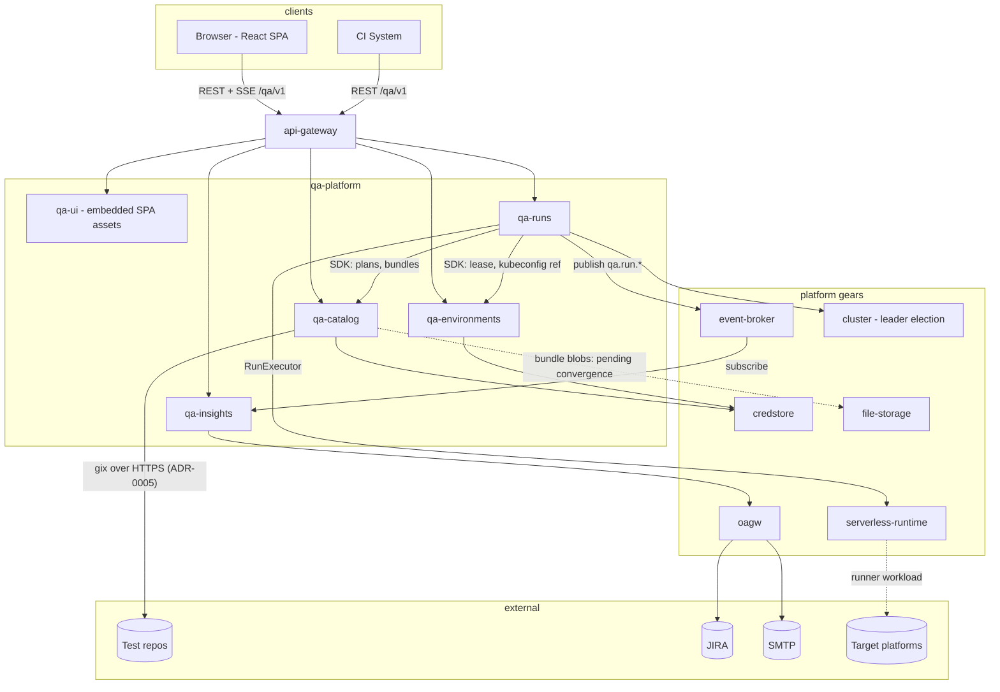
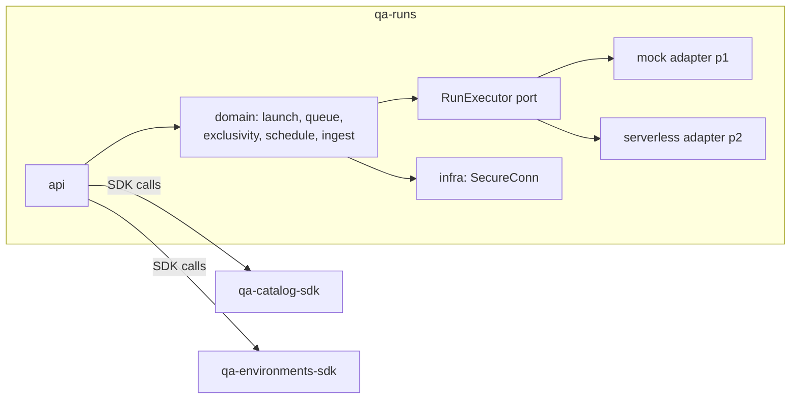
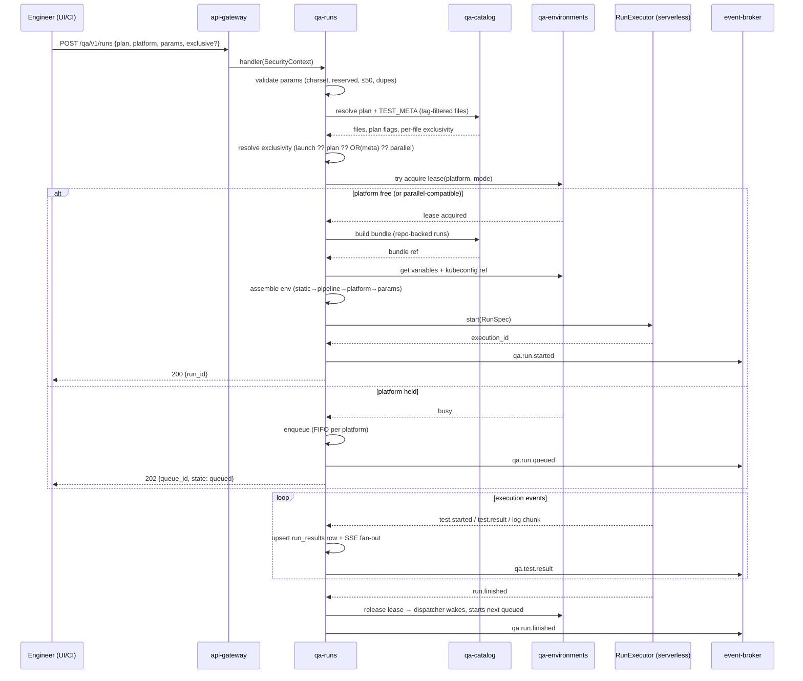
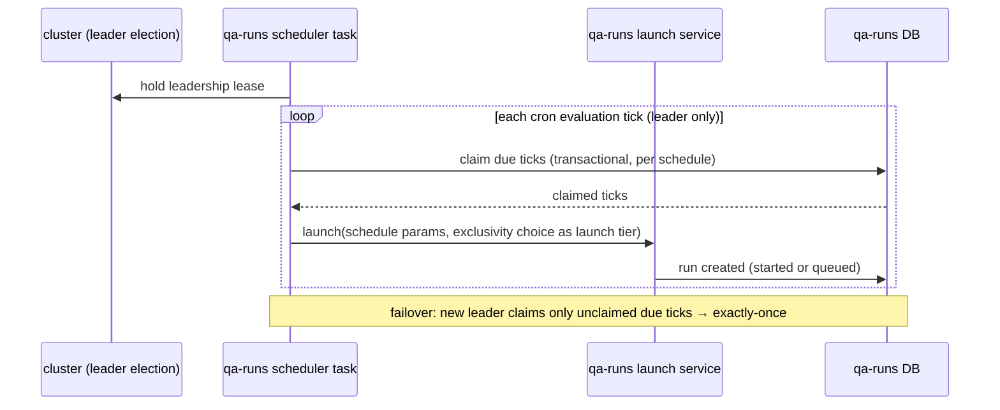
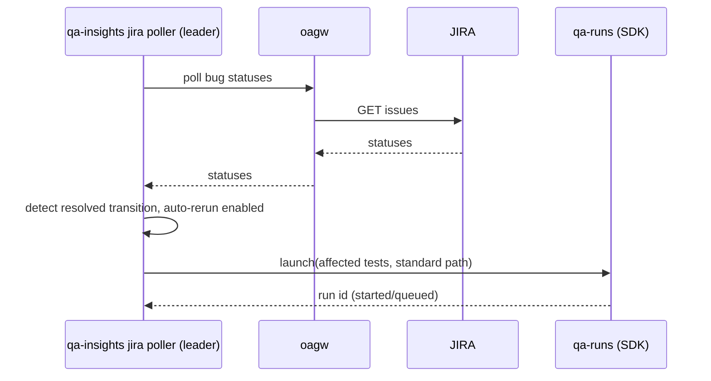

# Technical Design — QA Platform

- [ ] `p1` - **ID**: `cpt-cf-qa-design-subsystem`

<!-- toc -->

- [1. Architecture Overview](#1-architecture-overview)
  - [1.1 Architectural Vision](#11-architectural-vision)
  - [1.2 Architecture Drivers](#12-architecture-drivers)
  - [1.3 Architecture Layers](#13-architecture-layers)
- [2. Principles & Constraints](#2-principles--constraints)
  - [2.1 Design Principles](#21-design-principles)
  - [2.2 Constraints](#22-constraints)
- [3. Technical Architecture](#3-technical-architecture)
  - [3.1 Domain Model](#31-domain-model)
  - [3.2 Component Model](#32-component-model)
  - [3.3 API Contracts](#33-api-contracts)
  - [3.4 Internal Dependencies](#34-internal-dependencies)
  - [3.5 External Dependencies](#35-external-dependencies)
  - [3.6 Interactions & Sequences](#36-interactions--sequences)
  - [3.7 Database Schemas & Tables](#37-database-schemas--tables)
  - [3.8 Deployment Topology](#38-deployment-topology)
- [4. Additional Context](#4-additional-context)
- [5. Traceability](#5-traceability)

<!-- /toc -->

## 1. Architecture Overview

### 1.1 Architectural Vision

QA Platform decomposes the monolithic VHP Test Runner control plane into four domain gears plus a UI-hosting gear under `gears/qa-platform/`, each following the standard DDD-light layout (SDK crate + implementation crate with `api`/`domain`/`infra` layers), registered through ToolKit inventory discovery, and communicating only through SDK clients resolved from ClientHub.

The decomposition follows the natural seams already visible in the source system's service layer: **what to test** (catalog), **run it** (runs), **where** (environments), **what happened** (insights). Cross-gear chatter is low by construction — runs reads catalog and environments synchronously at launch time; insights ingests out-of-band, via its own reconcile sweep over qa-runs' SDK rather than a call the run path makes, and never blocks it.

The deepest architectural change from the source system is the execution plane: Argo Workflow objects and direct `kube` access are removed entirely. Run state becomes database-first in qa-runs; execution is delegated behind a narrow internal `RunExecutor` port whose first real implementation targets the platform serverless runtime; results arrive as typed events instead of scraped log markers. Everything the platform standardizes — authentication, tenancy scoping, secret storage, outbound egress, eventing, file storage, observability, API and error conventions — is delegated to the corresponding platform capability.

### 1.2 Architecture Drivers

#### Functional Drivers

| Requirement | Design Response |
|-------------|------------------|
| `cpt-cf-qa-fr-runs-queue`, `cpt-cf-qa-fr-runs-exclusivity` | Queue and exclusivity resolution are pure domain logic in qa-runs, DB-persisted, executor-independent — portable semantics test suite runs against them directly |
| `cpt-cf-qa-fr-runs-execute` | `RunExecutor` port in qa-runs domain; serverless-runtime adapter in infra; mock adapter for p1 development and tests |
| `cpt-cf-qa-fr-runs-results-ingest` | Execution event stream consumed by qa-runs; incremental persistence; run row authoritative from creation |
| `cpt-cf-qa-fr-runs-schedules` | In-gear cron evaluator as a lifecycle background task, gated by cluster-sdk leader election; fires through the same domain launch service as the API |
| `cpt-cf-qa-fr-catalog-bundles` | Bundle build in qa-catalog infra; blob behind the `BundleStore` port (gear-local filesystem in p1 — file-storage convergence per DECOMPOSITION 2.2); authenticated download endpoint |
| `cpt-cf-qa-fr-env-platforms` | Platform metadata in qa-environments DB; kubeconfig in credstore by reference; lease state owned by qa-environments, mutated via SDK by the qa-runs dispatcher |
| `cpt-cf-qa-fr-insights-history` | qa-insights polls qa-runs via its own reconcile sweep (`list_runs_finished_since`/`list_run_test_results`); own analytical schema; idempotent, rebuildable ingestion |
| `cpt-cf-qa-fr-ui-embedded` | qa-ui gear embeds built SPA via `rust_embed` (feature-gated), SPA-fallback routing |

#### NFR Allocation

| NFR ID | NFR Summary | Allocated To | Design Response | Verification Approach |
|--------|-------------|--------------|-----------------|----------------------|
| `cpt-cf-qa-nfr-run-duration` | 8 h runs surviving restarts | qa-runs domain + infra | DB-first run state; executor re-attach on startup (`watch(execution_id)` resumes); log archiving decoupled from control-plane process | Restart-during-run integration tests; soak test |
| `cpt-cf-qa-nfr-result-latency` | Result visible ≤ 5 s p95 | qa-runs ingestion path | Event-driven ingestion (no polling); single-row upsert per event | Latency assertion in e2e harness |
| `cpt-cf-qa-nfr-dispatch-latency` | Queued start ≤ 10 s p95 | qa-runs dispatcher | **Interval sweep at 5 s** (user decision 2026-08-14), giving p95 ≈ 4.75 s. The release-notification wake this row originally prescribed is **not built** — see DECOMPOSITION 2.3's tracked follow-ups | Queue-drain integration test with timing |
| `cpt-cf-qa-nfr-log-latency` | Log line ≤ 2 s p95 | qa-runs + SseBroadcaster | Executor log stream bridged to `SseBroadcaster` without buffering thresholds | e2e streaming test |
| `cpt-cf-qa-nfr-scale` | 100 platforms / 50 concurrent runs / 5 M result rows | qa-runs + qa-insights (see note on qa-catalog below) | Indexed queue table (the **result** table is indexed on `(tenant_id, run_id)` only, while `upsert_test_result` deletes on the four-column tuple — corrected 2026-08-17, and see DECOMPOSITION 2.3 for the two unbounded queries no pagination reaches); OData filtering/paging on the qa-runs and qa-insights collections, where row counts grow without bound; insights schema separated from hot run path | Seeded load test |
| `cpt-cf-qa-nfr-scheduler-exactly-once` | Exactly-once schedule firing | qa-runs scheduler | cluster-sdk leader election; due-tick claim recorded transactionally with launch creation | Multi-instance failover test |

**Scale allocation — qa-catalog carve-out.** `cpt-cf-qa-nfr-scale` is deliberately *not* allocated to the qa-catalog collections in p1: OData filtering and paging are deferred there (repositories, custom plans, products, SSH keys, bundles are operator-sized collections, and the shipped gear implements none of it — DECOMPOSITION 2.2 tracks it). Two parts of the NFR still land on qa-catalog and are honestly unmet rather than delegated:

- The **5,000-test-files-per-catalog** target hits plan discovery, not a collection endpoint. `list_plans` re-walks the working copy and re-parses every plan file on every request with no cache (`qa-catalog/src/domain/service/plans.rs`, `discover_plans` under `spawn_blocking`). At the p1 target this is repeated filesystem work per UI page load, so a discovery cache — keyed on the working copy's synced revision and invalidated by sync — is the expected next step; DECOMPOSITION 2.2 records it.
- Bundle build and download are fully in-memory with no size cap (`qa-catalog/src/domain/service/bundles.rs` module docs), acceptable only because bundle creation is SDK-only and once-per-launch.

#### Key ADRs

| ADR ID | Decision Summary |
|--------|-----------------|
| `cpt-cf-qa-adr-serverless-execution` | Execution plane: Argo Workflows → platform serverless runtime behind an internal `RunExecutor` port |
| `cpt-cf-qa-adr-structured-events` | Runner reporting: stdout markers → typed execution events |
| `cpt-cf-qa-adr-embedded-ui` | UI delivery: embedded SPA gear vs. separate static deployment |
| `cpt-cf-qa-adr-four-gear-decomposition` | Subsystem decomposition: four domain gears + UI gear |
| `cpt-cf-qa-adr-git-egress` | Git egress: `gix` in a qa-catalog infra adapter behind `RepoSyncPort`, not via oagw (amends §1.3, §3.2, §3.4, §3.5) |

### 1.3 Architecture Layers

<!-- Edge corrections per cpt-cf-qa-adr-git-egress: git egress leaves qa-catalog
directly (not via oagw), and the qa-catalog → file-storage edge is dashed because
`FileStorageClientV1` has no P1 operations yet — bundle blobs live on a gear-local
filesystem behind the `BundleStore` port in the interim (DECOMPOSITION 2.2). -->

<!-- Corrected 2026-09-01: `RUNS -->|publish qa.run.*| EB` and `EB -->|subscribe| INS`
are not built. event-broker registers no client, so qa-runs' publisher was a
logged no-op and has been removed, and qa-insights' transactional consumer —
which never ran, for the same reason — and its event-broker dependency have
been removed with it. qa-insights' actual ingest path is the reconcile sweep
over qa-runs' SDK, not this edge. Left in the diagram as the target this
subsystem's own event-registered interface (`cpt-cf-qa-interface-events`)
still specifies, not as a description of what runs today. -->

| Layer | Responsibility | Technology |
|-------|---------------|------------|
| Presentation | React SPA (embedded), OpenAPI docs | qa-ui (`rust_embed`), api-gateway |
| Application/API | REST DTOs, route wiring, SSE | ToolKit `OperationBuilder`, axum, `SseBroadcaster` |
| Domain | Launch/queue/exclusivity/schedule logic, catalog parsing, lease semantics, analytics | Plain Rust, `#[domain_model]`, per-gear |
| Infrastructure | SecureORM persistence, executor adapters, credstore/file-storage/oagw/event clients | SeaORM `SecureConn`, SDK clients via ClientHub |

## 2. Principles & Constraints

### 2.1 Design Principles

#### Semantics parity is a contract, not an aspiration

- [ ] `p1` - **ID**: `cpt-cf-qa-principle-semantics-parity`

The exclusivity precedence, queue behavior (three-outcome launch, FIFO, never-reject-for-busy), parameter validation, and environment assembly order are ported as an executable semantics test suite *before* their implementations. Any deviation is a test failure, not a review comment.

**ADRs**: `cpt-cf-qa-adr-four-gear-decomposition`

#### Run state is database-first

- [ ] `p1` - **ID**: `cpt-cf-qa-principle-db-first-state`

The `runs` row in qa-runs is authoritative from the moment of creation. Execution backends report into it; nothing reconstructs business state from execution-engine objects or logs. This inverts the source system's Argo-object-as-truth model.

**ADRs**: `cpt-cf-qa-adr-serverless-execution`, `cpt-cf-qa-adr-structured-events`

#### Executor behind a port

- [ ] `p1` - **ID**: `cpt-cf-qa-principle-executor-port`

qa-runs domain code depends only on the `RunExecutor` trait (`start`/`cancel`/`watch`/`list_active`). **Amended 2026-08-13 (Task 11): four operations, not three** — `list_active` answers "is this execution still alive?" for every outstanding claim at once, which is what the dispatcher's per-tick reconciliation needs and what the source system does with one list call per tick (`manager/src/services/run_dispatcher.rs:371-375`). One `watch` per claim cannot substitute: a stream that fails to open is indistinguishable from an execution that has ended, so it cannot express the fail-safe direction legacy relies on (`:237-252`, unreadable ⇒ busy). The returned set is **not tenant-scoped** and is safe only as a membership test, never enumerated into a response. See ADR-0001. The serverless adapter, the p1 mock, and any future backend are infra-layer details. The port is internal in v1 — deliberately not a public plugin interface until a second real backend forces the contract to mature.

**ADRs**: `cpt-cf-qa-adr-serverless-execution`

#### Insights never blocks the run path

- [ ] `p1` - **ID**: `cpt-cf-qa-principle-async-insights`

qa-insights ingests via its own reconcile sweep, polling qa-runs on a timer independent of the run path, and its ingestion is idempotent and rebuildable from qa-runs records. Slow analytics can never delay a launch, dispatch, or result write.

**ADRs**: `cpt-cf-qa-adr-four-gear-decomposition`

### 2.2 Constraints

#### No Kubernetes in the control plane

- [ ] `p1` - **ID**: `cpt-cf-qa-constraint-no-kube`

No QA Platform gear may depend on `kube`/`k8s-openapi` or assume a Kubernetes environment. Target-platform kubeconfigs are opaque secrets passed by reference to the execution plane.

#### Platform delegation is mandatory

- [ ] `p1` - **ID**: `cpt-cf-qa-constraint-platform-delegation`

Secrets → credstore; outbound HTTP/SMTP → oagw; blobs → file-storage; events → event-broker; coordination → cluster-sdk; auth/tenancy → gateway + PolicyEnforcer + SecureConn. No parallel in-gear implementations of platform concerns.

Two recorded, narrowly scoped departures — both amendments to this constraint, both traceable rather than silent:

1. **Git egress** leaves qa-catalog's own `gix` infra adapter instead of oagw, because the git smart protocol cannot be expressed as gateway HTTP requests (`cpt-cf-qa-adr-git-egress`; scoped in PRD `cpt-cf-qa-contract-egress`).
2. **Bundle blobs** live on a gear-local filesystem behind qa-catalog's `BundleStore` port, because the file-storage SDK has no P1 operations yet. This is an interim mechanism against a capability that *exists* rather than one PRD §10 lists as a p3 convergence, so it is tracked as a convergence note in DECOMPOSITION 2.2 with the adapter swap as the follow-up.

Interim mechanisms are otherwise allowed only where PRD §10 names a p3 convergence. Every departure must be recorded where the affected requirement lives, not only in an ADR.

#### Blocking dependency: serverless-runtime Python workloads

- [ ] `p2` - **ID**: `cpt-cf-qa-constraint-serverless-readiness`

The only real executor targets serverless-runtime, which is not yet implemented. All non-execution slices must build and test against the mock executor; the serverless adapter is isolated so the backend drops in without touching domain code.

**ADRs**: `cpt-cf-qa-adr-serverless-execution`

## 3. Technical Architecture

### 3.1 Domain Model

**Technology**: Rust structs (`#[domain_model]`), GTS schemas for event contracts.

**Core Entities**:

- [ ] `p1` - **ID**: `cpt-cf-qa-entity-model`

| Entity | Owner gear | Description |
|--------|-----------|-------------|
| TestRepository | qa-catalog | Registered git source; credential reference; sync state |
| Plan | qa-catalog | Discovered launchable unit (from `plans/*.yaml` or `<dir>/plan.yaml` — both flavors, see PRD `cpt-cf-qa-fr-catalog-plan-discovery`); not DB-persisted — materialized from synced content |
| CustomPlan | qa-catalog | Persisted user-composed file selection |
| TestFileMeta | qa-catalog | Parsed TEST_META per file (title, tags, three-state exclusive, plus an additive optional `bugs` key — see §4) |
| Product | qa-catalog | Product taxonomy; owns test repositories |
| TestBundle | qa-catalog | Ephemeral archive descriptor; blob behind the `BundleStore` port (gear-local filesystem in p1, file-storage on convergence) |
| SshKey | qa-catalog | Key metadata; material in credstore |
| Run | qa-runs | Authoritative run record: source, platform, params, resolved exclusivity, state machine, timing, log pointer |
| QueueEntry | qa-runs | FIFO entry per platform; seven states (queued/dispatching/running/done/failed/cancelled/expired — see §3.7) |
| Schedule | qa-runs | Cron spec, stored exclusivity choice, enabled flag, last-fired |
| RunResult | qa-runs | Run-level outcome and counts, updated incrementally |
| TargetPlatform | qa-environments | Metadata + credstore kubeconfig reference + lease state |
| PlatformVariable / PipelineVariable | qa-environments | Env-assembly inputs |
| TestResultRecord | qa-insights | Per-test-**file** historical row (analytical) |
| TestCaseResultRecord | qa-insights | Per-test-**case** historical row: `nodeid`, name, status, duration, `reason`, `ticket` |
| ExpectedCaseCount | qa-insights | Exact per-file `--collect-only` count for a `(repo, branch, file)` |
| JiraBug | qa-insights | Tracked bug, status, the single test identity it was filed against |
| SavedView | qa-insights | Persisted analytics query, keyed per owner / scope / plan |
| NotificationConfig | qa-insights | Per-tenant singleton: Slack and email settings and event toggles |
| NotificationLogEntry | qa-insights | Audit row per send attempt: channel, event type, outcome, detail |

**Four entities added and one corrected on 2026-08-18** (qa-insights design
spec, decisions D1, D2, D5 and D6). `TestCaseResultRecord` and
`ExpectedCaseCount` had no entry although the source system has both tables and
every per-case number in the product is computed from the first (see §3.7).
`NotificationConfig` and `NotificationLogEntry` replace what DECOMPOSITION 2.8
called "notification rules", which corresponded to no table in the source system
and none in this design. And `JiraBug`'s description said "linked tests",
plural: the real relation is one bug row per `(jira_key)` carrying the single
`test_name` and `plan_id` it was filed against, exactly as the Relationships
paragraph below already states — the table row contradicted the prose beneath it.

**Relationships**:
- Run → Plan|CustomPlan|single file (by reference + content snapshot via bundle): what was run
- Run → TargetPlatform (by ID): where; QueueEntry → (Run, TargetPlatform): waiting position
- TestResultRecord → Run (by ID, cross-gear reference — no FK, populated by qa-insights' own reconcile sweep re-reading qa-runs)
- JiraBug ↔ test file identity: an **insights-owned registry relation** keyed on test identity (test file/name + plan reference), created when a user files or links a bug and updated by the status poller. It is *not* read out of TEST_META — the source system has no bug key in TEST_META either (VHP Test Runner `manager/src/models.rs:687-700`, `JiraBug { jira_key, test_name, plan_id, … }`, created via `POST /api/runs/:name/jira` from `JiraCreateRequest { test_name }` in `manager/src/routes/settings.rs:580-631`, and fed back to the runner as the `SKIP_TESTS_WITH_BUGS` env var in `manager/src/services/argo.rs:476-481`). See PRD `cpt-cf-qa-fr-insights-jira`.

**Run state machine**: `created → queued? → dispatching → running → (succeeded | failed | canceled | timed_out | error)`, plus `queued → expired`; transitions only in qa-runs domain services. **Corrected 2026-09-01:** each transition used to publish a lifecycle event; the publisher was dead code (`event-broker` registered no client in any deployment) and was deleted, so no transition publishes anything today.

**Amended 2026-08-13 (qa-runs Task 7, user decision).** `expired` was added as a sixth terminal state and is reachable **only from `queued`**. It records a run whose queue row hit `queue_ttl_seconds` and was swept before it ever started. The source system never faced the question — it expires the *queue row* to `'expired'` (`manager/src/services/run_queue.rs:370-378`) and keeps no run row for a launch that never started, whereas `cpt-cf-qa-principle-db-first-state` gives this system one that needs a terminal state. Reusing `canceled` would make the TTL sweep indistinguishable from an operator cancel; reusing `timed_out` would conflate a queue-wait clock with the *execution* deadline `cpt-cf-qa-fr-runs-timeout` defines. Nothing past `dispatching` gains the edge, matching legacy's own sweep predicate (`WHERE state = 'queued'`, `run_queue.rs:378-380`: "such a row holds no claim, so expiring it cannot release a platform that a live workflow still owns"). This is also the one state name the run and queue vocabularies deliberately **share** — unlike `canceled`/`cancelled`, which must stay distinct (§3.7).

**Phase derivation is not the raw executor phase (amended 2026-08-13,
qa-runs plan decision D2).** A run's reported terminal phase is derived from
the executor's phase *plus* the ingested per-test results, and the derivation
downgrades: a run whose executor phase is `succeeded` is reported `failed`
if **any** test result is `failed`, `error`, **or `skipped`**
(`manager/src/services/argo.rs:2170-2201`). The skip arm is deliberate —
"a skipped test means the run didn't fully execute, so it must never read as
passing either" (`argo.rs:2180-2181`) — and it is ported as-is, including its
consequence: because the skip-list (`SKIP_TESTS_WITH_BUGS`,
`argo.rs:476-481`) makes the runner skip tests with open bugs, a run that
skipped only known-broken tests reports `failed`. The rule is idempotent by
construction: only `succeeded` is ever downgraded, so re-deriving a
persisted phase is a no-op.

### 3.2 Component Model

#### qa-catalog

- [ ] `p1` - **ID**: `cpt-cf-qa-component-catalog`

##### Why this component exists
Test content lives in external git; the platform needs a synced, parsed, queryable read model of it plus the product taxonomy that owns the repositories and attributes their content.

##### Responsibility scope
Repository registration and sync (in-gear `gix` infra adapter behind the `RepoSyncPort` domain port — `qa-catalog/src/infra/git/gix_sync.rs`, per `cpt-cf-qa-adr-git-egress`; **not** via oagw), branch cache, plan discovery and `plan.yaml` parsing, TEST_META text parsing (exclusivity, tags, title), custom plans CRUD, products and product folders (each repository belongs to a product), bundle build/serve/GC, SSH key metadata.

##### Responsibility boundaries
Does not launch anything, does not interpret exclusivity precedence (only parses per-file/per-plan values), does not resolve tag-filter admission (returns tags; qa-runs applies the filter — see §4), does not store secret material (credstore), does not own bundle blob durability (`BundleStore` port; gear-local filesystem in p1 pending the file-storage convergence — DECOMPOSITION 2.2).

##### Related components (by ID)
- `cpt-cf-qa-component-runs` — is called by (plan resolution, bundle creation at launch)
- credstore, authz-resolver — depends on (the gear declares `deps = [authz_resolver, credstore]`)
- file-storage — pending convergence, not yet a declared dependency (`FileStorageClientV1` has no P1 operations)
- oagw — **not** used by this gear (`cpt-cf-qa-adr-git-egress`)

#### qa-runs

- [ ] `p1` - **ID**: `cpt-cf-qa-component-runs`

##### Why this component exists
The orchestration heart: everything between "user clicks Run" and "results are persisted" that must be transactionally consistent.

##### Responsibility scope
Launch validation (params, tags), exclusivity resolution (three-tier), per-platform FIFO queue and dispatcher with crash recovery, run state machine, environment assembly, executor invocation via `RunExecutor`, execution event ingestion into run/run-result rows, run timeout enforcement, cancellation, re-run, cron scheduler (leader-elected), SSE log streaming. **Corrected 2026-09-01: "lifecycle event publication" removed** — the publisher was dead code (no deployment ever registered an `event-broker` client) and was deleted.

##### Responsibility boundaries
Does not parse repository content (catalog), does not own platform metadata or lease storage (environments — mutated via its SDK), does not build analytical aggregates (insights), does not talk to JIRA/SMTP.

##### Related components (by ID)
- `cpt-cf-qa-component-catalog` — depends on (plans, bundles)
- `cpt-cf-qa-component-environments` — depends on (lease acquire/release, kubeconfig reference, variables)
- serverless-runtime — calls through `RunExecutor` adapter
- cluster — leader election. **Corrected 2026-09-01: "event-broker — publishes
  to" removed.** qa-runs' publisher was dead code — `event-broker` registered
  no client in any deployment — and was deleted along with the dependency.

#### qa-environments

- [x] `p1` - **ID**: `cpt-cf-qa-component-environments`

##### Why this component exists
Target platforms are long-lived shared assets with secret credentials and occupancy state; several consumers (runs dispatcher, UI, version poller) need one authority for them.

##### Responsibility scope
Platform CRUD (metadata in DB, kubeconfig in credstore by reference), platform/pipeline variables, lease state (free / held / held-exclusively) with acquire/release operations exposed via SDK, platform version polling (leader-elected background task) with change events.

##### Responsibility boundaries
Does not decide queue order (runs), never returns credential material via REST (reference only; the executor adapter passes the reference to the execution plane).

##### Related components (by ID)
- `cpt-cf-qa-component-runs` — is called by (lease operations, variable reads)
- credstore — depends on

#### qa-insights

- [ ] `p1` - **ID**: `cpt-cf-qa-component-insights`

##### Why this component exists
Analytical concerns (history, coverage, JIRA correlation, notifications) have different write/read patterns and availability needs than the hot run path, and must never block it.

##### Responsibility scope
Ingestion of run/test results into analytical schema, per-test history, dashboard/coverage aggregates, OData analytics + saved views, JIRA bug registry + poller (leader-elected, via oagw) + skip-list provider + auto-rerun trigger (calls qa-runs SDK), email notifications on run completion (via oagw), ReportPortal link storage.

<!-- Corrected 2026-09-01: this scope read "Event-driven ingestion" until the
transactional broker consumer it named was deleted. event-broker registered no
client, so the consumer never ran; qa-insights' ingestion is, and has always
actually been, the reconcile sweep over qa-runs' SDK
(`list_runs_finished_since` / `list_run_test_results`), idempotent and
rebuildable. -->

##### Responsibility boundaries
Does not create or mutate runs except through the qa-runs SDK launch path (auto-rerun); ingestion is idempotent and rebuildable; no synchronous participation in launches.

##### Related components (by ID)
- `cpt-cf-qa-component-runs` — calls (auto-rerun launch)
- oagw — depends on (JIRA, SMTP)

<!-- Corrected 2026-09-01: "event-broker — subscribes to" removed. qa-insights'
event-broker dependency (the gear crate, `event-broker-sdk`, and the
transactional consumer built on them) was deleted: no deployment ever
registered the client it needed, and qa-runs' publisher — the only thing that
would have fed it — was already removed (see the correction above the
sequence diagram's `RUNS -->|publish qa.run.*| EB` edge). qa-insights depends
on no event-broker interface today. -->

#### qa-ui

- [ ] `p1` - **ID**: `cpt-cf-qa-component-ui`

##### Why this component exists
The SPA must ship with the subsystem in every deployment shape, including single-node with no web infrastructure.

##### Responsibility scope
Serve the built React SPA from embedded assets (`rust_embed`, feature-gated like api-gateway's `embed_elements`), SPA-fallback routing, correct content types and cache headers.

##### Responsibility boundaries
No domain logic, no database, no API of its own beyond asset routes. The SPA itself calls `/qa/v1/*` through the gateway with platform tokens.

##### Related components (by ID)
- api-gateway — routes through; all qa gears — consumed by the SPA over REST

### 3.3 API Contracts

- [ ] `p1` - **ID**: `cpt-cf-qa-interface-rest-design`

- **Contracts**: `cpt-cf-qa-interface-rest`, `cpt-cf-qa-interface-events`
- **Technology**: REST/OpenAPI via OperationBuilder; SSE for logs; OData on the qa-runs and qa-insights collections (deferred on the qa-catalog collections — see the §1.2 scale carve-out and DECOMPOSITION 2.2)
- **Location**: generated `/openapi.json` at the gateway (no hand-authored spec)

**Endpoints overview** (representative; full inventory emerges from OperationBuilder registrations):

| Method | Path | Gear | Description | Stability |
|--------|------|------|-------------|-----------|
| GET | `/qa/v1/plans` | catalog | Discovered plans for a `(repo_id, branch)` pair; unpaged and unfiltered in p1 | unstable |
| CRUD | `/qa/v1/custom-plans*` | catalog | Custom plans | unstable |
| CRUD | `/qa/v1/test-repos*` | catalog | Repositories + sync trigger + branches | unstable |
| GET | `/qa/v1/test-bundles/{id}` | catalog | Bundle download (execution plane) | unstable |
| CRUD | `/qa/v1/products*`, `/qa/v1/product-folders` | catalog | Product taxonomy | unstable |
| CRUD | `/qa/v1/ssh-keys*` | catalog | Key metadata | unstable |
| POST | `/qa/v1/runs` | runs | Launch (plan/custom/single-test) → 200 started / 202 queued / 429 limit | unstable |
| GET | `/qa/v1/runs`, `/qa/v1/runs/{id}` | runs | List (OData) / detail incl. incremental results | unstable |
| POST | `/qa/v1/runs/{id}/cancel`, `/{id}/rerun` | runs | Control | unstable |
| GET | `/qa/v1/runs/{id}/logs` | runs | **SSE** live log stream (archived log via file pointer when finished) | unstable |
| GET/DELETE | `/qa/v1/queue*` | runs | Queue visibility, cancel queued | unstable |
| CRUD | `/qa/v1/schedules*` | runs | Cron schedules | unstable |
| CRUD | `/qa/v1/platforms*` | environments | Target platforms + variables + lease view | unstable |
| GET | `/qa/v1/dashboard` | insights | Dashboard aggregate (recent runs, counts, pass rates, active/queued) | unstable |
| GET | `/qa/v1/dashboard/coverage` | insights | Coverage view (tests/plans × versions × platforms) | unstable |
| GET | `/qa/v1/analytics/overview` | insights | The eight-section overview payload; legacy parameters | unstable |
| GET | `/qa/v1/analytics/build-tests` | insights | Per-build test breakdown; legacy parameters + `build` | unstable |
| GET | `/qa/v1/analytics/export` | insights | CSV/JSON projection of a named overview section | unstable |
| GET/POST | `/qa/v1/analytics/views` | insights | Saved-view list / create | unstable |
| PUT/DELETE | `/qa/v1/analytics/views/{id}` | insights | Saved-view update / delete | unstable |
| GET | `/qa/v1/analytics/plan/{plan_id}/tests`, `/builds`, `/test-history` | insights | Plan drill-downs | unstable |
| POST | `/qa/v1/analytics/collect` | insights | On-demand exact-collect trigger | unstable |
| POST | `/qa/v1/collect/{repo_id}/{branch}` | insights | **Runner-facing** collect report target (`VHP_COLLECT_URL`) | unstable |
| GET | `/qa/v1/test-results`, `/qa/v1/test-case-results` | insights | The two flat collections — **OData** | unstable |
| GET | `/qa/v1/jira/open-bugs` | insights | Open-bug view | unstable |
| POST | `/qa/v1/jira/bugs` | insights | File or link a bug against a failed test from a run view | unstable |
| GET/PUT | `/qa/v1/settings/jira`, `/qa/v1/settings/jira-poller` | insights | JIRA and poller configuration | unstable |
| GET/PUT | `/qa/v1/settings/notifications` | insights | Notification configuration | unstable |
| POST | `/qa/v1/settings/notifications/test`, `/preview` | insights | Test send and message preview | unstable |
| GET | `/qa/v1/settings/notifications/log` | insights | Notification audit log | unstable |
| POST | `/qa/v1/insights/rebuild` | insights | Operator replay of a time range from qa-runs (admin scope) | unstable |
| GET | `/qa/ui/*` | qa-ui | SPA assets (fallback → `index.html`) | unstable |

All routes: auth posture and license posture declared in OperationBuilder; canonical RFC-9457 errors; tenant scoping enforced via SecurityContext → PolicyEnforcer → AccessScope → SecureConn.

**The qa-insights inventory was expanded on 2026-08-18** (qa-insights design
spec, decision D3), from three rows — `/qa/v1/dashboard*`, `/qa/v1/analytics/*`
and `/qa/v1/jira/open-bugs` — to the list above. The old rows were not merely
terse: `/qa/v1/analytics/*` as a single wildcard hid seven distinct handlers with
seven distinct response shapes, and nothing recorded the settings surface, the
runner-facing collect report route, or the rebuild endpoint at all. The source
system registers the equivalents at `manager/src/routes/mod.rs:210-249`
(analytics + collect), `:250-294` (settings, including the four notification
routes at `:270-286`), `:295-299` (open bugs) and `:31` / `:301-304`
(dashboard and coverage).

**OData applies to two endpoints, not to the analytics surface — decision D7.**
The "Technology" line above and `cpt-cf-qa-nfr-scale` (§1.2) both say "OData on
the qa-runs and qa-insights collections", which an implementer could reasonably
read as covering `/qa/v1/analytics/*`. It does not, and the distinction is
load-bearing in both directions:

* `/qa/v1/test-results` and `/qa/v1/test-case-results` **are** collections —
  flat, unbounded, and exactly the tables the 5 M-row target is about. They carry
  OData filtering, sorting and cursor paging, with filtering restricted to
  indexed columns (an OData filter on an unindexed column over 5 M rows is a
  sequential scan wearing a query's clothes) and the same page-size clamp qa-runs
  uses, so one page-size rule holds across the subsystem.
* The overview, export, build-tests and the three plan drill-downs are
  **computed aggregates**. They keep the source system's fixed parameter set
  verbatim — `product_id`, `version`, `scope`, `plan_id`, `branch`,
  `days_heatmap`, `days_trend`, `group_by`, `group_value`
  (`AnalyticsOverviewQuery`, `manager/src/routes/analytics.rs:18-33`), plus
  `build` on build-tests. OData over a rollup has no meaning, and changing these
  parameters would break every existing SPA call for no gain.

**Also new on the qa-runs rows**: `PUT /qa/v1/schedules/{id}/notifications`
(inside the `/qa/v1/schedules*` CRUD row) carries the three per-schedule Slack
settings of decision D9 — see §3.7.

**The verb changed from the source system's, deliberately.** Legacy registers
this route as `axum::routing::post` (`manager/src/routes/mod.rs:95-98`); the gear
uses `PUT`. Recorded at this length because it has already been mistaken twice
for a transcription error. Three reasons, in order of weight:

1. **The REST surface is not the frozen contract.** What is frozen is the
   *test-facing* contract — environment variable names, `plan.yaml` and TEST_META
   — under `cpt-cf-qa-fr-migration-runner-contract`. No requirement freezes an
   HTTP verb or a path.
2. **This very route already diverges in two other ways**, so "the SPA calls it
   that way" was never true of the gear: the prefix moves from `/api` to
   `/qa/v1`, and the key moves from the schedule's `{name}` to its `{id}`. A
   client that survives those two survives the verb; a client that does not was
   already going to be rewritten.
3. **The operation is a full, idempotent replacement of a settings
   sub-resource**, which is what `PUT` means, and it matches the shape the
   sibling gears already use for the same kind of operation.

**SDK-only operations** (no REST route, deliberately): `get_plan`, `get_test_meta`, and `create_bundle` on `QaCatalogClientV1` exist for qa-runs' launch path only — single-plan reads, TEST_META aggregation, and bundle construction are launch internals, not a public surface, and keeping `create_bundle` off REST is what bounds the in-memory bundle build (§1.2 scale carve-out). Bundle *download* is REST (`GET /qa/v1/test-bundles/{id}`) because the execution plane needs it.

**Events.** ~~(GTS-registered, schemas derived from Rust types)~~ **Corrected 2026-08-17 by the independent spec-coverage audit: neither half is true of the shipped system.** Nothing registers these schemas — qa-runs has no `toolkit-gts` dependency, invokes no registration macro, and submits nothing to the inventory the types-registry drains — and no JSON Schema is derived from any payload type. The ids below are GTS-*spelled* string constants. **Nor are the names below the wire ids**: the shipped id for the first row is `gts.cf.core.events.type.v1~cf.qa.runs.run_created.v1` and siblings, and since `cpt-cf-qa-interface-events` forbids mutating an existing version, the real ids are what this table should carry. The table also omits `qa.run.queue_expired`, which the frozen guide's mandatory-alert rule depends on and which qa-runs' TTL sweep still writes as a WARN log — not as a published event; see the correction below the table. Closing any of this is blocked on the platform's own `type_provisioning`, which is a bare `todo!()`.

| Event | Publisher | Payload highlights |
|-------|-----------|-------------------|
| `qa.run.created/queued/started/finished/canceled` | qa-runs | run id, plan ref, platform id, state, counts, timing |
| `qa.test.result` | qa-runs | run id, file, test id, status, duration, `nodeid`, `reason`, `ticket` |
| `qa.schedule.fired` | qa-runs | schedule id, produced run id |
| `qa.platform.version_changed` | qa-environments | platform id, old/new version |

**Corrected 2026-09-01: qa-runs publishes none of its four rows above.**
event-broker registers no client, so every publish call was a logged no-op;
the dead code has been removed rather than left running against nothing. The
table still records the interface `cpt-cf-qa-interface-events` specifies —
qa-insights' actual data path is the reconcile sweep over qa-runs' SDK
(`list_runs_finished_since` / `list_run_test_results`), not these rows.

**`qa.test.result` gained three fields on 2026-08-18** (qa-insights design spec,
decision D1): the pytest `nodeid`, the skip/xfail `reason`, and the attributed
`ticket`. They exist because qa-insights cannot compute a single per-case number
without them — `OverviewSummary.case_*` and `AnalyticsListItem.case_status` /
`case_tickets` have no other source (`manager/src/routes/analytics.rs:89-109`,
`:112-133`), and the source system has carried them since
`test_case_results` was introduced (`manager/migrations/001_initial.sql:253-263`).
Note that the payload's existing `node` field is the **execution** node — a DAG
node name such as `repo-smoke` — and is not a pytest nodeid; the two are
unrelated and both are kept.

**The type id and the version are unchanged.** `cpt-cf-qa-interface-events`
forbids mutating a published version, and this is not a mutation: all three
fields are **optional**, so an old consumer's deserialization is unaffected and
an old event still parses. Publishing `…qa.runs.test_result.v2` instead would
have forced every consumer to be updated in lockstep with a producer change that
takes nothing away — a version bump is the remedy for a breaking change, and
there is no breaking change here to remedy.

### 3.4 Internal Dependencies

| Dependency gear | Interface used | Purpose |
|-----------------|----------------|---------|
| qa-catalog | `qa-catalog-sdk` (ClientHub) | Plan resolution, TEST_META aggregation input, bundle creation at launch |
| qa-environments | `qa-environments-sdk` | Lease acquire/release, kubeconfig reference, variables for env assembly |
| qa-runs | `qa-runs-sdk` | Auto-rerun launches from qa-insights; collect-run triggers; reconciliation backfill; per-schedule notification settings |
| qa-catalog | `qa-catalog-sdk` (ClientHub) | **From qa-insights**: plan/TEST_META universe and static case counts for analytics |
| authz-resolver | `authz_resolver_sdk::PolicyEnforcer` | Per-operation access scopes (declared dependency of every domain gear) |
| credstore | `credstore-sdk` | SSH keys, repo tokens, kubeconfigs |
| file-storage | file-storage contract | Bundle blobs, archived run logs — **pending**: `FileStorageClientV1` has no P1 operations, so qa-catalog bundle blobs are gear-local in the interim (DECOMPOSITION 2.2) |
| oagw | `oagw-sdk` | JIRA polling, SMTP. **Not git** — git egress leaves qa-catalog's own `gix` infra adapter per `cpt-cf-qa-adr-git-egress` |
| ~~event-broker~~ | ~~`event-broker-sdk`~~ | **Corrected 2026-09-01: removed, not pending.** No qa-platform gear declares this dependency any more. qa-runs' publisher and qa-insights' transactional consumer were both dead code — no deployment ever registered the client the consumer needed, and the publisher had no working consumer to feed — and both were deleted along with the `event-broker`/`event-broker-sdk` deps. qa-insights' reconcile sweep over the qa-runs row above is, and has always actually been, the only path that ran. |
| cluster | `cluster-sdk` | Leader election (scheduler, pollers) |
| api-gateway | route registration | Ingress, auth, OpenAPI |

**Dependency rules** (per project conventions): no circular dependencies —
**there are two contract-mediated edges out of qa-insights**, and both are
acyclic. The insights→runs back-edge is the one ADR-0004 already sanctions. The
insights→catalog edge was added on 2026-08-18 (qa-insights design spec, Finding
4) and had no row here before: every analytics list item carries `component`,
`tags`, `plan_id`, `plan_name` and `versions`
(`AnalyticsListItem`, `manager/src/routes/analytics.rs:112-133`), and the
quality-vector rollup is computed over TEST_META `quality_vectors` — the source
system reads all of that off the on-disk checkout, which in this split is
qa-catalog's alone (`cpt-cf-qa-adr-git-egress`). The same edge carries the static
per-file test-function counts of `cpt-cf-qa-fr-insights-expected-cases`, which
qa-catalog can project from the parse it already performs for TEST_META. The edge
is non-cyclic in the strict sense that matters: qa-insights depends on the
**`qa-catalog-sdk` crate**, not on the `qa-catalog` gear, and qa-catalog depends
on neither. It does not violate `cpt-cf-qa-principle-async-insights` either —
that principle forbids the *run path* from reading insights, not insights from
reading catalog at query time. Beyond those two edges the rule stands unchanged: SDK modules only for inter-gear communication; `SecurityContext` propagated across all in-process calls; oagw is the only route to external **HTTP** systems, with one recorded exception — **git egress from qa-catalog's `gix` infra adapter** (`cpt-cf-qa-adr-git-egress`), because the git smart protocol is a stateful pkt-line exchange that oagw's request-centric egress contract cannot express. The exception is scoped to git clone/fetch/ls-remote over HTTPS with credstore-resolved credentials; it is not a general licence for gears to open sockets, and it required a matching PRD-level carve-out on `cpt-cf-qa-contract-egress` (PRD §7.2).

### 3.5 External Dependencies

#### Serverless runtime (execution plane)

- **Contract**: `cpt-cf-qa-contract-runner`

Runs execute as Python serverless workflows via the serverless SDK contract. The `RunExecutor` adapter maps `start` → workflow invocation (test source reference, env map, kubeconfig secret reference, timeout), `watch` → execution event/log stream, `cancel` → workflow cancellation. Until the runtime lands, a mock adapter provides deterministic synthetic executions for all non-execution development and tests.

#### JIRA / SMTP

Reached exclusively via oagw with credentials resolved from credstore. JIRA API version pinned in qa-insights config.

#### Git remotes

- **Contract**: `cpt-cf-qa-contract-egress` (with the git exception recorded there)

Reached directly by qa-catalog's `gix` infra adapter behind `RepoSyncPort` — **not** via oagw (`cpt-cf-qa-adr-git-egress`). Credentials are resolved from credstore and injected through gix's in-process credential callback, never written to disk or embedded in a URL.

Authentication is **HTTPS token or SSH key**, chosen by the remote's URL scheme (there is one `credential_ref` column and no auth-mode column, so the scheme decides). Over http(s) the credstore material is basic-auth material; over ssh it is a private key, and `credential_ref` names a `qa_ssh_keys` row whose `credstore_ref` holds the PEM.

SSH was deferred in p1 on the grounds that gix's ssh transport shells out to a system `ssh` and offers no in-process key injection, "so supporting it would mean materializing key material on disk". **That premise was retired on 2026-08-27** (ADR-0005, "Amendment: SSH remotes are supported"): the private key is loaded into a short-lived per-sync `ssh-agent` over stdin and reached via `-o IdentityAgent=<socket>` (paired with `-o IdentitiesOnly=yes -o IdentityFile=<agent public key>`, without which `ssh` never offers the agent's key at all) set as `core.sshCommand` on the gix repository, so the private key never becomes a file. The costs that came with it — the runtime image now needs `openssh-client`, and host-key verification is disabled by explicit decision — are recorded in that amendment.

#### Target platforms (systems under test)

Reached only by the runner workload inside the execution plane, using the kubeconfig resolved from the secret reference. Control-plane gears never open connections to targets; the version poller queries targets through the same executor mechanism (a lightweight probe workflow) rather than direct cluster access. <!-- keeps no-kube constraint airtight -->

### 3.6 Interactions & Sequences

#### Launch → queue → dispatch → execute → ingest

**ID**: `cpt-cf-qa-seq-launch`

**Use cases**: `cpt-cf-qa-usecase-launch-immediate`, `cpt-cf-qa-usecase-queue`

**Actors**: `cpt-cf-qa-actor-engineer`, `cpt-cf-qa-actor-execution-plane`

**Description**: One creation path for manual, CI, scheduled, and auto-rerun launches. The 429 branch (per-user/global limits) is omitted for brevity; limits are checked before enqueue. **Corrected 2026-09-01: the four `R->>EB` steps do not run.** qa-runs' event publisher was removed — event-broker has no working consumer, so every one of those calls was a logged no-op — and this diagram is left describing the interface contract, not the shipped sequence.

#### Schedule firing (leader-elected)

**ID**: `cpt-cf-qa-seq-schedule`

**Use cases**: `cpt-cf-qa-usecase-schedule`

#### JIRA auto-rerun

**ID**: `cpt-cf-qa-seq-jira-rerun`

**Use cases**: `cpt-cf-qa-usecase-jira-loop`

### 3.7 Database Schemas & Tables

- [ ] `p1` - **ID**: `cpt-cf-qa-db-schemas`

Each gear owns its schema; migrations via `DatabaseCapability`, executed by HostRuntime. Every table carries `id` (UUID PK), `tenant_id` (the column is named `tenant_id`, not `owner_tenant_id` as an earlier draft of this section had it — both shipped qa-platform migrations use `tenant_id`, matching house style), `created_at`, `updated_at`, and a `ScopableEntity` mapping; those standard columns are omitted below. Cross-gear references are by ID only — no cross-schema FKs. Physical tables are `qa_`-prefixed (`qa_test_repositories`, …); the logical names below omit the prefix.

Two documented departures from that standard-column set, both in qa-catalog and both deliberate: **`qa_ssh_keys` and `qa_test_bundles` have no `updated_at`**, because both rows are immutable after insert — an SSH key's material lives in credstore and is replaced by delete+create, and a bundle descriptor's checksum/size/expiry are fixed at build time. Carrying a column that can only ever equal `created_at` would invite readers to treat it as meaningful; the DESIGN text is amended here rather than the migration.

**qa-catalog** (reconciled against `qa-catalog/src/infra/storage/migrations/m20260812_000002_initial.rs`, the source of truth): `test_repositories` (product_id — required FK into `products`, `ON DELETE RESTRICT` — name, url, default_branch, content_root, credential_ref, last_synced_at, sync_error), `repo_branches` (repo_id, name, refreshed_at), `ssh_keys` (name, credstore_ref, fingerprint — no `updated_at`), `custom_plans` (name, files JSON, tags JSON, timeout_seconds), `products` (name, product_key, description, folder), `test_bundles` (storage_ref, checksum_sha256, size_bytes, expires_at — no `updated_at`).

Names that changed from earlier drafts of this section, for readers following old references: `root` → `content_root`; the single `sync_state` column → `last_synced_at` + `sync_error` (a timestamp and a failure reason answer "is this copy usable and why not" without a state vocabulary); `product_versions.repo_branch_map` → `repo_branches` — and `product_versions` was subsequently removed entirely (the source system deleted its version→branch table in VHP-319; branch selection replaced it), so readers following old references should stop looking for it; `test_repositories` gained `name` (repositories are picked by name in the UI and are unique per tenant on it). `test_bundles.run_ref` was dropped — see below.

**Decision — `test_bundles.run_ref` is dropped; qa-runs owns the run→bundle mapping.** This section previously listed a `run_ref` column, and PRD `cpt-cf-qa-fr-catalog-bundles` describes a bundle as packaging the content of "a repo-backed run", which reads as if the bundle knows its run. The shipped contract says otherwise, in three places at once: `BundleRequest` carries only `repo_id`/`branch`/`files`, `TestBundle` returns only `storage_ref`/`checksum_sha256`/`size_bytes`/`expires_at`, and `create_bundle` is an SDK call qa-runs makes *during* launch — at which point the run row already exists and is the natural owner of the reference. A `run_ref` here would be a back-pointer from the callee to the caller's aggregate, i.e. exactly the cross-gear coupling `cpt-cf-qa-adr-four-gear-decomposition` avoids, and it would have to be nullable for any bundle built outside a launch. Consequences of the drop, both accepted: bundle GC is driven purely by `expires_at` (`idx_qa_bundles_expiry`), never by run liveness — a bundle whose run is still executing when the TTL expires must be re-created or the TTL raised; and audit attribution of "which run downloaded this bundle" is an access-log/insights concern, not a catalog column. If a future requirement genuinely needs catalog-side attribution, it is an additive nullable column plus an SDK field, not a redesign.

**Multi-branch working copies.** One `gix` clone per repository at
`<repos_dir>/<repo_id>/git` owns objects and refs; each branch's content is
materialized into `<repos_dir>/<repo_id>/branches/<branch_dir>` (see
`qa-catalog/src/infra/git/layout.rs`). Branch snapshots are plain
directories — no `.git`, and the repository index is never written for them,
because the index belongs to the shared clone and per-branch writes would
clobber one another. `branch_dir` appends an 8-character digest because
normalization is lossy: `release/5.0` and `release-5-0` would otherwise
share a directory.

Two lock tiers guard the shared object store: per-repository (every git
mutation) and per-`(repo, branch)` (duplicate syncs of one branch), always
taken repo-then-branch. Freshness is an in-memory TTL cache
(`branch_freshness_ttl_seconds`), deliberately not persisted — launches
force-sync, so a cache lost on restart costs one redundant fetch. The
consequence to know: `sync_error` stays repository-scoped, so a failed sync
of one branch fails reads of the others until the next success.

**`folder` is not `tests_folder`.** `Product::folder` is a UI grouping label
(`None` = root). The source system's `Product.tests_folder` was a different
thing — the top-level directory attributing *local* plans, baked into the
runner image, to a product. The new design is repo-backed only, so
`tests_folder` has no equivalent and repository ownership carries all
attribution.

**qa-runs**: `runs` (source ref+type, platform_id, params JSONB, resolved_exclusive, state, timing, counts, log_storage_ref, execution_id, schedule_id?), `run_queue` (platform_id, run_id, run_kind, source, exclusive, state, error, enqueued_at, dispatched_at, finished_at), `schedules` (cron, target ref, exclusive_choice `true|false|auto`, enabled, params JSONB, last_fired_tick, **slack_notifications_enabled, slack_channel, slack_notification_events JSONB**), `schedule_ticks` (schedule_id, due_at, claimed_by — the exactly-once claim table).

**`schedules` gained three notification columns on 2026-08-18** (qa-insights
design spec, decision D9). No document previously recorded per-schedule
notification configuration, yet the source system exposes exactly these three
fields at `POST /api/schedules/{name}/notifications`
(`manager/src/routes/mod.rs:95-98`,
`manager/src/routes/schedules.rs::api_update_notifications`), persisting them as
CronWorkflow annotations and round-tripping them by delete-and-recreate.
`slack_notification_events` holds a subset of the six scheduled-run events
(`ScheduledRunNotificationEvent`, `manager/src/models.rs:952-959`). They live on
qa-runs, not qa-insights, because a schedule is a qa-runs aggregate and a
notification setting on it is a field, not a separate entity; qa-insights reads
them over `qa-runs-sdk` when a scheduled run changes status. The
delete-and-recreate round-trip is deliberately **not** ported — it is an artifact
of annotation storage, and this gear has a real table, so the port is a plain
`UPDATE` that must leave every other column (`exclusive_choice` above all)
untouched. On MySQL the JSON column cannot carry a literal default; it follows
whatever `m20260813_000004_schedules.rs` already does for `include_tags` /
`exclude_tags`.

`run_test_results` (run_id, test_file, test_name, status, duration, launch_id,
jira_key, **nodeid, reason, ticket**) — **added 2026-08-13 (qa-runs plan,
Task 9)**; the last three **added 2026-08-18 (qa-insights design spec, decision
D1)**, as three new nullable columns plus the matching optional fields on the
`qa.test.result` event (§3.3). They exist because the source system stores
per-*case* outcomes as well as per-*file* ones
(`test_case_results`, `manager/migrations/001_initial.sql:253-263`) and
qa-insights cannot compute `case_status`, `case_tickets` or any of the
`case_*` summary counters without them. The change is additive by construction
and the shipped 778-test qa-runs suite staying green is its gate. An earlier draft of
this list omitted a per-test table, but `cpt-cf-qa-fr-runs-results-ingest`
requires per-test results to be persisted incrementally, and
`cpt-cf-qa-principle-async-insights` forbids the run path from reading
qa-insights to get them. So qa-runs owns the authoritative per-test rows and
qa-insights builds its analytical
`test_results` by reading them back — via its reconcile sweep over qa-runs'
own SDK, not the events this paragraph originally said fed it (**Corrected
2026-09-01**: qa-runs' publisher was dead code and was deleted; qa-insights'
sweep is, and has always actually been, its only ingest path) — two tables
with different owners, write patterns, and lifetimes, which is the same split
the source system had between `run_results`/`test_results` in the manager and
its analytics views.
Deduplication is delete-then-insert on `(run_id, test_name, test_file)`
(`manager/src/routes/runs.rs:1153-1185`) rather than a unique index. ~~which is
also what keeps the key inside InnoDB's 3072-byte limit.~~

**Corrected 2026-08-15, and the correction is a deletion because both halves of
the old rationale failed.** (1) The InnoDB 3072-byte reason is **dead**: no gear
in this workspace enables `toolkit-db`'s `mysql` feature, so InnoDB's limit
constrains nothing that runs. (2) The replacement reason offered during Task
16b — *"legacy dedupes by delete-then-insert, so the schema must accept a
repeated tuple"* — is a **non-sequitur**, and a reviewer falsified it: delete
then unconditional insert never leaves two rows carrying that tuple, so it is
fully compatible with a unique index, and neither legacy statement would have
broken under one. **The causality runs the other way** — the absence of the
index is why delete-then-insert was chosen, not a consequence of it.

**So no positive justification for the missing index is recorded here, and that
is the honest state.** What is true and testable: the index does not exist, its
absence is pinned by `a_repeated_per_test_tuple_is_accepted`, and uniqueness is
an application invariant held by delete-then-insert inside one transaction. Any
future revision that adds a reason must cost it against the tuple's actual
width on **Postgres**, which is the shipped dialect.

**Corrected 2026-08-13.** The paragraph above originally called these rows "the
`RunResult` entity of §3.1". That is false and was transcribed unchecked from
the qa-runs plan: §3.1 defines `RunResult` as *"Run-level outcome and counts"*
(the five aggregate counters `passed`/`failed`/`skipped`/`in_progress`/`total`,
denormalized onto the `runs` row), and the shipped
`qa_runs_sdk::RunResult` agrees. The per-test row is a different thing
entirely, has **no** SDK counterpart, and is named `run_test_results` here.
Conflating the two would point an implementer at the wrong table.

`run_queue` **lost its `execution_ref`** — removed 2026-08-13 (qa-runs plan,
Task 9). The source system's queue row carries `workflow_name`
(`manager/migrations/001_initial.sql:297`) because it has no run row for a
queued launch, so that column is its only handle on the execution
(`manager/src/services/run_queue.rs:333-337`,
`manager/src/services/run_dispatcher.rs:440-457`). Here `run_id` resolves to a
`runs` row that already owns `execution_ref`, so a column on the queue row
would be a second home for one execution with nothing to arbitrate a
disagreement. `qa_runs_sdk::QueueEntry` already omitted the field for this
reason; the column list now matches it.

`run_queue` **also lost `target_ref`**, for the same reason and in the same
change — recorded here 2026-08-13 after a review noted the removal had been
made without a note. Legacy's queue row carries `target_id` *and* a serialized
`intent` blob (`manager/migrations/001_initial.sql:292-293`) because, having no
run row for a queued launch, it must be able to reconstruct the whole launch
from the queue row alone — `load_intent` does exactly that
(`manager/src/services/run_queue.rs:270-277`). Here `run_id` resolves to a
`runs` row that already holds the target in its four flattened `target_*`
columns, so a copy on the queue row would be the same two-homes-one-fact
problem as `execution_ref`. The shipped `qa_run_queue` has neither, and
`qa_runs_sdk::QueueEntry` says so in its own doc: `target_id` and `intent` "are
not repeated because `run_id` resolves to a `Run` that already carries the
target."

`runs` additionally carries `app_version` and `app_build`, both nullable text,
**snapshotted from the target platform at launch** — added 2026-08-13 (qa-runs
plan, Task 9) by user decision. The source system does the same
(`manager/src/routes/runs.rs:594`, persisted at
`manager/migrations/001_initial.sql:56` and `:149`); re-deriving them from
`platform_id` on read would let a platform upgrade silently change a queued
run's or a re-run's `APP_VERSION`, breaking reproducibility and the
preserved-env-var contract of `cpt-cf-qa-fr-migration-runner-contract`.

**Gap closed the same day (Task 9b).** This paragraph briefly recorded that
`qa_environments_sdk::TargetPlatform` exposed `observed_version` but no build
identifier, leaving `app_build` without an upstream source. qa-environments now
carries `observed_build` alongside it (migration `m20260813_000004`), mirroring
`observed_version` in nullability, width, mapper treatment and REST exposure.
Neither column has a writer yet — the version poller is unbuilt and both are
tracked together in `DECOMPOSITION.md` 2.1 so one retrofit closes both.

Note on the citation: `cpt-cf-qa-fr-migration-runner-contract` enumerates
`KUBECONFIG`, `APP_VERSION`, `TEST_VERSION`, `PRODUCT_KEY`,
`SKIP_TESTS_WITH_BUGS`, ReportPortal variables and run parameters — it does
**not** name `APP_BUILD`. The requirement's *rule* still covers it (the
contract is that the test-facing variables are unchanged), and the evidence
that `APP_BUILD` is one of them is the source system itself: it injects the
variable into every runner pod from all three submit paths
(`manager/src/services/argo.rs:465`, `:779`, `:1098`) and reserves the name
against user-defined variables (`manager/src/routes/settings.rs:16`). Cite
those, not the enumerated list.

**qa-environments**: `platforms` (name, product_id?, description?, kubeconfig_credstore_ref, availability, observed_version, observed_build, default_branch?), `platform_variables` (platform_id, name, value — unique on `(tenant_id, platform_id, name)`), `pipeline_variables` (name, value), `platform_leases` (platform_id, mode parallel|exclusive, holder run_ids JSONB).

Four amendments to that line. `observed_build` was added by Task 9b on
2026-08-13 (see the qa-runs paragraph above). `platform_variables`' unique index
was **tenant-blind on ship** — `(platform_id, name)` — and was rebuilt as
`(tenant_id, platform_id, name)` by migration `m20260813_000005` on 2026-08-13;
it was the live instance of the "every unique index is tenant-prefixed" rule
stated below, and is called out here so the shipped schema and this list agree.

`default_branch` was added by **Task 13b on 2026-08-14**, restoring parity spec
§3.4 rule 1's middle tier (explicit → **platform default** → repository
default). This line's original omission of it is *why* that tier had no source:
the column exists in legacy (`platforms_meta.default_branch`,
`manager/migrations/001_initial.sql:233`, read by
`manager/src/services/platforms.rs:846-849`) and was dropped here with no
recorded decision, so a launch with no explicit branch silently used the
repository default where legacy used the platform's. Unlike `observed_build`,
which is machine-written, this field is **operator-set** and therefore reaches
`NewPlatform`, `PlatformPatch` and the REST request type.

`description` was omitted from this list on ship and is **not** an amendment to
the schema — the column has existed since `m20260812_000001` (`description TEXT
NULL`). It is added here on 2026-08-14 only so the list matches the table, since
this document is treated as specification and an inaccurate column list has
already cost one tier its source.

`platform_leases` is keyed on a bare `platform_id`, i.e. the lease is **not
tenant-partitioned** — deliberate, since a physical platform is a single
resource whichever tenant registered it, but it means a run row carrying
another tenant's `platform_id` would contend for the owning tenant's lease.
Platform ownership is therefore validated in qa-runs' launch path, not by any
constraint; see the note on `qa_runs.platform_id`.

**qa-insights** — eleven tables. Ten are source-system tables with tenancy and
UUID keys added; one (`ingest_watermarks`) is new.

| Table | Columns beyond the standard set | Source-system origin |
|---|---|---|
| `test_results` | run_id, test_file, test_name, status, duration, launch_id, jira_key, **product_version, platform_id, plan_id, branch, run_finished_at** | `test_results` (`manager/migrations/001_initial.sql:65`, + `:166-167`) |
| `test_case_results` | run_id, test_file, nodeid, name, status, duration, reason, ticket | `test_case_results` (`:253`) |
| `test_case_collect` | repo_id, branch, test_file, case_count, collected_at — unique `(tenant_id, repo_id, branch, test_file)` | `test_case_collect` (`:272`) |
| `analytics_saved_views` | owner_id, scope, plan_id, plan_id_key, name, query_json | `analytics_saved_views` (`:183`) |
| `jira_bugs` | jira_key, test_name, plan_id, app_version, platform, status, summary, resolved_at† | `jira_bugs` (`:78-89`) |
| `jira_config` | one row per tenant | `settings` row `jira` (table at `:93`; key read at `manager/src/services/jira.rs:24`) |
| `jira_poller_config` | one row per tenant, incl. `auto_rerun_on_resolve` and `poll_interval_seconds` | `settings` row `jira_poller` (`manager/src/routes/settings.rs:515`) |
| `notification_config` | one row per tenant; the fifteen `NotificationsConfig` fields (`manager/src/models.rs:1338-1362`) | `settings` row `notifications` (`manager/src/services/notifications.rs:87`) |
| `run_notifications` | run_id, notification_kind, event_type, sent_at — unique `(tenant_id, run_id, notification_kind, event_type)` | `run_notifications` (`:197`) |
| `notification_log` | run_id?, channel, event_type, outcome, detail | `notification_log` (`:205`) |
| `ingest_watermarks` | last_reconciled_finished_at, last_swept_at — unique `(tenant_id)` | none — new |

**Amended 2026-08-18 (qa-insights design spec, decisions D1, D2, D4 and D6).**
This paragraph previously read, in full: *"`test_results` (run_id, file,
test_id, status, duration, product_version, platform_id — indexed on (file,
test_id) and run_id), `jira_bugs` (key, status, linked_tests JSONB,
auto_rerun), `saved_views` (name, query JSONB), `notification_rules` (trigger,
recipients)"*. Four tables where there are eleven — and the shortfall was not
uniform. Each of the four went wrong in its own way, and a fifth table was
missing outright:

* **`test_results` was the only result table.** The source system has two, at
  two granularities, and the second is what every per-case number in the product
  is computed from (D1 — see `cpt-cf-qa-fr-insights-history`).
* **`test_case_collect` was missing entirely**, along with the whole
  expected-cases requirement it serves (D2 — see
  `cpt-cf-qa-fr-insights-expected-cases`).
* **`saved_views (name, query JSONB)` had the wrong key.** The real table is
  `analytics_saved_views` and its unique index is
  `(owner_id, scope, COALESCE(plan_id, ''), name)`
  (`manager/migrations/001_initial.sql:194`). Owner, scope and per-plan
  qualification are load-bearing — `GET /api/analytics/views` takes `scope` and
  `plan_id` as query parameters — so a name-keyed table cannot serve the endpoint
  (D4).
* **`jira_bugs` had an invented shape.** `linked_tests JSONB` implies one bug
  fanning out to many tests; the real table is the other way round — one row per
  `(jira_key)`, carrying the single `test_name` and `plan_id` it was filed
  against, with optional `app_version` and `platform` qualifiers
  (`manager/migrations/001_initial.sql:78-89`, indexed on `(test_name, plan_id)`
  at `:90`). That keying is what `cpt-cf-qa-fr-insights-jira` already describes
  in prose; this line contradicted it. Its other invented column, `auto_rerun`,
  is dealt with in the † footnote below.
* **`notification_rules (trigger, recipients)` does not exist and never did.**
  There is no rules table in the source system: notification configuration is a
  single row in a generic key/value `settings` table (`:93`) under the key
  `notifications`, read through `SettingsService::get_or_default`. The invented
  table is dropped (D6).

Four decisions in that table are adaptations rather than transcription, and are
recorded here because a reader who knows the source system will otherwise read
them as drift:

1. **`test_results` is denormalized.** `product_version`, `platform_id`,
   `plan_id`, `branch` and `run_finished_at` are copied from the run at ingest.
   The source system joins `run_results` in every analytics query; here that join
   would be a cross-gear call, which `cpt-cf-qa-principle-async-insights` forbids
   on a hot path. Denormalizing is safe because a finished run's platform and
   version never change afterwards.
2. **`plan_id_key`.** SQLite and MySQL do not both support functional indexes, so
   the source system's `COALESCE(plan_id, '')` is materialized as its own
   `NOT NULL DEFAULT ''` column and written by the repository, preserving the
   semantics (a global and a plan-scoped view of one name coexist; two global
   views of one name do not) rather than the SQL.
3. **`tenant_id` joins every unique key**, including the saved-view key and the
   `jira_bugs` key that is globally unique on `jira_key` in the source system —
   two tenants must be able to hold the same view name, and per the rule at the
   end of this section a tenant-blind unique index is a cross-tenant channel.
4. **`jira_config.api_token` stores a credstore reference, never the token.**
   This is the one place the port deliberately diverges from the source system,
   which stores the token itself. The platform has a credential store; a bearer
   token in a gear table would not survive review.

† **`jira_bugs` deliberately has no `auto_rerun` column** — proposed, and
dropped on 2026-08-18. The footnote survives the column because the column was
carried unexamined through two earlier drafts of this section, and a reader who
finds `auto_rerun` in the source system's `JiraPollerConfig` and not in this
table will otherwise assume it was forgotten and re-add it.

The source system's `jira_bugs` table stops at `resolved_at`
(`manager/migrations/001_initial.sql:78-89`). Auto-rerun is a **single global**
switch, `JiraPollerConfig.auto_rerun_on_resolve` (`manager/src/models.rs:1419`,
read at `manager/src/services/jira_poller.rs:61-63`), and it lives here on
`jira_poller_config`. A per-bug flag would therefore be net-new design in parity
costume: nothing in the source system writes it, nothing reads it, and D8's
whole point is that the rerun gate belongs to the poller rather than to the bug.
`cpt-cf-qa-fr-insights-auto-rerun` is satisfied by the global switch plus the
new-build gate alone.

If per-bug control is ever genuinely wanted, it is an additive nullable column
plus an SDK field — not a redesign, and not a reason to add the column
speculatively now.

`test_results` and `test_case_results` are the two tables `cpt-cf-qa-nfr-scale`'s
5 M-row target applies to and the two that carry OData (§3.3, D7). Their indexes
follow the source system's — `idx_test_results_name`
(`manager/migrations/001_initial.sql:76`), the three on `test_case_results`
(`:265-267`), `idx_jira_bugs_test` and `idx_jira_bugs_status` (`:90-91`) — with
`tenant_id` leading. The three `test_case_results` indexes are at `:265-267`.
They were cited for a while as `:267-270`, which picks up only the last of the
three and then runs on into the comment block above `test_case_collect`.

The `run_notifications` composite key **is** the dedupe mechanism rather than an
incidental primary key (`:197-203`), and is the reason a claim-then-send is
expressible as a single insert. Its key column changes from the source system's
`workflow_name` to `run_id`, that being the gear's equivalent run identity.

Example — `run_queue`:

| Column | Type | Description |
|--------|------|-------------|
| platform_id | UUID | Queue partition key |
| run_id | UUID | Waiting run |
| state | TEXT | queued / dispatching / running / done / failed / cancelled / expired |

**Amended 2026-08-13 (qa-runs plan, decision D1).** An earlier draft of this
section listed `run_queue.state` as `queued / dispatched / canceled` and a
`position BIGSERIAL` column. Both were sketches that were never reconciled
against the source system. The shipped vocabulary is the frozen one from
`../testrunner/docs/guides/exclusive-runs-and-the-queue.md` (lines 88-96):
`queued`, `dispatching`, `running`, `done`, `failed`, `cancelled`, `expired`.
Two of these carry the load: a row in `dispatching` or `running` is a *claim*
that holds the platform (`manager/src/services/run_queue.rs:104`), and
`expired` is the TTL terminal state that guarantees a queued run can never
disappear silently (guide line 96 — its alert is mandatory).

There is **no stored position**. FIFO order is `ORDER BY enqueued_at ASC,
id ASC` (`run_queue.rs:243-257`), and `queue_position` / `blocked_by` /
`ttl_expires_at` are computed per request over the rows that request
returned (`run_queue.rs:485-533`) — with the documented consequence that a
truncating `limit` understates them, so the platform-filtered listing is the
reliable one (guide lines 179-184).

Three admission limits also belong here and were absent from every spec
document. All three are operator settings with `0` meaning "disabled":
`max_concurrent_runs` (cluster-wide; 429 at admission, never a queued row —
`run_queue.rs:34-54, 879-891`), `queue_ttl_seconds` (per queued row; default
7200 — `models.rs:767-769`, arithmetic in `run_queue.rs:736-759`), and
`queue_max_depth` (**per tenant scope, per platform** — see the correction below; default 20 — `models.rs:774-776`; the 429
and its operator message at `run_dispatcher.rs:161-172`, the predicate at
`run_queue.rs:830-832`). They are what make `cpt-cf-qa-fr-runs-launch`'s
"rejected with the limit that was hit" a closed set of exactly two causes.

**Correction, 2026-08-14 (qa-runs Task 14 security review).** `queue_max_depth` is
enforced **per (tenant scope, platform)**, not per platform, because `queued_depth`
and `queued_rows` are scope-filtered — which is required, since an unscoped count
would make `QueueFull.queued` a cross-tenant oracle and unscoped queries are
banned. Three consequences, all previously unstated:

- Total queued rows on one platform is bounded by **Σ over scopes** of
  `queue_max_depth`, not by `queue_max_depth`.
- **FIFO is per scope too.** The frozen guide's "strictly FIFO … otherwise a
  queued exclusive run would starve forever" is guaranteed *within* a scope;
  there is no global FIFO across scopes on a shared platform.
- Because `AccessScope` admits a **set** of tenants, under a hierarchical policy
  the depth read spans every tenant the scope admits while the insert stamps
  `subject_tenant_id` alone — so one tenant's rows can consume a sibling's
  admission budget.

**Load-bearing invariant this exposes, recorded here because nothing enforces it:
a target platform belongs to exactly one tenant.** Every property above is benign
under that invariant and only under it. It is currently implied by
qa-environments' PEP and asserted nowhere. `platform_leases` is deliberately keyed
on a bare `platform_id` and is *not* tenant-partitioned, so if the product ever
wants genuinely shared platforms, `queue_max_depth`, FIFO and the lease must be
redesigned **together** — treat that requirement as the trigger.

**Multi-replica caveat, same review.** `PlatformLocks` is process-local and
admission runs inline in **every** replica's REST handler, so across replicas the
only mutual exclusion is the qa-environments lease CAS on one row. The frozen
guide already scopes this ("admission correctness assumes a single manager
replica", line 232), but two specific consequences were unstated: the depth read
is not atomic with the insert, so N replicas can overshoot the cap by up to
N−1 (bounded, harmless); and **the FIFO guarantee can invert** — one replica's
inline admission can start a fresh launch while another replica's tick is
mid-drain holding older queued rows. Task 16's leader election makes the *ticker*
single-writer and leaves admission N-writer, so closing the inversion needs a
database advisory lock keyed on `platform_id`, not leader election.
They are carried as typed gear config on qa-runs (the convention
`QaCatalogConfig` in `qa-catalog/src/config.rs` establishes), not through the
p3 Settings Service convergence — the source system read them from its own
`runner_defaults` settings row (`models.rs:778-788`, `impl Default for
RunnerDefaultsConfig`), which has no counterpart here.

One spelling trap, stated here because it is otherwise undiscoverable: a queue
row's terminal state is `cancelled` (two `l`s — the frozen spelling from the
guide and the source system, `run_queue.rs:413`), while a **run's** is
`canceled` (one `l` — this document's own vocabulary at §3.1, which has no
source-system counterpart: the source system had no run-level cancel state at
all, an Argo terminate simply produced a failed workflow). They are different
vocabularies over different tables and neither is a typo. Do not unify them
without changing both this section and §3.1.

**Constraints**: UNIQUE(tenant_id, run_id); index on (tenant_id, platform_id, state, enqueued_at, id) for dispatch (no stored `position` column — FIFO order is computed, see above); `schedule_ticks` UNIQUE(tenant_id, schedule_id, due_at) makes the exactly-once claim a constraint, not a convention.

**Corrected 2026-08-13** against the shipped migration, which this line
predated and did not match. Two changes, both in the direction the rest of this
section already required. The unique key leads with `tenant_id`, not
`platform_id` — the "every unique index is tenant-prefixed" rule below applies
to it, and `UNIQUE(platform_id, run_id)` would have been tenant-blind on a
child table. And the dispatch index is **not partial**: `WHERE state = 'queued'`
predicates are a Postgres/SQLite feature with no MySQL equivalent, and this
subsystem ships one DDL per dialect from a single column list, so a partial
index would have to become a plain one on MySQL anyway. `state` is instead an
ordinary equality column inside the index prefix — third, after `tenant_id` and
`platform_id`, and ahead of the `enqueued_at, id` sort — so one index still
serves the dispatch query's filter and its ORDER BY together. `schedule_ticks`
shipped in Task 17 carrying the tenant-prefixed key given here
(`m20260813_000004_schedules.rs`, `idx_qa_schedule_ticks_claim`); the sentence
that preceded this one predicted the form rather than recording it.

**Every unique index is tenant-prefixed — including on child tables.** A child table whose parent already carries the tenant (`repo_branches` under `test_repositories`) must still lead its unique index with `tenant_id`: `idx_qa_branches_unique(tenant_id, repo_id, name)`. A tenant-blind unique index on such a table is a cross-tenant channel even when every query is correctly scoped, because resource UUIDs are identifiers, not secrets. A caller who learns another tenant's `repo_id` can insert a row *of its own tenant* referencing it: the insert passes tenant validation, stays invisible to both tenants' scoped reads, and yet permanently collides with the victim's writes (squatting denial of service) while the unique-violation error itself reports whether the victim's row exists (an existence oracle). Prefixing `tenant_id` confines such a row to the squatter's own key space, where it is harmless junk. This rule applies to every gear's schema, not only qa-catalog; the reasoning is repeated in `qa-catalog/src/infra/storage/migrations/m20260812_000002_initial.rs` for implementers, together with the MySQL/InnoDB key-width arithmetic that the wider key columns have to satisfy.

### 3.8 Deployment Topology

- [ ] `p2` - **ID**: `cpt-cf-qa-topology`

All five gears are libraries composed into host binaries (per `apps/cf-gears-example-server` pattern: a thin `main.rs` + `registered_gears.rs` linking the gear crates for inventory discovery). All three platform shapes are supported; the legacy nginx UI deployment, Argo installation, and per-component images are retired.

| Shape | Composition | Artifacts | How you run it |
|-------|-------------|-----------|----------------|
| Single-node (dev, edge, demo) | One process: api-gateway + authn/authz + credstore + cluster + file-storage + oagw + event-broker + qa-* gears (UI embedded) | none — the binary | `cargo run -p <host-app> -- --config config/qa.yml`; SQLite or local Postgres via config; UI at `/qa/ui/` |
| Multi-node (bare metal, on-prem) | Same binary on several hosts; gears local or OoP (gRPC) per `runtime.type` config; shared Postgres; cluster-sdk backend for leader election | binary + config | systemd or equivalent; no orchestration layer required |
| Kubernetes | Host-binary image behind an ingress; execution plane (serverless-runtime) scaled/placed independently — its placement decides which networks reach target platforms | `deploy/docker/*.Dockerfile`, `deploy/helm/qa-platform/` (Deployment, Service, ConfigMap, Secret, RBAC/lease — mini-chat chart precedent) | `helm upgrade --install qa-platform ...` with external or bundled Postgres |

**Packaging deliverables** (`cpt-cf-qa-fr-deploy-packaging`): reference host-app composition, Dockerfile(s) (source-build and prebuilt-binary variants), and the Helm chart live under `gears/qa-platform/deploy/`, following `gears/mini-chat/deploy/` as the structural precedent. The chart deliberately excludes what the legacy `charts/vhp-testrunner` had to carry: no Argo subchart, no UI deployment (embedded in the binary), no runner image wiring (runner is a serverless workload package owned by the execution feature).

**Execution-plane packaging**: the migrated runner ships as a versioned Python workflow package registered with serverless-runtime (format per serverless-sdk), not as a standalone image referenced by the chart. Its distribution mechanics are defined by the serverless-runtime spec and consumed here; see `cpt-cf-qa-adr-serverless-execution`.

## 4. Additional Context

**State relocations vs. the source system** — the two intentional inversions implementers must not "fix" back:
1. Run state is DB-first (`cpt-cf-qa-principle-db-first-state`); there is no poller reconciling from the execution engine. The `watch` stream is the only ingestion path, and re-attach on restart replaces the source system's run-results poller.
2. `run_results` (run-level) lives in qa-runs; `test_results` (analytical per-test history) lives in qa-insights and is populated by qa-insights' own reconcile sweep polling qa-runs. UI run-detail reads qa-runs; history/analytics pages read qa-insights.

**Retired mechanisms and their replacements**: Argo Workflow/CronWorkflow objects → runs rows + in-gear scheduler; CronWorkflow trigger-POST containers → leader-elected cron task; stdout marker scraping → typed execution events; WebSocket log endpoint → SSE; Askama HTML pages → none (SPA only); `settings` table → typed gear config + Settings Service at p3; direct SMTP (lettre) and JIRA reqwest calls → oagw; local `/tmp` bundle/repo dirs → file-storage (archived run logs; **bundles pending** — a gear-local filesystem `BundleStore` in the interim, DECOMPOSITION 2.2) with repo working copies remaining gear-local scratch by design.

**Where the tag filter is applied.** qa-catalog returns each file's tags and its three-state `exclusive`; it never decides admission. qa-runs owns the filter, and must port the source system's *deliberate asymmetry* rather than reinvent it: an untagged file is **admitted** by an exclude-only filter and **rejected** by an include filter, because it cannot prove membership — fail-open for exclude, fail-closed for include (VHP Test Runner `manager/src/services/test_meta.rs:81-108`, `tags_admit`; all three inputs trimmed and lowercased before comparison). The same predicate gates a file's vote in the TEST_META exclusivity tier (`manager/src/services/exclusivity.rs:160-173`, `file_declares_exclusive` returns `None` for a filtered-out file, i.e. "does not vote"). Tracked for `cpt-cf-qa-fr-runs-exclusivity` in DECOMPOSITION 2.2.

**The TEST_META `bugs` key is a new additive convention, not a ported one.** The source system has no `bugs`/`jira`/`issues` key in TEST_META — its complete recognized key set is `title` (plus the legacy `TEST_TITLE` fallback), `component`, `tags`, `quality_vectors`, and `exclusive`, with `description` taken from the module docstring. The gear ships a `bugs` list parser (`qa-catalog/src/domain/parsing/test_meta.rs`, `BUGS_RE`, explicitly marked "No legacy counterpart") which will therefore be empty on every existing repository. It is retained as an opt-in convention for repositories that want to declare known-broken tests at the source, and it is *additive*: it breaks no existing repo and it is **not** the source of truth for `cpt-cf-qa-fr-insights-jira`, which reads the insights-owned bug registry. Consumers must not treat an empty `bugs` list as "no known bugs".

**Runner migration sketch** (detail in `cpt-cf-qa-adr-structured-events`): the pytest wrapper keeps its test-facing env contract; its marker-printing layer is replaced by an event emitter targeting the serverless execution event channel; ReportPortal reporting stays inside the runner; stdout/stderr remain the raw log stream.

## 5. Traceability

- **PRD**: [PRD.md](./PRD.md)
- **ADRs**: [ADR/](./ADR/)
- **Decomposition**: [DECOMPOSITION.md](./DECOMPOSITION.md)
