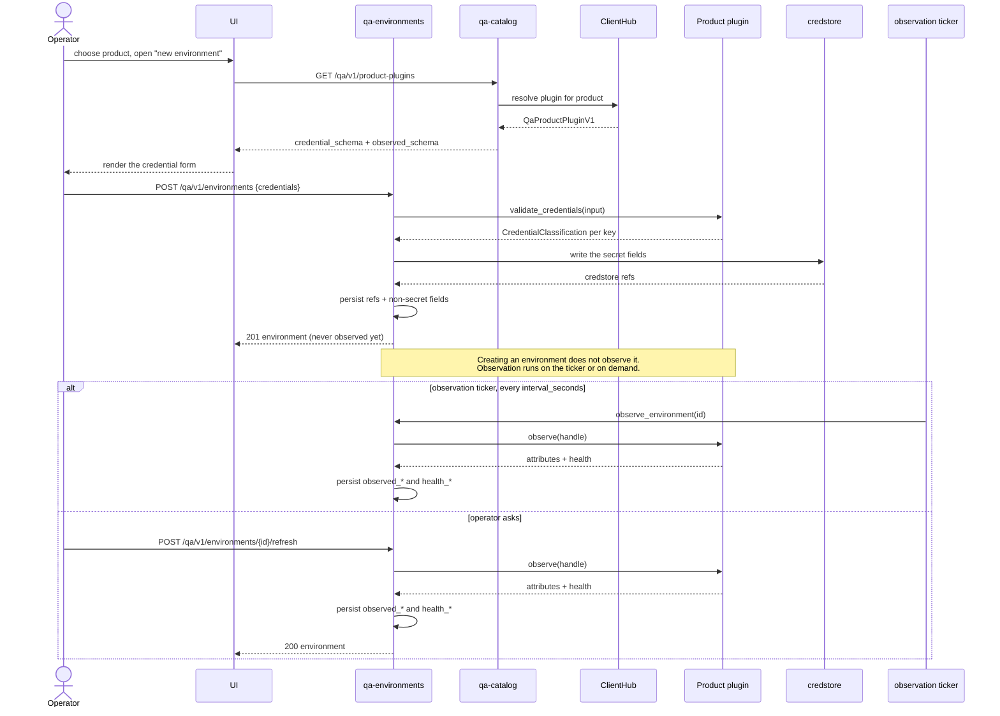
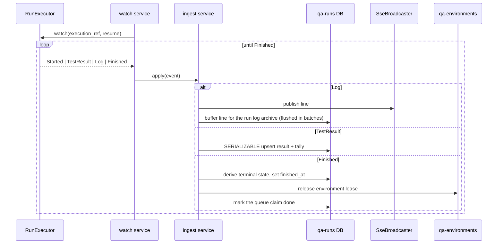

# Technical Design — QA Platform

- [ ] `p1` - **ID**: `cpt-cf-qa-design-subsystem`

<!-- toc -->

- [1. Architecture Overview](#1-architecture-overview)
  - [1.1 Architectural Vision](#11-architectural-vision)
  - [1.2 Architecture Drivers](#12-architecture-drivers)
  - [1.3 Architecture Layers](#13-architecture-layers)
- [2. Principles & Constraints](#2-principles--constraints)
  - [2.1 Design Principles](#21-design-principles)
  - [2.2 Constraints](#22-constraints)
- [3. Technical Architecture](#3-technical-architecture)
  - [3.1 Domain Model](#31-domain-model)
  - [3.2 qa-environments](#32-qa-environments)
  - [3.3 qa-catalog](#33-qa-catalog)
  - [3.4 qa-runs](#34-qa-runs)
  - [3.5 qa-insights](#35-qa-insights)
  - [3.6 qa-platform-ui](#36-qa-platform-ui)
  - [3.7 Product SDK, Product Plugins, Connectors](#37-product-sdk-product-plugins-connectors)
  - [3.8 Database Schemas & Tables](#38-database-schemas--tables)
  - [3.9 Interactions & Sequences](#39-interactions--sequences)
  - [3.10 Authorization Surface](#310-authorization-surface)
  - [3.11 Observability](#311-observability)
  - [3.12 Deployment Topology](#312-deployment-topology)
  - [3.13 Configuration](#313-configuration)
- [4. Traceability](#4-traceability)

<!-- /toc -->

## 1. Architecture Overview

### 1.1 Architectural Vision

QA Platform is the test-management control plane for Virtuozzo products. An operator registers an
**environment** (a running instance of a product), points the platform at a **test repository**,
and launches **runs** against that environment; results arrive as typed events, are persisted per
test file and per test case, and are read back as **analytics**.

The subsystem is four ToolKit gears under `gears/qa-platform/`, each a standard DDD-light crate
pair (an SDK crate carrying the client trait and models, an implementation crate with `api` /
`domain` / `infra` layers), registered through ToolKit inventory discovery and talking to one
another only through SDK clients resolved from `ClientHub`:

| Gear | Question it answers | Owns |
|------|--------------------|------|
| `qa-environments` | *where does a test run?* | environments, their credentials, observation and health, leases, variables |
| `qa-catalog` | *what is there to run?* | products, test repositories and their branches, plans, custom plans, SSH keys, test bundles |
| `qa-runs` | *run it* | runs, the per-environment queue, schedules, dispatch, execution, log streaming, result ingestion |
| `qa-insights` | *what happened?* | historical results per file and per case, dashboards, analytics, JIRA correlation, notifications |

A fifth deliverable, `qa-platform-ui`, is a React SPA served by nginx, and a Helm chart deploys the
whole set — gears, UI, Postgres, Keycloak and the Argo integration — onto a Kubernetes cluster.

Two ideas carry most of the architecture.

**Everything product-specific lives behind one trait.** The platform itself knows nothing about any
particular Virtuozzo product. `QaProductPluginV1` (in `qa-product-sdk`) declares the credential form
an operator fills in, the facts an observation of a live environment yields, what a run needs in
order to reach that environment, and the runner shape to launch. A product plugin is a gear with a
GTS identity that registers in `ClientHub` and is resolved per product through
`qa_products.plugin_instance_id`. Adding a product is adding a crate, not editing the core. Two
plugins ship: **VHP**, whose environment is a Kubernetes cluster read through `qa-connector-k8s`,
and **VHI**, whose environment is a management node reached over SSH and driven through the
`vinfra` CLI via `qa-connector-ssh`.

**Execution is a port, not a dependency.** `qa-runs` owns run state in its own database from the
moment a run is created; nothing reconstructs business state from an execution engine's objects or
from log text. Backends sit behind the internal `RunExecutor` port (`start` / `watch` / `cancel` /
`list_active`) and report into the database as typed events. Two adapters exist: a deterministic
in-memory `MockRunExecutor`, which is the default, and `ArgoRunExecutor`, which submits Argo
`Workflow` objects and is compiled only under the non-default `argo` cargo feature. A default build
of every qa-platform **gear** therefore has no Kubernetes dependency in its tree. `qa-environments`
carries a second, independently-switched Kubernetes-touching adapter — the runner-`Secret` writer —
behind its own non-default `runner-secret` feature (not `argo`; the two gears toggle the same target
cluster independently). `qa-connector-k8s`, the transport library the VHP plugin links, carries
`kube`/`k8s-openapi` **unconditionally**: it is the one crate in the subsystem not covered by a
feature gate, because it is not a gear and is linked only by the plugins that need a cluster. §2.2
states the boundary precisely.

### 1.2 Architecture Drivers

#### Functional Drivers

| Requirement | Phase | Design Response |
|-------------|-------|-----------------|
| `cpt-cf-qa-fr-catalog-repos` | `p1` | `qa-catalog` `repos` service; `gix` clone/fetch in `infra/git`; branch cache in `qa_repo_branches`; `POST /qa/v1/test-repos/{id}/sync` |
| `cpt-cf-qa-fr-catalog-plan-discovery` | `p1` | Plan discovery from the synced work tree (`plan.yaml` / `TEST_META` conventions); `GET /qa/v1/plans`, `GET /qa/v1/product-folders` |
| `cpt-cf-qa-fr-catalog-custom-plans` | `p1` | `qa_custom_plans` (file list, tags, timeout); full CRUD under `/qa/v1/custom-plans` |
| `cpt-cf-qa-fr-catalog-ssh-keys` | `p1` | `qa_ssh_keys` holds a `credstore_ref` and a fingerprint only; private material never leaves credstore |
| `cpt-cf-qa-fr-catalog-bundles` | `p1` | `qa_test_bundles` + `BundleStore` port; a bundle is a checksummed, expiring snapshot of a work tree fetched by the runner |
| `cpt-cf-qa-fr-environments-registry` | `p1` | `qa_environments` with per-product credential JSON, `is_default` per product, full CRUD under `/qa/v1/environments` |
| `cpt-cf-qa-fr-environments-observation` | `p1` | `QaProductPluginV1::observe` yields attributes and health in one handshake; persisted to `observed_*` and `health_*` columns; `POST /qa/v1/environments/{id}/refresh` |
| `cpt-cf-qa-fr-env-lease` | `p1` | `qa_environment_leases` with an optimistic `version`; shared and exclusive modes; `GET /qa/v1/environments/{id}/lease` |
| `cpt-cf-qa-fr-environments-variables` | `p1` | Per-environment variables (`qa_environment_variables`) and subsystem-wide pipeline variables (`qa_pipeline_variables`), merged at dispatch |
| `cpt-cf-qa-fr-runs-launch` | `p1` | `launch` service resolves target, environment, plugin access and variables into a `RunSpec`; `POST /qa/v1/runs` |
| `cpt-cf-qa-fr-runs-queue` | `p1` | Per-environment FIFO in `qa_run_queue`; `decide_admission` starts a run immediately when its environment is free; runs with no environment are never queued |
| `cpt-cf-qa-fr-runs-dispatch` | `p1` | Interval sweep (`dispatcher_interval_seconds`, default 5 s) draining the queue through `RunExecutor::start` |
| `cpt-cf-qa-fr-runs-cancel` | `p1` | `POST /qa/v1/runs/{id}/cancel` → `RunExecutor::cancel`, state machine transition, lease release |
| `cpt-cf-qa-fr-runs-rerun` | `p1` | `POST /qa/v1/runs/{id}/rerun` re-launches a run's resolved target |
| `cpt-cf-qa-fr-runs-schedules` | `p1` | `qa_schedules` (cron) + `qa_schedule_ticks` as the claim ledger; one row per due instant for a fire, plus non-fire rows from the referential-check ticker |
| `cpt-cf-qa-fr-runs-results-ingest` | `p1` | `IngestService::apply` folds typed `ExecutionEvent`s into `qa_runs` counters and `qa_run_test_results` rows under `SERIALIZABLE` with bounded retry |
| `cpt-cf-qa-fr-runs-logs` | `p1` | `SseBroadcaster` streams live log lines; `RunLogArchive` persists the finished-run copy to `qa_run_logs`; `GET /qa/v1/runs/{id}/logs` |
| `cpt-cf-qa-fr-insights-history` | `p1` | `qa_test_results` (per file) and `qa_test_case_results` (per case) with OData query surface |
| `cpt-cf-qa-fr-insights-dashboard` | `p1` | `DashboardService` aggregates recent runs, counts, pass rates and active/queued; `GET /qa/v1/dashboard` |
| `cpt-cf-qa-fr-insights-analytics` | `p1` | Eight-section overview, per-build breakdown, per-test history, export, saved views |
| `cpt-cf-qa-fr-insights-collect` | `p1` | `--collect-only` case counts per `(repo, branch, file)` in `qa_test_case_collect`, launched by the hourly collect cycle or `POST /qa/v1/analytics/collect`, and reported back by the runner to `POST /qa/v1/collect/{repo_id}` |
| `cpt-cf-qa-fr-insights-jira` | `p1` | JIRA client through OAGW; `qa_jira_bugs` correlation; poller with optional auto-rerun on resolve |
| `cpt-cf-qa-fr-insights-notifications` | `p1` | Slack and email channels, per-tenant config, `qa_notification_log` audit, `qa_run_notifications` idempotency |
| `cpt-cf-qa-fr-ui` | `p1` | React SPA: dashboard, runs, plans, custom plans, environments, products, schedules, analytics, settings |
| `cpt-cf-qa-fr-product-plugins` | `p1` | `QaProductPluginV1` resolved per product from `ClientHub`; VHP and VHI plugins ship |
| `cpt-cf-qa-fr-packaging` | `p1` | Helm chart deploying gears, UI, Postgres, Keycloak, Argo RBAC and the migration/seed jobs |

#### NFR Allocation

| NFR ID | NFR Summary | Allocated To | Design Response | Verification Approach |
|--------|-------------|--------------|-----------------|----------------------|
| `cpt-cf-qa-nfr-run-duration` | Multi-hour runs survive control-plane restarts | qa-runs domain + infra | Run state is database-first; `watch(execution_id)` re-attaches on startup; log archiving is decoupled from the control-plane process | Restart-during-run integration tests; soak test |
| `cpt-cf-qa-nfr-result-latency` | A result is visible ≤ 5 s p95 after the runner reports it | qa-runs ingestion path | Event-driven ingestion, no polling; one upsert per event | Latency assertion in the e2e harness |
| `cpt-cf-qa-nfr-dispatch-latency` | A queued run starts ≤ 10 s p95 after its environment frees. **Measured 2026-09-21** — see §3.11, "The dispatch-latency window, and the measurement that was retracted" | qa-runs dispatcher | Interval sweep at 5 s; the ≈4.75 s design argument assumed a single queued run per environment and did not account for `max_concurrent_runs` being checked *before* the per-environment FIFO, nor for genuine multi-run backlog per environment | `qa_runs_free_to_start_duration_seconds` is the row's own quantity, anchored on `qa_environment_leases.freed_at` — the lease-release instant the retracted 2026-09-18 measurement lacked. Two 600 s windows differing only in per-environment backlog (2 vs 5): n = 214 and 239, every sample ≤ 10 s, p95 4.21 s and 4.51 s by per-sample SQL, while `qa_runs_queue_wait_duration_seconds` over the same drains moved 7.7× — which is what says the number is not queue depth. `qa_runs_free_to_start_unanchored_total` publishes the coverage. §3.11 has the method and the three things it does not settle |
| `cpt-cf-qa-nfr-log-latency` | A log line reaches a viewer ≤ 2 s p95 | qa-runs + `SseBroadcaster` | Executor log stream bridged to SSE with no buffering threshold | e2e streaming test |
| `cpt-cf-qa-nfr-tenant-isolation` | No row crosses a tenant boundary | every gear, infra/storage | `SecureORM` with a tenant column on every table; per-gear `tests_tenant_scoping` suites | Tenant-scoping test module per gear |
| `cpt-cf-qa-nfr-credential-containment` | Credential material never reaches a published surface | `qa-product-sdk`, plugins, connectors | Nothing derived from credential material is formatted; `PluginFailure::detail` is `&'static str`; keys travel credstore → memory → pipe → short-lived ssh-agent; secrets reach remote commands on stdin | `assert_no_leak` drives every plugin with planted material and fails the build if any of it surfaces |
| `cpt-cf-qa-nfr-infra-agnostic` | A default build has no Kubernetes dependency | qa-runs, qa-environments, qa-connector-k8s | The Argo adapter is behind qa-runs' non-default `argo` feature and the runner-`Secret` writer is behind qa-environments' own, independently-switched, non-default `runner-secret` feature; `qa-connector-k8s` carries `kube`/`k8s-openapi` unconditionally but is linked only by the plugins that need a cluster, not by a default gear build | `cargo tree -p qa-runs -i kube -e normal` prints nothing, and `cargo tree -p qa-environments -i kube` errors (`kube` is not in the graph at all) without `--features runner-secret` |
| `cpt-cf-qa-nfr-ingest-recovery` | Ingestion recovers within 60 s of a control-plane restart | qa-insights | `qa_ingest_watermarks` records the last reconciled `finished_at`; the reconcile sweep resumes from it | Restart test asserting watermark advance |

#### Key Decisions (ADRs)

| ADR | Decision | Rationale |
|-----|----------|-----------|
| `cpt-cf-qa-adr-execution-plane` — [ADR-0001](./ADR/0001-cpt-cf-qa-adr-execution-plane.md) | Execution behind the internal `RunExecutor` port; Argo adapter behind a non-default feature | Keeps the control plane infrastructure-agnostic while shipping a real backend |
| `cpt-cf-qa-adr-structured-events` — [ADR-0002](./ADR/0002-cpt-cf-qa-adr-structured-events.md) | Runners report typed execution events | Machine-readable and schema-stable; no log scraping on the result path |
| `cpt-cf-qa-adr-embedded-ui` — [ADR-0003](./ADR/0003-cpt-cf-qa-adr-embedded-ui.md) | The SPA ships as its own nginx image alongside the gears | One deployable unit per concern; no static-hosting dependency |
| `cpt-cf-qa-adr-four-gear-decomposition` — [ADR-0004](./ADR/0004-cpt-cf-qa-adr-four-gear-decomposition.md) | Four domain gears rather than one | The seams are natural and cross-gear chatter is low by construction |
| `cpt-cf-qa-adr-git-egress` — [ADR-0005](./ADR/0005-cpt-cf-qa-adr-git-egress.md) | `gix` directly in the qa-catalog infra adapter; host-key verification disabled for git and SSH | OAGW does not speak the git wire protocol; the exposure is recorded |
| `cpt-cf-qa-adr-product-plugins` — [ADR-0006](./ADR/0006-cpt-cf-qa-adr-product-plugins.md) | Product behaviour is an in-process plugin resolved per product | Adding a product is adding a crate |
| `cpt-cf-qa-adr-connectors-as-libraries` — [ADR-0007](./ADR/0007-cpt-cf-qa-adr-connectors-as-libraries.md) | Connectors are plain libraries: no gear, no GTS identity, nothing resolves them | A transport is not a policy decision |
| `cpt-cf-qa-adr-credential-containment` — [ADR-0008](./ADR/0008-cpt-cf-qa-adr-credential-containment.md) | No value derived from credential material is ever formatted | A leak is unrecoverable; the rule is enforced by a build-failing test |
| `cpt-cf-qa-adr-insights-reconcile` — [ADR-0009](./ADR/0009-cpt-cf-qa-adr-insights-reconcile.md) | qa-insights ingests by sweeping qa-runs' SDK, off the run path | The run path never blocks on analytics |
| `cpt-cf-qa-adr-product-scoping` — [ADR-0010](./ADR/0010-cpt-cf-qa-adr-product-scoping.md) | A row is attributed to a product through its target, never its environment | Collect runs have no environment at all |
| `cpt-cf-qa-adr-smtp-egress` — [ADR-0011](./ADR/0011-cpt-cf-qa-adr-smtp-egress.md) | `lettre` directly in the qa-insights infra adapter; the relay password resolved from credstore in-process; the allow-list in application config, not a NetworkPolicy | OAGW speaks HTTP and SMTP is not HTTP; the relay host is per-tenant runtime data and NetworkPolicy has no DNS matcher |

### 1.3 Architecture Layers

```text
┌──────────────────────────────────────────────────────────────┐
│  qa-platform-ui (React SPA, nginx)                           │
│  Product switcher · runs · plans · environments · analytics  │
├──────────────────────────────────────────────────────────────┤
│  Presentation (api_gateway — platform)                       │
│  REST + SSE under /qa/v1, AuthN middleware                   │
├──────────────────────────────────────────────────────────────┤
│  qa-environments │ qa-catalog │ qa-runs │ qa-insights        │
│  ┌────────────────────────────────────────────────────────┐  │
│  │ API layer (api/rest/)                                  │  │
│  │ OperationBuilder routes, handlers, DTOs, Problem errors│  │
│  ├────────────────────────────────────────────────────────┤  │
│  │ Domain layer (domain/)                                 │  │
│  │ services · ports · repos · state machine · authz       │  │
│  ├────────────────────────────────────────────────────────┤  │
│  │ Infra layer (infra/)                                   │  │
│  │ SecureORM storage · executor · git · leader · metrics  │  │
│  └────────────────────────────────────────────────────────┘  │
├──────────────────────────────────────────────────────────────┤
│  qa-product-sdk  ──  QaProductPluginV1                       │
│      qa-vhp-product-plugin      qa-vhi-product-plugin        │
│           │                            │                     │
│      qa-connector-k8s            qa-connector-ssh            │
├──────────────────────────────────────────────────────────────┤
│  Platform capabilities                                       │
│  credstore · ClientHub · types-registry · authz · oagw       │
└──────────────────────────────────────────────────────────────┘
```

## 2. Principles & Constraints

### 2.1 Design Principles

#### Execution is a port

- [ ] `p1` - **ID**: `cpt-cf-qa-principle-executor-port`

`qa-runs` depends on `RunExecutor`, never on an execution engine. The trait is four operations —
`start(RunSpec) -> ExecutionRef`, `watch(ExecutionRef) -> stream of ExecutionEvent`,
`cancel(ExecutionRef)`, `list_active()` — and it is frozen: an adapter satisfies it, it does not
widen it. Everything except an adapter builds and tests against `MockRunExecutor`.

#### Run state is database-first

- [ ] `p1` - **ID**: `cpt-cf-qa-principle-db-first-state`

The `qa_runs` row is authoritative from the moment of creation. Execution backends report into it;
nothing reconstructs business state from execution-engine objects or from log text.

#### A product's behaviour lives behind one trait

- [ ] `p1` - **ID**: `cpt-cf-qa-principle-product-plugin`

No gear branches on a product. Product-specific behaviour is reached only through
`QaProductPluginV1`, resolved from `ClientHub` by the product's `plugin_instance_id`.

#### Credential material is never formatted

- [ ] `p1` - **ID**: `cpt-cf-qa-principle-no-credential-formatting`

No value derived from credential material is rendered — not through `Display`, not through `Debug`,
not into a message, a log line or a DTO. The one sanctioned exception is text a remote sent back.
A credential-store reference is, in every gear, exactly what credstore's `SecretRef` accepts:
letters, digits, `_` and `-`, 1 to 255 characters, with no scheme prefix. A malformed reference is
refused at write as a `400` naming the field.

#### Semantics are specified, not inferred

- [ ] `p1` - **ID**: `cpt-cf-qa-principle-specified-semantics`

Where a rule governs run outcomes — how a terminal state is derived, what a skipped test means,
what a dead node means — the rule is written down and tested, not left to emerge from whatever the
code happens to do. A behaviour nobody specified is a behaviour nobody can rely on, so a change of
this kind is a decision to be recorded rather than an implementation detail.

#### Analytics never blocks a run

- [ ] `p1` - **ID**: `cpt-cf-qa-principle-async-insights`

`qa-insights` reads `qa-runs` through its SDK on its own reconcile sweep. The launch and ingest
paths make no call into qa-insights.

### 2.2 Constraints

#### No Kubernetes in a default build

- [ ] `p1` - **ID**: `cpt-cf-qa-constraint-no-kube`

`kube` and `k8s-openapi` may appear in the dependency tree only under three gates: the `argo` cargo
feature of `qa-runs`, the `runner-secret` cargo feature of `qa-environments`, and unconditionally in
`qa-connector-k8s`, which is linked only by the VHP plugin. Verified with
`cargo tree -p qa-runs -i kube -e normal` (nothing for a default build) and
`cargo tree -p qa-environments -i kube` (errors — `kube` is not in the graph at all — without
`--features runner-secret`).

#### Host-key verification is disabled

- [ ] `p1` - **ID**: `cpt-cf-qa-constraint-no-host-key-pinning`

Git remotes and SSH sessions both accept an unverified host key. What this exposes, and what would
have to change to tighten it, is recorded in [ADR-0005](./ADR/0005-cpt-cf-qa-adr-git-egress.md) and
in the doc comment on the constant that sets it.

#### One designated tenant per deployment

- [ ] `p1` - **ID**: `cpt-cf-qa-constraint-single-tenant-deployment`

Every table carries `tenant_id` and every query is tenant-scoped, but the shipped Helm chart seeds a
single tenant. Multi-team tenancy is configuration, not new code.

#### The runner contract is pytest

- [ ] `p1` - **ID**: `cpt-cf-qa-constraint-pytest-runner`

Test repositories are pytest-based and keep the `plan.yaml` / `TEST_META` conventions. Case counts
come from `--collect-only`; per-case identity is a pytest `nodeid`.

#### The subsystem's checks run in the repository's shared CI

There is no separate workflow for qa-platform. Its checks are steps in the shared `.github/workflows/ci.yml`, and three of them are paid for by pull requests that never touch `gears/qa-platform`:

* the `integration` job runs `make test-qa-runs-pg`, `test-qa-insights-pg`, `test-qa-catalog-pg`, `test-qa-catalog-git` and `test-qa-platform-features` whenever its `rust` filter matches, and that filter matches a Rust or Cargo change anywhere in the repository; the Postgres tiers run in Docker containers, which that job has;
* the `lint` job runs `make helm-tests`, `helm lint` and kubeconform over the chart on every run, with no path filter at all;
* the `test` job runs `make qa-openapi-check` on Linux.

In the other direction, the workflow-level `paths` and the `rust` filter both re-include qa-platform's Markdown, TypeScript, shell, chart and config files (the citation guards read them), so a documentation-only change to this subsystem runs the full Rust test job, which a documentation-only change elsewhere does not.

The cost, stated as it was when the first of these steps landed: added wall-clock on unrelated pull requests, and a qa-platform regression turns an unrelated pull request red. Gating the three jobs' qa-platform steps behind a `gears/qa-platform/**` path filter would remove it; it has not been done, and doing it would mean a change elsewhere that breaks qa-platform (a toolkit or workspace dependency bump) is no longer caught on that change's own pull request.

## 3. Technical Architecture

### 3.1 Domain Model

| Entity | Owning gear | Meaning |
|--------|-------------|---------|
| `Product` | qa-catalog | A Virtuozzo product. Carries no behaviour of its own; `plugin_instance_id` names the plugin that does |
| `TestRepository` | qa-catalog | A git remote, its default branch and content root, optionally a credential reference |
| `RepoBranch` | qa-catalog | Cached branch name for a repository, refreshed by sync |
| `Plan` | qa-catalog | A test plan discovered in a synced work tree; identified by `(repo_id, path)` |
| `CustomPlan` | qa-catalog | An operator-assembled file list with tags and an optional timeout |
| `SshKey` | qa-catalog | A named credstore reference plus a fingerprint. Never the key |
| `TestBundle` | qa-catalog | A checksummed, expiring snapshot of a work tree that a runner fetches |
| `Environment` | qa-environments | A running instance of a product: credentials, observed attributes, health, default flag |
| `EnvironmentLease` | qa-environments | Who currently holds an environment, in shared or exclusive mode, with an optimistic `version` |
| `EnvironmentVariable` | qa-environments | A name/value pair scoped to one environment |
| `PipelineVariable` | qa-environments | A name/value pair scoped to the subsystem |
| `Run` | qa-runs | One execution of a target against an environment, with its resolved parameters, state and tallies |
| `QueueEntry` | qa-runs | A run's position in its environment's FIFO |
| `Schedule` | qa-runs | A cron rule that launches a target repeatedly |
| `ScheduleTick` | qa-runs | The claim ledger row proving one due instant was fired once |
| `RunTestResult` | qa-runs | Per-test-file outcome for a live run |
| `RunLog` | qa-runs | The durable text of a finished run's log |
| `TestResultRecord` | qa-insights | Per-test-**file** historical row (analytical) |
| `TestCaseResultRecord` | qa-insights | Per-test-**case** historical row: `nodeid`, name, status, duration, `reason`, `ticket` |
| `ExpectedCaseCount` | qa-insights | Exact per-file `--collect-only` count for a `(repo, branch, file)` |
| `JiraBug` | qa-insights | A tracked bug, its status, and the single test identity it was filed against |
| `SavedView` | qa-insights | A persisted analytics query, keyed per owner / scope / plan |
| `NotificationConfig` | qa-insights | Per-tenant singleton: Slack and email settings and event toggles |
| `NotificationLogEntry` | qa-insights | Audit row per send attempt: channel, event type, outcome, detail |

#### Run state machine

- [ ] `p1` - **ID**: `cpt-cf-qa-design-run-state-machine`

A run moves `created → queued? → dispatching → running → terminal`. Ten states, six of them
terminal:

```text
   created
      │
      ├──────────────┐
      ▼              │
   queued            │            terminal
      │  │           │            ─────────
      │  └──────────────────────▶ expired      (queue TTL sweep; only from queued)
      ▼              ▼
  dispatching ◀──────┘
      │  │
      │  └──────────────────────▶ failed | error   (submit failed; nothing ever ran)
      ▼
   running ─────────────────────▶ succeeded | failed | canceled | timed_out | error
```

The legal-successor table is `qa-runs/src/domain/state_machine.rs`, matched exhaustively on the
source state so that adding a `RunState` variant fails compilation rather than inheriting a
permissive default. Five guards are decisions rather than consequences:

* **`queued → running` is illegal.** A queued row must pass through `dispatching`, because
  `dispatching` is the state that holds the environment claim while the repository sync and the
  bundle build run.
* **`dispatching → failed | error` needs no intervening `running`.** A submit that fails leaves no
  execution behind.
* **`queued → expired` is the queue TTL sweep's edge, and only `queued` has it.** A run past
  `dispatching` is no longer waiting on the queue, so `queue_ttl_seconds` no longer applies. It is
  a distinct state on purpose: reusing `canceled` would make the sweep indistinguishable from an
  operator cancel, and reusing `timed_out` would conflate the queue-wait clock with the execution
  deadline of `cpt-cf-qa-fr-runs-timeout`.
* **`succeeded` is the one mutable terminal state.** `succeeded → {failed, error, canceled,
  timed_out}` is legal; the other five terminal states refuse every exit, including the self-edge,
  so a duplicate completion event is rejected by the guard rather than silently rewriting
  `finished_at`.
* **A dead execution node downgrades an otherwise green run.** `ExecutionOutcome::node_failure`
  feeds the same argument as a test failure, so a run whose tests all passed on a node that then
  died does not report success. **Skipped tests do not**: a run whose tests were all skipped is
  still a success, and the skip count is carried in the tally instead.

Two vocabularies spell cancellation differently and deliberately: a run is `canceled`, a queue row
is `cancelled`. They are different columns on different tables and must not be unified. Expiry,
by contrast, is spelled `expired` on both, and that agreement is the point — an operator sees one
word for one event.

### 3.2 qa-environments

- [ ] `p1` - **ID**: `cpt-cf-qa-component-environments`

Registry of the places tests run, and the only gear that talks to a live product instance.

#### Services

| Service | Responsibility |
|---------|----------------|
| `environments` | CRUD, product scoping, `is_default` resolution per product, observation orchestration |
| `environment_credentials` | Validates a submitted credential form through the product plugin, then writes secret fields to credstore and keeps only references |
| `leases` | Acquire / release / inspect, shared and exclusive, optimistic on `version` |
| `variables` | Per-environment and subsystem-wide variable CRUD. An upsert of one name that races another both succeed, and the later value wins. |

#### Ports

| Port | Implementation |
|------|----------------|
| `ProductPlugin` | `infra/product_plugin.rs` — resolves `dyn QaProductPluginV1` from `ClientHub` by the product's `plugin_instance_id` |
| `RunnerSecret` | `infra/runner_secret_writer.rs` — materialises the secret a runner will mount, through the plugin's declared `MountSpec` |
| `Metrics` | `infra/metrics.rs` |

#### Observation

`QaProductPluginV1::observe` returns attributes and health from **one** call, so one client and one
handshake serve both. Results land in `observed_version`, `observed_build`, `observed_base_url`,
`observed_attrs` (plugin-declared JSON), `health_state`, `health_detail` and `health_checked_at`.
An environment nothing has observed yet is an ordinary shape, not an error: `observed_role` is
`None` and dispatch omits the variables that would have come from it.

A background cycle re-observes on an interval; `POST /qa/v1/environments/{id}/refresh` forces one.
Both are bounded by `observation.observe_timeout_seconds` (default 300 s, the default poll
interval): a plugin that has not answered by then is abandoned and the environment records a
`Timeout` failure for both halves, like any other failed observation.
Both are measured by `qa_environments_observation_cycle_*` and `qa_environments_observation_*`.

#### Credential handling

The **gear**, not the plugin, writes credstore — only the gear holds the tenant-scoped
`SecurityContext`. `validate_credentials` therefore returns a `CredentialClassification` per
submitted key (which fields are secret), never anything credstore-shaped, because the plugin runs
before that write happens and cannot know a reference.

Every read of an environment's credential — an observation, whether a refresh or the background
cycle, and the runner `Secret` write on create, update and self-heal — runs as the qa-environments
system actor, bound to the tenant that owns the environment (the tenant the background cycle binds
to), not to the caller's. A refresh therefore cannot succeed on a secret the background cycle cannot
read: a reference to a secret with `private` sharing, which only its owner can read, fails both, and
the recorded reason says to store it with `tenant` sharing. The caller is authorized first under its
own context.

#### Endpoints

| Method | Path | Purpose |
|--------|------|---------|
| GET, POST | `/qa/v1/environments` | List (OData) and create |
| GET, PATCH, DELETE | `/qa/v1/environments/{id}` | Read, update, delete |
| GET | `/qa/v1/environments/{id}/lease` | Current lease holders and mode |
| POST | `/qa/v1/environments/{id}/refresh` | Force an observation |
| GET, PUT | `/qa/v1/variables` | Pipeline and per-environment variables: list, and create or update by natural key |
| DELETE | `/qa/v1/variables/{id}` | Delete a variable |

### 3.3 qa-catalog

- [ ] `p1` - **ID**: `cpt-cf-qa-component-catalog`

What there is to run, and the only gear that reaches a git remote.

#### Services

| Service | Responsibility |
|---------|----------------|
| `products` | Product CRUD; binds a product to its plugin instance |
| `plugin_registry` | Enumerates registered `QaProductPluginV1` instances and their declared schemas |
| `repos` | Test-repository CRUD, sync orchestration, branch cache |
| `sync_cache` | The on-disk work tree per repository and branch |
| `plans` | Plan discovery from a synced work tree |
| `custom_plans` | Operator-assembled plan CRUD |
| `ssh_keys` | Named credstore references and fingerprints |
| `bundles` | Checksummed work-tree snapshots for runners |
| `validation` | Shared input validation across the above |

#### Ports

| Port | Implementation |
|------|----------------|
| `RepoSync` | `infra/git` — `gix` clone/fetch directly, per [ADR-0005](./ADR/0005-cpt-cf-qa-adr-git-egress.md) |
| `BundleStore` | `infra/bundle_store` — content-addressed storage with an expiry |
| `Metrics` | `infra/metrics.rs` |

#### Plan discovery

A synced work tree is walked under the repository's `content_root`. Plan identity is
`(repo_id, path)` — there is no synthetic plan id, and `plan_key` in qa-insights is the same pair
rendered as a string. Case counts per file come from pytest `--collect-only` and are the
`qa-catalog` half of what qa-insights stores as `ExpectedCaseCount`.

#### Branch model and the first read of a branch

Each branch has its own work tree, materialized by a sync of that branch. A read of a branch's
content — `GET /qa/v1/plans`, a single plan, `TEST_META`, and the build of a test bundle — goes
through one step:

1. If the repository has synced successfully (`last_synced_at` set, `sync_error` clear) and the
   branch's work tree is on disk, the read is served from it. No sync, no network.
2. Otherwise the read syncs the branch first. It always confirms the branch on the remote before
   that: the branch list is refreshed (a ref listing, no content fetch) and the branch must appear
   in it. The cached list alone never decides, because it lags the remote in both directions.
   A listing that fails is answered by whose fault it is. A configuration fault — the
   repository's credential cannot be resolved in credstore, or the remote refuses it, or demands
   one and none is configured, or an ssh key is passphrase-protected, or a credential is
   configured for a plain `http://` remote, which never sends one in clear text — is recorded in
   `sync_error` (sanitized) and answered `400` with that reason, exactly as an explicit sync
   records it. Any other failure (unreachable, timing out, failing) is `503` and records nothing.
   An HTTP `403` from the remote is in this second class, not the first: hosts answer `403` for
   missing permissions and for rate limits alike, and only `401` reliably means the credential
   was refused. Either failure backs the repository off for `remote_failure_backoff_seconds`
   (default 30 s): every read of that repository that would sync it gives the same answer — the
   recorded reason as `400`, or `503` — without contacting the remote. A credential backoff
   answers only while `sync_error` still holds the reason it recorded; once another failure has
   replaced that text, reads ask the remote again. An explicit sync that records a credential
   fault starts the same backoff. The backoff is in memory and per replica. A successful listing
   or sync, a forced sync, and a change of the repository's `url` or `credential_ref` end it
   early, and a failure found by an attempt that began before such a change neither starts one
   nor, for a credential fault, is recorded. Neither the explicit sync nor the branch-cache
   refresher is held back by it; the refresher records nothing and so never starts one, though
   its successful listing ends one. A
   branch the remote does not have is `404` (`BranchNotFound`, naming the branch), and the sync
   engine is never called for it. A sync failure records `sync_error` on the repository, which
   every branch of that repository reads as "not synced", so a mistyped or deleted branch must not
   reach the engine. A branch the remote has is synced without `force`: the freshness cache and the
   per-repository and per-branch sync locks apply, so concurrent first reads of one branch fetch
   its content once. While `sync_error` is set the freshness window does not short-circuit: a
   branch synced inside it is fetched again, because only a successful sync clears the error,
   and without that a branch synced a minute ago would be refused with another branch's failure
   for the rest of the window. So while one branch keeps failing, reads of the repository's other
   branches are full fetches whatever the TTL: each successful one clears the error, and the next
   failure sets it again. The branch cache both of them rewrite is updated as an idempotent diff —
   names already cached are kept, names the listing lacks are removed, new names are inserted
   unless another writer inserted them first — so concurrent reads, syncs and refreshes of one
   repository never fail on each other's write. Surrounding whitespace in the branch name is
   ignored, as in an explicit sync.
3. If the work tree is still unavailable afterwards, the answer is `400` (`RepoNotSynced`) carrying
   the repository's recorded sync failure, which is repository-wide and so may be another branch's.
   A fetch that fails after a successful listing, and a configuration fault found while listing,
   end here, as `400`.

A manual `POST /qa/v1/test-repos/{id}/sync` is therefore not a precondition of reading or launching
on a non-default branch. It stays the way to force a fetch.

The sync in step 2 runs under the reader's own security context and needs `SYNC` on the repository,
exactly as an explicit sync does; a reader without it gets `403`. The repository's credential,
though, is read from credstore as the qa-catalog system actor, bound to the tenant that owns the
repository — the identity and the tenant the background branch refresher reads it as — on an
explicit sync and on a read alike. A credential stored with `private` sharing, which only its owner
can read, is therefore a configuration fault for everyone, recorded with a reason that says to store
it with `tenant` sharing, rather than working for its owner and failing every refresh. A credential
read that credstore refuses outright is recorded the same way. Only step 1 needs no `SYNC`: the
branch has a work tree and `sync_error` is clear. While `sync_error` is set, every read takes
step 2.

The analytics universe walk, which reads every repository of a product in one call, does not use
this step. It skips a repository that is not synced (`last_synced_at` unset or `sync_error` set) or
has no work tree for the selected branch, and never syncs it, so one unreachable remote cannot blank the overview.

#### Limits on talking to a remote

Every remote operation is bounded, because a test repository's url is tenant input. A sync
(clone or fetch, then checkout) runs under `sync_timeout_seconds` (default 300 s) and a branch
listing under `ls_refs_timeout_seconds` (default 30 s). At the deadline the work is interrupted:
gix stops at its next read of the pack or during checkout, and the catalog waits up to 30 s
for that before it answers. A handshake has no such checkpoint: a peer that trickles it, a byte
inside every stall bound, keeps an abandoned operation's blocking thread for as long as it keeps
trickling. Per replica that is at most one listing thread per url, one sync thread per repository
(holding that repository's clone directory), and one waiter: the next sync of that repository
waits for the clone directory on a blocking thread of its own, but only until its own deadline,
so for up to `sync_timeout_seconds`. Further listings do not add to it: a listing of a url whose
previous listing was abandoned and still runs answers `503` at once, without contacting the
remote. That bound is keyed by the url alone, so it is shared by every repository and every
tenant that names the same url: while one is held, all of them answer `503` for it. A
timeout backs the repository off (`remote_failure_backoff_seconds`). A branch listing that times
out is an outage: it answers `503`, and reads inside the backoff answer `503` without contacting
the remote. A content sync that times out is recorded in `sync_error`, so the read that ran it
answers `400` with that reason, and it is backed off as that recorded reason, like a size fault:
reads inside the backoff answer the same `400` at once, without contacting the remote, so a
remote that trickles its content does not cost every read another `sync_timeout_seconds`.
An update that changes a repository's `url`, `content_root` or `credential_ref` (a
credential-only change included) takes the per-repository sync lock, so it waits for an in-flight
sync of that repository to answer: up to `sync_timeout_seconds` plus the 30 s grace.

The transports carry their own bounds as well. Over HTTP(S) the reqwest backend connects within
20 s and fails a body read that stalls for 30 s. gix's `http.lowSpeedLimit`,
`http.lowSpeedTime` and `gitoxide.http.connectTimeout` are not set, because that backend ignores
them. Every ssh remote runs `ssh -o BatchMode=yes -o ConnectTimeout=15 -o ServerAliveInterval=15
-o ServerAliveCountMax=4`, with or without a key.

One clone or fetch may add at most `max_fetch_bytes` (default 1 GiB) to the repository's pack
directory, and one branch checkout may write at most `max_checkout_bytes` (default 512 MiB).
Over the first, the fetch is stopped and the repository's working area removed. Over the
second, nothing is written. Either is a property of the repository, not an outage: it is
recorded in `sync_error`, answered `400`, and backed off; reads inside the backoff answer the
recorded reason without fetching again. The defaults keep one fetch to 5 % of the chart's 20 GiB
volume, which every clone, snapshot and bundle shares. A snapshot is what every runner pod
downloads, so a larger one is past useful for a test suite. A `0` disables any of the four
limits. The budgets bound the pack and the blobs, not everything a sync costs: the advertised
refs and the tracking refs written outside `objects/pack` are not counted, gix holds a single
object in memory while it receives the pack, and line-ending or filter conversion can write a
checkout somewhat larger than the sum of its blob sizes.

#### Reads do not serialize against a snapshot rewrite

The per-repository and per-branch sync locks serialize writers only. Plan discovery, `TEST_META` reads and bundle packing walk a branch's work tree with no lock, and a sync rewrites that work tree in place: `infra::git::gix_sync` clears the directory and writes the tip's content into it, because gix's checkout writes only index entries and would otherwise leave files deleted upstream behind. A read that overlaps a sync of the same branch can therefore see a partial or an empty tree. That is a transient wrong answer, not corruption; the next read is whole.

This is at parity with the source system, whose readers also walk the checkout unlocked while only its writers take a lock, so two concurrent launches on one `(repo, branch)` race there exactly as they do here. One difference is of degree: the source system updates a branch through `git worktree`, rewriting files in place, while this gear clears first, so it can also expose an *empty* read where the source exposes only a partial one.

**No new snapshot machinery is added.** qa-runs closes only the widened part: a bundle build that fails right after the dispatch step's own force-sync is retried once (`domain::service::dispatch_spec`, `build_bundle`). Once, not in a loop, so a group that genuinely cannot be built — a deleted path, a branch without the files — fails its run instead of holding the dispatcher. The fixes on record, if the race ever bites, are a per-branch read lock (readers share, a sync excludes) or generation-numbered snapshot directories behind an atomic "current" pointer, so a reader finishes on the generation it opened. Neither is built.

#### Endpoints

| Method | Path | Purpose |
|--------|------|---------|
| GET, POST | `/qa/v1/products` | List and create |
| PUT, DELETE | `/qa/v1/products/{id}` | Update, delete |
| GET | `/qa/v1/product-plugins` | Registered plugin instances and their credential/observed schemas |
| GET | `/qa/v1/product-folders` | Folder tree used by the plans browser |
| GET, POST | `/qa/v1/test-repos` | List and create |
| GET, PUT, DELETE | `/qa/v1/test-repos/{id}` | Read, replace, delete |
| GET | `/qa/v1/test-repos/{id}/branches` | Cached branch list |
| POST | `/qa/v1/test-repos/{id}/sync` | Fetch and refresh the work tree and branch cache |
| GET | `/qa/v1/plans` | Discovered plans, filterable by repository and branch; syncs a branch that has no work tree yet, `404` for a branch the remote lacks |
| GET, POST | `/qa/v1/custom-plans` | List and create |
| GET, PUT, DELETE | `/qa/v1/custom-plans/{id}` | Read, replace, delete |
| GET, POST | `/qa/v1/ssh-keys` | List and create |
| DELETE | `/qa/v1/ssh-keys/{id}` | Delete |
| GET | `/qa/v1/test-bundles/{id}` | Download a bundle; anonymous, authorised by the per-bundle HMAC tag in `?sig=` (§3.13 `bundle_download_signing_secret`) |

### 3.4 qa-runs

- [ ] `p1` - **ID**: `cpt-cf-qa-component-runs`

The orchestration core: it decides when a run may start, submits it, watches it, folds its events
into the database, and streams its log.

#### Services

| Service | Responsibility |
|---------|----------------|
| `launch` | Resolves a submitted target (plan, test file, custom plan or collect URL), its environment, the plugin's access spec and the merged variables into a `RunSpec` |
| `admission` | `decide_admission` — start now, or queue behind the environment's FIFO |
| `dispatch` | The interval sweep that drains the queue, claims the environment, builds the bundle and calls `RunExecutor::start` |
| `dispatch_spec` | Assembles the executor-facing specification: image, command, mounts, environment bindings, service account |
| `watch` | Drains `RunExecutor::watch` into `IngestService`; one observer per run per process |
| `ingest` | Folds `ExecutionEvent`s into run counters and per-file result rows |
| `runs` | Run CRUD, cancel, rerun, list |
| `schedules` | Cron evaluation and the tick claim ledger |
| `serialized_db` | The `SERIALIZABLE`-with-bounded-retry wrapper the ingest path runs inside |

#### The `RunExecutor` port

- [ ] `p1` - **ID**: `cpt-cf-qa-interface-executor-port`

```rust
#[async_trait]
pub trait RunExecutor: Send + Sync {
    async fn start(&self, spec: RunSpec) -> Result<ExecutionRef, DomainError>;
    async fn watch(&self, execution_ref: &ExecutionRef, resume: LogResume)
        -> Result<ExecutionStream, DomainError>;
    async fn cancel(&self, execution_ref: &ExecutionRef) -> Result<(), DomainError>;
    async fn list_active(&self) -> Result<BTreeSet<ExecutionRef>, DomainError>;
}
```

`watch` is the operation that makes `cpt-cf-qa-nfr-run-duration` reachable: it takes a
`LogResume` position, so a control plane that restarts mid-run re-attaches to a live execution
rather than losing it. `list_active` is what the boot path sweeps to find executions to re-attach
to.

Two adapters:

| Adapter | Feature gate | Behaviour |
|---------|--------------|-----------|
| `MockRunExecutor` | default | Deterministic, in-memory. Every run reports one fabricated passing test |
| `ArgoRunExecutor` | `argo` (non-default) | Submits an Argo `Workflow`, polls its status, follows pod logs, deletes on cancel |

`ExecutorKind` in `qa-runs/src/config.rs` chooses between them, read once at startup.

#### Execution events

- [ ] `p1` - **ID**: `cpt-cf-qa-interface-events`

| Event | Carries | Effect on the database |
|-------|---------|------------------------|
| `Started` | — | `state = running`, `started_at` set |
| `TestResult(TestObservation)` | file, name, `nodeid`, status, duration, reason, ticket | Upsert into `qa_run_test_results`; increment the matching tally column on `qa_runs` |
| `Log { node, line }` | one line of runner output | Published to `SseBroadcaster`; appended to the run's archive |
| `Finished { outcome }` | terminal outcome and node health | Terminal state derived and written, `finished_at` set, lease released |

The ingest path opens both of its transactions `SERIALIZABLE` with a bounded retry, so the
per-test tally and the terminal write cannot interleave into a phantom read.

**There is no runner-facing ingest endpoint, and its absence is deliberate.** Results reach the
database only through `watch`, which runs under a system actor rather than a caller's subject. An
HTTP entry point would need an authentication decision that has not been taken, and would add a
second, un-leader-gated producer to a path that already has one.

#### Queue and admission

`qa_run_queue` is a FIFO per environment. `decide_admission` starts a run immediately when its
environment is free, which makes the common case queue-free; a run with **no** environment — a
collect run, for instance — is never queued and never blocks another. Exclusivity is resolved at
launch into `resolved_exclusive`, with `exclusive_tier` recording where the answer came from
(`launch`, `plan.yaml`, `test_meta` or `default`).

Two clocks bound a run and they are different: `queue_ttl_seconds` bounds the wait in `queued`
and ends in `expired`; `timeout_at` bounds the execution and ends in `timed_out`.

#### Logs

Live lines fan out through `SseBroadcaster` to subscribers **on the publishing replica**; the
durable copy is written by `RunLogArchive` to `qa_run_logs` and is what a reader gets after the
run finishes. `GET /qa/v1/runs/{id}/logs` serves `text/event-stream`. No SDK method returns log
text: a run's log is reachable only as that stream, which is the property qa-insights relies on
when it collects case counts rather than parsing markers out of log output.

#### Leader election

`infra/leader` gates the dispatcher, the scheduler and the schedule referential-check ticker. The
shipped implementation is `NoopLeaderElector`, under which every replica runs all three — a
single-replica deployment shape is therefore assumed, and §3.11 records what a second replica would
change.

The dispatcher's **boot-recovery pass** is what makes that assumption load-bearing: it fails every
claim left `dispatching` with no execution reference, on the premise that only this process could
have been mid-submit, which a second replica would break. The other two do not lean on the gate —
`cpt-cf-qa-nfr-scheduler-exactly-once` holds with every replica evaluating every schedule, through
`qa_schedule_ticks`' claim index, and a referential check that runs twice records the same finding
at two timestamps rather than firing twice. So the gate is defence in depth for those two and a
correctness premise for boot recovery, and the chart enforces the premise for the whole bundle by
refusing to render `gears.replicaCount` above 1 — which the ReadWriteOnce gears PVC independently
requires. Giving qa-runs a real elector (the `ClaimRowElector` shape qa-insights already ships for
its JIRA poller) is what would lift the cap for this reason; nobody has proposed it, and the PVC
constraint would remain.

#### Endpoints

| Method | Path | Purpose |
|--------|------|---------|
| GET, POST | `/qa/v1/runs` | List (OData) and launch |
| GET | `/qa/v1/runs/{id}` | Read |
| POST | `/qa/v1/runs/{id}/cancel` | Cancel a live run |
| POST | `/qa/v1/runs/{id}/rerun` | Re-launch the run's resolved target |
| GET | `/qa/v1/runs/{id}/logs` | `text/event-stream` of log lines |
| GET | `/qa/v1/queue` | Queue entries, filterable by environment |
| DELETE | `/qa/v1/queue/{id}` | Dequeue a row still `queued` |
| POST | `/qa/v1/queue/{id}/force-start` | Bypass the FIFO for one entry |
| GET, POST | `/qa/v1/schedules` | List and create |
| GET, PUT, DELETE | `/qa/v1/schedules/{id}` | Read, replace, delete |
| GET | `/qa/v1/schedules/{id}/ticks` | A schedule's fire history |
| PUT | `/qa/v1/schedules/{id}/notifications` | Replace a schedule's Slack settings |

### 3.5 qa-insights

- [ ] `p1` - **ID**: `cpt-cf-qa-component-insights`

The analytical read model. It never sits on the run path.

#### Services

| Service | Responsibility |
|---------|----------------|
| `reconcile` | The sweep that pulls finished runs from `qa-runs` through its SDK and hands them to `ingest` |
| `ingest` | Writes `qa_test_results` and `qa_test_case_results` rows for a reconciled run |
| `results` | OData query surface over both result tables |
| `dashboard` | Recent runs, counts, pass rates, active and queued, plus the coverage view |
| `analytics` | Overview, per-build breakdown, per-test history, export |
| `saved_views` | Persisted analytics queries per owner / scope / plan |
| `collect` | `--collect-only` case counts per `(repo, branch, file)` |
| `jira` / `jira_poller` | Bug correlation, status polling, optional auto-rerun on resolve |
| `notify` | Slack and email dispatch with an audit log |
| `tenants` | Per-tenant iteration for the background sweeps |

#### Ingestion

- [ ] `p1` - **ID**: `cpt-cf-qa-design-insights-reconcile`

Ingestion is a **sweep, not a call**. `reconcile` walks runs that finished after
`qa_ingest_watermarks.last_reconciled_finished_at`, ingests them, and advances the watermark. The
run path makes no call into qa-insights, so analytics can be down, slow or restarting without any
effect on a launch. Recovery after a restart is the watermark, which is why
`cpt-cf-qa-nfr-ingest-recovery` is a property of a table rather than of a retry policy.

**One sweep is bounded, and a window wider than that bound drains across ticks.** A sweep starts
at `watermark - reconcile_lookback_seconds`, deliberately behind its own mark, and walks at most 50
pages of `reconcile_page_size` — 10,000 runs at the defaults. A pass that spends that budget before
catching up persists a **resume cursor** (`qa_ingest_watermarks.sweep_cursor_*`: the
`(finished_at, id)` key of the last run it fully consumed, and the floor it walked from), and the
next tick resumes after it instead of repeating the pass. The watermark moves once the drain passes
it. A pass honours a stored cursor only when that cursor vouches for its window — the stored floor at
or before the floor it derives, the stored position at or after it — so a floor that moved forward
during a drain keeps the cursor, and a replica carrying a wider lookback (an earlier floor) discards
it and walks the band before it. A pass that catches up erases the cursor, so the tick after a drain
is back to `watermark - lookback` and re-reads the whole lookback.

The alarm follows the drain rather than fighting it: a pass that leaves the watermark unmoved while
not caught up counts as a stall **unless its resume cursor rose past the highest cursor that
ticker has seen under the same mark**. A healthy drain therefore never escalates; `gear::stall_of`
escalates the tenant to `ERROR` after three passes on which the watermark stood still *and* the
cursor high-water stopped rising — a wedge, including the one two replicas on different lookbacks
can form when the band only the wider one covers holds more than one pass' budget. The stall `WARN`
and the `ERROR` both carry `sweep_cursor_at`.

**What a drain costs late runs.** While a drain resumes across a moving floor, no pass re-reads the
band behind its cursor, so the effective late-arrival lookback shrinks by however far the drain
moved the mark. A run written into that band after the pass that listed it, and older than
`watermark_at_catch_up - reconcile_lookback_seconds`, is outside every later window: the recovery is
`POST /qa/v1/insights/rebuild` over it, which pages under its own budget and reports where to
resume — including when qa-runs stops answering part way through. Raising `reconcile_page_size`
shortens a drain but is capped at the 500-row page qa-runs' finished-since listing serves; a
configured `0` is raised to `1`, since a zero-row page reads as caught up and would silence the
sweep.

Three roles are eligible for leadership — the reconciler, the JIRA poller and the collect cycle —
but only one of them needs a real one. `qa_leader_claims` backs `ClaimRowElector`, and only the
JIRA poller runs under it: its effect is a **launch**, through the normal admission path, and
nothing downstream deduplicates one, so two replicas polling the same resolved bug would launch it
twice. The reconciler and the collect cycle run under `NoopLeaderElector` instead — every replica
is the leader — because their writes converge on their own: `upsert_run_results` is
delete-then-insert per run and a watermark never moves backwards, so two replicas sweeping the same
tenant concurrently produce a correct projection, and election there is an optimisation (fewer
redundant cross-gear reads), not a correctness requirement. Two reprojections of one run never
both keep their rows: each takes the run's `qa_run_projection_locks` row first (§3.8).
Notification dispatch's claim lifecycle does not need leader-gating either, and that now matters in
production rather than in principle: **the sweep is the run-completed notification's producer.**
`ReconcileService::reproject` calls `NotifyService::notify_run_completed` once a run's projection
transaction has committed — after the commit, never inside it, because the call ends in an SMTP
conversation or a Slack webhook and an open transaction held across network egress pins a
connection for the length of a relay timeout. `qa_run_notifications`' unique index on
`(tenant_id, run_id, notification_kind, event_type)` is what stops a re-swept run from
re-notifying, independent of which replica reconciled it, which is exactly the property that lets
this loop stay un-leader-gated while sending mail.

**What actually notifies** is decided by `domain::notify::routing::route`, from four inputs: the
tenant's notification config, the event, the run's schedule settings if it has any, and the run's
own outcome. In order:

* **The outcome policy, which gates both channels.** The run's results are classified the same
  three ways its message headline is — failed, succeeded, or neither (no results, or only statuses
  that are neither) — by one function, `render::run_completed_outcome`, from which the headline is
  then derived, so the gate and the message cannot disagree. A failed run notifies if
  `notify_on_failure` is set, a passing one if `notify_on_success` is, and one that is neither if
  *either* is, since no policy speaks about it. With both off, nothing notifies.
* **`ScheduleNotificationSettings::slack_enabled` gates Slack, and only Slack** — the flag does
  what its name says. A run with no `schedule_id`, or whose schedule cannot be resolved, has
  nothing to narrow with and routes on the tenant's settings alone.
* Then `slack_enabled`/`email_enabled` and the per-channel destination checks apply.
* `notify_on_schedule_completion` is stored, round-tripped through the settings API and the UI, and
  **read by nothing** — here and in the source system alike, where a repository-wide search finds
  only the struct, its `Default` and one snapshot literal.

**Three of those were the opposite until 2026-09-29, and all three were faithful ports.** The source
system gates its whole run-completed path on `is_scheduled_run` first — an ad-hoc run logged a skip
and returned before any channel flag was consulted — and its single
`scheduled_completion_notifications_enabled` gate returns before the email branch as well, so one
flag named for Slack silenced mail too (this gear exposes that flag as the schedule's Slack switch,
`slack_enabled`, which qa-insights reads over the qa-runs SDK). Its
`notify_on_failure`/`notify_on_success` are read nowhere. The owner ruled all three reversed,
accepting both the divergence and the extra mail. `notify_on_schedule_completion` was left out of
the ruling because the source system's nearest equivalent is a per-run computation, not this
tenant-wide field, so reviving it would mean inventing a meaning for it.

**The narrowing half is worth stating separately**: the config default is `notify_on_failure` on
and `notify_on_success` off, so a deployment that never sets the latter stops announcing passing
runs it used to announce. The settings page grew both switches in the same change.

Every non-send claims its dedupe slot, so a later configuration change cannot make a rebuild
announce a run this deployment already decided about — which is also what bounds the widening
above: a run this deployment has already considered holds both claims whatever it decided, and one
older than the cutoff is declined before routing is reached, so the runs that newly notify are only
the ones nothing had looked at yet. Every *send* is audited on both outcomes (`failed`, or
`unsupported_egress` when the deployment has no adapter for the channel). Every decision
`notify_run_completed` makes is enumerated here, with whether it writes a `qa_notification_log`
row.

*Audited* (the row is under channel `run` unless stated):

* a run that finished before the notification cutoff: `skipped`, "it is history and was not
  announced" (the run is neither routed nor claimed);
* a run that is not ingested yet or not visible to the caller: `skipped`;
* a run or schedule read, or a results read, that fails for any other reason: `failed`; a results
  read that finds the run not ingested is `skipped`;
* a channel send that loses its claim to an earlier one, on either channel: `skipped`, "Already
  sent (duplicate reservation)", under that channel;
* a Slack decline that routing made, the first time it is made for a run, and only when routing's
  answer was not the source system's silent one (`slack_skip_is_audited`: the schedule's Slack
  switch blocked it, or `slack_enabled` is on — so an outcome-policy decline is visible to a tenant
  who uses Slack): channel `slack`, `skipped`.

*Silent*, on purpose or by construction:

* routing wanted Slack but `slack_enabled` is false;
* routing wanted Slack and the webhook reference is empty (`slack_capable` is false): the claim is
  taken, no row is written;
* **every** email skip, routing's or the capability gate's, because the source system's email
  branch has no `else`;
* the same Slack decline seen again on a later sweep tick (`first_time` is false);
* a run whose every channel was already decided (`already_decided`), which returns before any read.

A send that **fails** is audited on both channels, and its claim is released so a rebuild can
re-attempt it.

**A deployment upgrading into this does not get its history mailed**, and it takes two migrations
rather than one. `m20260929_000004_run_completed_notification_cutoff` records the instant this
deployment began notifying, in one row of its own table, and `notify_run_completed` declines any
run that finished before it. `m20260929_000003_seed_run_completed_notification_claims` writes one
claim row per already-projected run per run-completed channel, so every run this gear had already
ingested also reads as already-sent through the send-once index — the table *is* the record of
what has been notified, so that is the correct statement of "already dealt with" rather than a
suppression window.

Neither is redundant. The claim seed can only name runs that left rows in `qa_test_results`, and a
run that finished with **zero** results leaves none — measured on the dev stand on 2026-09-29,
1095 of 2326 finished runs. Those are exactly the runs the sweep re-projects on every pass (§3.5,
and `domain::service::reconcile`'s header), so they reach the producer every time and only the
cutoff silences them. In the other direction the cutoff cannot judge a run whose `finished_at`
lands just after the migration's own clock through skew, and there the claim row answers.

The cutoff is a **persisted** instant rather than one computed at boot, for two reasons that are
both silent failures: a restart would move it forward and re-open the window, and every replica
sweeps under `NoopLeaderElector`, so per-process instants would disagree and the effective cutoff
would be whichever pod restarted least recently.

**A third migration handles the opposite hazard**, added when the outcome policy went live.
`m20260929_000007_opt_existing_tenants_into_success_notifications` sets `notify_on_success = TRUE`
for every tenant that already had a notification config when it ran. Only a build from the window
between `c5bcf0a24` (the reconcile sweep first calls `notify_run_completed`, 2026-09-29 14:32) and
`4d563bb3f` (the outcome flags become gates, 2026-09-29 23:22) ever ran with the flag inert and
notifications live: there every scheduled run notified whatever its outcome. Before `c5bcf0a24`
nothing was notified at all, and Slack could not deliver until 2026-09-30 (ADR-0011's amendment).
Making the flag a gate without touching stored rows would have *silenced* the passing runs of a
tenant on that intermediate build, which is a reduction where the ruling was to widen; for a
deployment upgrading from before it, the opt-in decides what it starts receiving. The column's
default stays `FALSE`, so a tenant onboarded afterwards is not opted in — "do not change what an
existing deployment does" and "what should someone new get" are different questions and get
different answers. Its own header carries why the default was not flipped instead, and why its
re-execution guard is the migration ledger rather than a `WHERE` clause.

The three alerts that are *not* a run completing — `run.canceled`, `run.queue_expired` and
`schedule.fired` — still have no producer. The transactional broker consumer that would have
routed them went with the event-broker dependency, and no replacement is planned. Neither this
document nor `PRD.md` promises those three anywhere, so nothing is owed —
`cpt-cf-qa-interface-events` (§3.4, "Execution events") is a separate, live contract over four
events, all of them routed.

#### Two granularities, one key shape

`qa_test_results` is per test **file**; `qa_test_case_results` is per test **case**, keyed by
pytest `nodeid`. Both carry `run_id` and `test_file`; they differ in granularity, not in key shape,
which is why the per-case columns land on their own table rather than widening the per-file one.
Per-case rows are what make xfail/xpass visible and let a file's ticket badges render without a
second fetch.

#### Coverage

`GET /qa/v1/dashboard/coverage` answers **code** coverage — `line_pct`, `branch_pct`,
`function_pct` typed by `qa_insights_sdk::CoverageBuild`. The requirement it discharges,
`cpt-cf-qa-fr-insights-dashboard`, is phrased as *execution* coverage (which tests and plans ran
against which product versions and environments), for which `qa_test_results` does have columns.
**Which of the two readings the requirement should have is open**, and the array this endpoint
returns is empty in every deployment today because nothing computes the code-coverage quantity. An
empty answer invites the wrong explanation, so it is stated here: the shape is declared and a
client can bind it; no producer exists.

#### Egress

- [ ] `p1` - **ID**: `cpt-cf-qa-contract-egress`

Every outbound **HTTP** call from this gear — JIRA and Slack — goes through the platform's Outbound
API Gateway, which controls egress. For JIRA the gateway also resolves the credential from credstore
and injects it as a header. A JIRA failure is classified as a Slack failure is (`UpstreamEgress`,
`channel = "jira"`): JIRA's `401`/`403` is `Authentication`, meaning the secret behind
`api_token_credstore_ref` was refused; the gateway answering for an unreachable JIRA is
`Unreachable`; a deadline is `Timeout`; any other refusal is `Rejected`. The JIRA poller counts a
refused credential as `qa_insights_jira_bug_total{outcome="status_check_refused"}`, apart from
`status_check_failed`, and logs it at error. `POST /qa/v1/jira/bugs` tries the failed tests in
`test_name` order and logs each test it cannot file. The first `Unreachable`, `Timeout` or
`Authentication` failure stops the attempts (one endpoint and one credential per tenant; the rest
are logged once as not attempted), while a `Rejected` one does not. Within one attempt, a dedupe
search that meets such a failure ends the attempt with it and no create is sent; any other failed
search still falls through to the create, so a duplicate issue is filed rather than a report lost. When no test was filed or
found, it answers `503` naming the `jira` channel and the class of the failure that stopped the
attempts (else the first `Rejected` one); when one was filed or found, it answers `200` with those
entries. **Slack's credential cannot be injected that way**: an incoming
webhook's secret is its URL *path*, and every gateway auth plugin writes a header. So
`infra::notify::slack_oagw` resolves the secret named by `slack_webhook_credstore_ref` — which holds
the full `https://hooks.slack.com/services/…` URL — from credstore itself, as the qa-insights
system actor bound to the sending tenant — the settings test send included, so a secret stored with
`private` sharing, which only its owner can read, fails the test exactly as it would fail every real
send, and the refusal says to store it with `tenant` sharing; refuses anything that is not such a
URL before dialling; provisions a per-tenant no-auth upstream `hooks.slack.com` with one route
`POST /services`; and proxies the path through it.
The host is fixed by code, and no error the adapter returns carries the path (a failure of the send
is `UpstreamEgress` with fixed detail, because the audit log stores its text; an unusable
reference is `Validation` (400) and a credential-store outage is `Internal` (500)) — ADR-0011's
2026-09-30 amendment. Each JIRA call, Slack send and SMTP send is bounded at ten seconds, and the
bound starts before the credential lookup and the gateway provisioning, not after them. The
subsystem's
egress contract permits exactly one direct-HTTP exception and it belongs to qa-catalog's git
transport, so a `reqwest` dependency in qa-insights would itself be the violation.

**SMTP is not an HTTP call and is the contract's second exception**
([ADR-0011](./ADR/0011-cpt-cf-qa-adr-smtp-egress.md)). OAGW cannot proxy a stateful,
server-greets-first protocol that upgrades to TLS mid-stream, so `infra::notify::mail_smtp` opens
the connection itself with `lettre`, and this gear resolves the relay password from credstore
directly, as the same actor — one of the only two credentials it ever holds in plaintext, the other being the Slack
webhook URL above. TLS is mandatory (465 implicit,
otherwise `STARTTLS` required), the send — password lookup included — is bounded at ten seconds,
and the destination is
constrained by `QaInsightsConfig::smtp_allowed_hosts` rather than by a `NetworkPolicy`: all four
gears share one pod whose egress already has to permit arbitrary git remotes and arbitrary tenant
management nodes, and the relay host is a per-tenant column a chart cannot know. The ADR carries
that argument in full.

**A failed run-completed send is not retried automatically, and recovery is an operator
rebuild.** When Slack or the relay refuses a message, `notify_run_completed` records the failure
in `qa_notification_log` (`outcome = failed`, or `unsupported_egress` when the deployment has no
adapter for the channel) and *releases* the claim it took, so the slot is free for another
attempt. Nothing in the sweep makes that attempt: `ReconcileService` re-projects only runs absent
from `qa_test_results`, so a run that projected at least one result row is never revisited, and
only a run with genuinely zero result rows is re-tried on the next tick by accident of that diff.
For everything else the recovery is `POST /qa/v1/insights/rebuild` over the window that failed,
which re-projects every run in it and re-attempts exactly the sends whose claims were released
(§3.9). Watch `GET /qa/v1/settings/notifications/log` for `failed` rows to know a window needs
one. Building a real retry queue would need durable per-attempt state this schema does not have,
and it is recorded here as absent rather than implied to exist.

**Delivery is at-least-once when the outcome is ambiguous.** A send that timed out may still have
reached Slack or the relay, and its claim is released like any other failure's, so the run can be
announced twice: on the next sweep for a run with zero result rows, or by the rebuild that
re-attempts released claims. Keeping the claim on a timeout would instead lose, without a trace,
every notification that genuinely never left; the gear accepts the duplicate.

#### Endpoints

| Method | Path | Purpose |
|--------|------|---------|
| GET | `/qa/v1/dashboard` | Recent runs, counts, pass rates, active and queued; takes `product_id` |
| GET | `/qa/v1/dashboard/coverage` | Coverage view (see above) |
| GET | `/qa/v1/test-results` | Per-file results, OData |
| GET | `/qa/v1/test-case-results` | Per-case results, OData |
| GET | `/qa/v1/analytics/overview` | The eight-section overview payload |
| GET | `/qa/v1/analytics/build-tests` | Per-build test breakdown |
| GET | `/qa/v1/analytics/plan/builds` | Builds for a plan |
| GET | `/qa/v1/analytics/plan/tests` | Tests for a plan |
| GET | `/qa/v1/analytics/plan/test-history` | One test's history across builds |
| GET | `/qa/v1/analytics/export` | Export of the current query |
| POST | `/qa/v1/analytics/collect` | Trigger a collect run |
| GET, POST | `/qa/v1/analytics/views` | Saved views: list and create |
| PUT, DELETE | `/qa/v1/analytics/views/{id}` | Replace, delete |
| POST | `/qa/v1/collect/{repo_id}` | The runner's report of one file's exact case count; anonymous, HMAC-verified (§3.13 `collect_report_signing_secret`) |
| POST | `/qa/v1/insights/rebuild` | Re-derive the read model |
| POST | `/qa/v1/jira/bugs` | File, or find, a JIRA bug for each failed test of a run |
| GET | `/qa/v1/jira/open-bugs` | Open bugs only |
| GET, PUT | `/qa/v1/settings/jira` | JIRA connection settings |
| GET, PUT | `/qa/v1/settings/jira-poller` | Poll interval and auto-rerun toggle |
| GET, PUT | `/qa/v1/settings/notifications` | Slack and email configuration |
| GET | `/qa/v1/settings/notifications/log` | Send-attempt audit |
| POST | `/qa/v1/settings/notifications/preview` | Render a template without sending |
| POST | `/qa/v1/settings/notifications/test` | Send a test notification |

### 3.6 qa-platform-ui

A React SPA built with Vite and served by nginx. It talks only to `/qa/v1`, through a generated
OpenAPI client plus a hand-written adapter layer.

#### Layers

| Module | Responsibility |
|--------|----------------|
| `src/api/generated/openapi.d.ts` | Types generated from the gears' own OpenAPI document. Never hand-edited except to mirror a gear-side doc change |
| `src/api/types.ts` | The UI's view types, where they differ from the wire types |
| `src/api/adapters.ts` | Wire → view transforms, one per resource |
| `src/api/hooks.ts` | TanStack Query hooks, cache keys, pagination |
| `src/api/client.ts` | Fetch wrapper, auth header, problem-detail decoding |
| `src/pages/*` | One page per surface |
| `src/components/*` | Per-domain component folders plus shared `ui/` primitives |

The adapter layer exists because the wire shape and the view shape are genuinely different in
places: the pagination envelope carries a `total` and no page number; run phases are a lowercase
set; a plan's identity is the pair `(repo_id, path)` rather than a synthetic id. Each transform
carries the field-level justification in its own comment.

#### The product switcher

- [ ] `p1` - **ID**: `cpt-cf-qa-design-ui-product-scoping`

Every list in the UI is scoped to the selected product, and a row is attributed to a product
**through its target** — a repository or a custom plan — never through its environment, because
collect runs have no environment at all (see
[ADR-0010](./ADR/0010-cpt-cf-qa-adr-product-scoping.md)).

Where that attribution happens differs by surface, and the difference is visible to the user:

| Surface | Scoped by | Where |
|---------|-----------|-------|
| Dashboard | `product_id` request parameter | server |
| Runs, schedules, plans, environments, custom plans | target → product | browser, over data the page already holds |

Where the server cannot attribute a row and the client can, the page says so rather than leaving
the discrepancy to a comment.

#### SSE and the token bridge

`EventSource` cannot set headers, and the gears read a credential only from `AUTHORIZATION`. nginx
therefore maps `?access_token=<jwt>` onto an `Authorization` header for the log-stream location
only. Two consequences are handled explicitly:

* The header must **never** be added to a location the SPA calls with a real `Authorization`; the
  fallback protects the one URL it covers and no other.
* nginx's default `combined` log format would write the whole request line — token included — to
  stdout, which in the Helm deployment goes wherever the cluster ships container logs. A dedicated
  `log_format sse_no_query` redacts the query string on that location, and only that location.

`deploy/helm/tests/test_nginx_template.sh` asserts both, and holds `nginx.conf.baseline` as the
byte-for-byte expected render of the template.

### 3.7 Product SDK, Product Plugins, Connectors

#### `qa-product-sdk`

Declares `QaProductPluginV1` and the value types around it. The trait has seven methods, none defaulted:
two for declaration, three for environment/run lifecycle, and two for dispatch:

| Method | Called by | Purpose |
|--------|-----------|---------|
| `credential_schema() -> Vec<FieldDesc>` | qa-catalog, qa-environments, UI | The credential form an operator fills in |
| `observed_schema() -> Vec<FieldDesc>` | qa-catalog, qa-environments, UI | The fields an observation can yield. `validate_schemas` refuses a secret kind here |
| `validate_credentials(&CredentialInput)` | qa-environments | Reject a malformed form; classify which submitted keys are secret |
| `observe(&EnvironmentHandle)` | qa-environments | Detected attributes **and** health, from one handshake |
| `prepare_run_access(&EnvironmentHandle)` | qa-runs | Mounts, environment bindings and a service account for a run |
| `runner(Option<&ObservedAttrs>) -> RunnerSpec` | qa-runs | Runner image and command for this product's run, optionally informed by the last observation |
| `env_contract() -> RunVarContract` | qa-runs | Run-variable names this plugin reserves beyond the platform's own floor |

`prepare_run_access` **must work from credstore references alone.** It reads `credstore_ref`, never
`resolved`: dispatch calls it without resolving anything, precisely so no plaintext credential is
materialised in the dispatching process. A plugin that needs the bytes of a secret to build a mount
has the wrong mount — `MountSpec::Secret` names the reference and lets the executor resolve it.

`assert_no_leak` in the SDK's test support drives a plugin with planted credential material and
fails the build if any of it reaches a published surface. `PluginFailure::detail` is
`&'static str` for the same reason: it cannot be built from runtime bytes.

#### Registration and resolution

A plugin is a gear. On boot it calls `PluginV1::<QaProductPluginSpecV1>::build_registration`,
which yields a GTS instance id, and registers itself in `ClientHub` under
`ClientScope::gts_id(&instance_id)`. `qa_products.plugin_instance_id` holds that same id, so a gear
resolves a product's behaviour by reading the column and asking `ClientHub`. No gear branches on a
product key.

#### The two shipped plugins

| Plugin | Environment is | Reached through | Observation source |
|--------|----------------|-----------------|--------------------|
| `qa-vhp-product-plugin` | a Kubernetes cluster | `qa-connector-k8s` | the cluster's install topology |
| `qa-vhi-product-plugin` | a management node | `qa-connector-ssh` | the `vinfra` CLI and `/etc/hci-release` |

VHI is the first product whose target is a host rather than a cluster, and it is the reason the
transport split exists at all.

#### Connectors are libraries

- [ ] `p1` - **ID**: `cpt-cf-qa-design-connectors-as-libraries`

`qa-connector-k8s` and `qa-connector-ssh` are plain library crates: no gear, no GTS identity,
nothing resolves them at runtime. A product plugin links one the way it links any dependency. The
distinction is load-bearing — a connector is a transport, and choosing a transport is not a policy
decision the platform should be able to re-bind underneath a plugin. See
[ADR-0007](./ADR/0007-cpt-cf-qa-adr-connectors-as-libraries.md).

`qa-connector-ssh` carries the credential rules the SSH transport forces:

* A private key travels credstore → memory → a pipe → a short-lived `ssh-agent`. Never a file,
  never `argv`, never an environment variable.
* A secret reaches a remote command on **stdin**, because `sshd`'s `AcceptEnv` discards the
  environment channel and `argv` is world-readable through `/proc`.
* A command's output is read up to 1 MiB of stdout and 64 KiB of stderr; past that the command is
  killed and the observation records a `Malformed` failure.

`qa-connector-k8s` reads a tenant's API server, so every read is bounded: lists go a page of 250
at a time; more than 5000 nodes fails the health read rather than computing it from part of the
list, more than 10 000 namespaces leaves the count unknown, a list still handing out continue
tokens past the pages its cap needs is abandoned (a node list fails, a namespace count is left
unknown), and the cluster-wide ConfigMap scan asks for 16 and does not page; no response body over 8 MiB is buffered; each request has a 10 s
connect and 30 s read/write timeout. These are constants of the connector, not configuration —
the deadline for a whole observation is qa-environments' `observation.observe_timeout_seconds`.

### 3.8 Database Schemas & Tables

Each gear owns its own schema and no gear reads another's tables; cross-gear reads go through SDK
clients. Every table carries `tenant_id` and every query runs through `SecureORM` with that column
as the tenant scope.

Every gear's schema was declared by **one** migration at the first installation, and each list has
been append-only since (each gear's `migrations/mod.rs` is the list). The collapse to one was a property of a platform that installed from scratch rather than a
rule for the future — the chains were collapsed when no deployment had run any of them, and
nothing has been collapsed since. What the collapse removed was the record of how the schema was reached — a
table rename, an expand/contract pair around the plugin columns, a dozen single-column
additions — none of which a new database performs.

The column an environment is referenced by is `environment_id` throughout:
`qa_environment_variables`, `qa_environment_leases`, `qa_runs`, `qa_run_queue`,
`qa_schedules`, `qa_test_results` and `qa_jira_bugs`. The wire, the OData filter names, the
Rust fields and the columns all spell it the same way.

**`platform_id` on the wire is refused, not accepted.** The launch body, the schedule body
and `GET /qa/v1/queue` each answer 400 naming the field if a caller still sends the old key,
rather than dropping it silently — a dropped `platform_id` on the queue read would return the
whole deployment's queue instead of one environment's.

**Postgres and SQLite, and no MySQL.** qa-insights has no MySQL schema — five of its
indexes exceed InnoDB's 3072-byte key limit — and `cpt-cf-qa-fr-packaging` deploys all four
gears in one process, so no deployment can omit it. The other three gears therefore refuse
the MySQL backend too rather than carrying a dialect nothing can reach. Postgres is what the
Helm chart runs; SQLite is what the test tier uses.

#### qa-environments schema

**`qa_environments`** — one registered instance of a product.

| Column | Type | Notes |
|--------|------|-------|
| `id` | uuid | PK |
| `tenant_id` | uuid | tenant scope |
| `name` | text | |
| `product_id` | uuid | required; the product whose plugin governs this environment |
| `description` | text? | |
| `available` | bool | operator-controlled availability |
| `observed_version` | text? | from `observe` |
| `observed_build` | text? | a build, never a branch |
| `observed_base_url` | text? | from `observe`; feeds run variables |
| `observed_attrs` | jsonb | plugin-declared observed fields |
| `default_branch` | text? | default branch for runs against this environment |
| `is_default` | bool | at most one default per product |
| `version_detect_error` | text? | last observation failure |
| `version_detected_at` | timestamptz? | |
| `credentials` | jsonb | credstore **references** and non-secret fields only |
| `config` | jsonb | plugin-specific configuration |
| `health_state` | text | from `observe` |
| `health_detail` | text? | |
| `health_checked_at` | timestamptz? | |
| `created_at`, `updated_at` | timestamptz | |

**`qa_environment_leases`** — who holds an environment. PK `environment_id`.

| Column | Type | Notes |
|--------|------|-------|
| `environment_id` | uuid | PK; the environment |
| `tenant_id` | uuid | |
| `mode` | text | `shared` or `exclusive` |
| `holders` | jsonb | run ids currently holding |
| `version` | bigint | optimistic concurrency token |
| `freed_at` | timestamptz? | the instant the lease was last released, stamped inside the release compare-and-swap; the anchor `qa_runs_free_to_start_duration_seconds` measures from (`m20260921_000002_lease_freed_at`) |
| `updated_at` | timestamptz | |

**`qa_environment_variables`** — `id`, `tenant_id`, `environment_id`, `name`,
`value`, `created_at`, `updated_at`.

**`qa_pipeline_variables`** — `id`, `tenant_id`, `name`, `value`, `created_at`, `updated_at`.
Subsystem-wide; merged under per-environment variables at dispatch.

#### qa-catalog schema

**`qa_products`** — `id`, `tenant_id`, `name`, `product_key`, `description`, `folder?`,
`plugin_instance_id` (**not null** — the GTS id of the plugin governing this product),
`created_at`, `updated_at`.

**`qa_test_repositories`** — `id`, `tenant_id`, `product_id`, `name`, `url`, `default_branch`,
`content_root`, `credential_ref?` (credstore), `head_commit?` (the commit the last sync
resolved; `m20260921_000003_repo_head_commit`), `last_synced_at?`, `sync_error?`, `created_at`,
`updated_at`.

**`qa_repo_branches`** — `id`, `tenant_id`, `repo_id`, `name`, `refreshed_at`. The branch cache
refreshed by sync and by the branch-cache refresher. A row carries its repository's owning tenant,
whoever's request wrote it; `refreshed_at` is when the name was first listed, since a refresh keeps
rows the listing still names.

**`qa_custom_plans`** — `id`, `tenant_id`, `name`, `files` (jsonb), `tags` (jsonb),
`timeout_seconds?`, `created_at`, `updated_at`.

**`qa_ssh_keys`** — `id`, `tenant_id`, `name`, `credstore_ref`, `fingerprint`, `created_at`. The
private key is never in this table.

**`qa_test_bundles`** — `id`, `tenant_id`, `storage_ref`, `checksum_sha256`, `size_bytes`,
`expires_at`, `created_at`.

#### qa-runs schema

**`qa_runs`** — the authoritative run row.

| Column | Type | Notes |
|--------|------|-------|
| `id` | uuid | PK |
| `tenant_id` | uuid | |
| `name` | text | |
| `run_kind` | text | `plan`, `test`, `custom_plan`, `collect` |
| `target_repo_id` | uuid? | one of the four target shapes is set |
| `target_path` | text? | plan path |
| `target_test_file` | text? | single-file target |
| `target_custom_plan_id` | uuid? | |
| `target_collect_url` | text? | collect target; carries no environment |
| `environment_id` | uuid? | the environment; null for collect runs |
| `test_version` | text? | resolved branch or ref of the test repository |
| `app_version`, `app_build` | text? | the observed product version under test |
| `state` | text | one of the ten run states |
| `resolved_exclusive` | bool | the resolved exclusivity answer |
| `exclusive_tier` | text | where that answer came from: `launch`, `plan.yaml`, `test_meta`, `default` |
| `is_validation` | bool | |
| `parameters` | jsonb | |
| `include_tags`, `exclude_tags` | jsonb | |
| `source` | text | what launched it |
| `schedule_id` | uuid? | set for scheduled runs |
| `bundle_ids` | jsonb | the bundles the runner fetches |
| `execution_ref` | text? | the executor's opaque reference |
| `log_storage_ref` | text? | |
| `timeout_at` | timestamptz? | the execution deadline |
| `started_at`, `finished_at` | timestamptz? | |
| `error` | text? | |
| `passed`, `failed`, `skipped`, `in_progress`, `total` | int | tallies folded by ingest |
| `xfail`, `xpass` | int | expected-failure and unexpected-pass tallies, folded by ingest alongside the five above; added by `m20260921_000005_run_xfail_counter` and `m20260921_000006_run_xpass_counter`, default `0` |
| `created_at`, `updated_at` | timestamptz | |

**`qa_run_queue`** — `id`, `tenant_id`, `environment_id`, `run_id`, `run_kind`,
`source`, `exclusive`, `state` (`queued`, `dispatching`, `running`, `done`, `failed`, `cancelled`,
`expired`), `error?`, `enqueued_at`, `dispatched_at?`, `finished_at?`, `created_at`, `updated_at`.

**`qa_run_test_results`** — per-file results for a live run: `id`, `tenant_id`, `run_id`,
`test_file`, `test_name`, `status`, `duration?`, `launch_id?`, `jira_key?`, `nodeid`, `reason?`,
`ticket?`, `created_at`, `updated_at`.

**`qa_run_logs`** — the durable copy of a finished run's log: `run_id` (PK), `tenant_id`, `text`
(Text), `lines`, `updated_at`.

**`qa_run_log_positions`** — one execution node's most recent archived line's kubelet emission
instant, the resume anchor for a re-followed pod log: `run_id`, `tenant_id`, `node`,
`last_emitted_at`, `updated_at`; PK `(run_id, node)`, and `(run_id, tenant_id)` cascades from
`qa_runs` (`m20260918_000004_run_log_positions`).

**`qa_schedules`** — `id`, `tenant_id`, `name`, `run_kind`, the same five target columns (`target_repo_id`, `target_path`, `target_test_file`,
`target_custom_plan_id`, and `target_collect_url` — the collect target, which carries no environment),
`environment_id?`, `branch?`, `cron`, `exclusive_choice`, `enabled`, `include_tags`, `exclude_tags`,
`parameters`, `slack_notifications_enabled`, `slack_channel?`, `slack_notification_events`,
`last_fired_tick?`, `created_at`, `updated_at`.

**`qa_schedule_ticks`** — the claim ledger: `id`, `tenant_id`, `schedule_id`, `due_at`,
`claimed_by`, `claimed_at`, `run_id?`, `error?`, `created_at`. A real fire writes one row per due
instant, which makes a double-fire visible rather than silent. The schedule referential-check
ticker also writes rows here — `due_at = checked_at` (not a due instant), `run_id = None`,
`claimed_by = "referential-check"` — to record a schedule whose target has gone dangling since it
was written; `claimed_by` is what distinguishes a finding from a fire.

#### qa-insights schema

**`qa_test_results`** — per test **file**, historical: `id`, `tenant_id`, `run_id`, `test_file`,
`test_name`, `status`, `duration?`, `launch_id?`, `jira_key?`, `product_version?`, `app_build?`,
`environment_id?`, `repo_id?`, `plan_path?`, `branch?`, `run_finished_at?`, `run_created_at?`,
`ingest_ordinal`, plus timestamps.

The eight trailing columns denormalize the run's plan identity and timing onto each result row —
`(repo_id, plan_path)` is what WS2 re-keyed every in-memory fold on, and `run_finished_at` is what
the per-tenant index and the dashboard's recency windows order by. `ingest_ordinal` is **not** an
analytics column: it is a persistence-ordering tiebreak (the port of legacy's `test_results.id`
SERIAL), which is why it is absent from `domain::analytics::ExecRow` and from
`qa_insights_sdk::TestResultRecord` — a reader of either type is not missing it by omission.

**`qa_test_case_results`** — per test **case**: `id`, `tenant_id`, `run_id`, `test_file`, `nodeid`,
`name`, `status`, `duration?`, `reason?`, `ticket?`, `created_at`, `updated_at`.

**`qa_run_projection_locks`** — `id`, `tenant_id`, `run_id`, `projected_at`; unique on
`(tenant_id, run_id)`. Every write of a run's results upserts this row first, in the same
transaction, so two writers of one run — two replicas' sweeps, or a sweep and a rebuild — run one
after the other and the later batch replaces the earlier one.

**`qa_test_case_collect`** — expected case counts: `id`, `tenant_id`, `repo_id`, `branch`,
`test_file`, `case_count`, `collected_at`, `created_at`, `updated_at`.

**`qa_ingest_watermarks`** — `id`, `tenant_id`, `last_reconciled_finished_at?`,
`sweep_cursor_at?`, `sweep_cursor_run_id?`, `sweep_cursor_floor?`, `created_at`, `updated_at`. The
recovery point for the reconcile sweep. The three `sweep_cursor_*` columns are the within-window
resume cursor (§3.5), added by `m20260929_000006_ingest_watermarks_sweep_cursor`; they are `NULL`
together, and `NULL` is the steady state. Unlike the watermark they are not monotonic — a pass that
catches up erases them. (A `last_swept_at` column for a
stale-in-progress sweep was dropped by `m20260929_000005_drop_ingest_watermarks_last_swept_at`; no such sweep exists.)

**`qa_leader_claims`** — `id`, `tenant_id`, `role`, `holder`, `claimed_at`, `expires_at`, with a
unique index on `(tenant_id, role)`. The per-tenant claim that backs `ClaimRowElector`. Only the JIRA poller
runs under it (§3.5); the reconciler and the collect cycle run under `NoopLeaderElector` and never
read this table.

**`qa_analytics_saved_views`** — `id`, `tenant_id`, `owner_id`, `scope`, `repo_id?`, `plan_path?`,
`plan_key`, `name`, `query_json`, timestamps.

**`qa_jira_bugs`** — `id`, `tenant_id`, `jira_key`, `test_name`, `repo_id`, `plan_path`,
`app_version?`, `environment_id?`, `status`, `summary`, `resolved_at?`, timestamps. One row per bug
per test identity.

**`qa_jira_config`** — `id`, `tenant_id`, `url`, `project_key`, `email`,
`api_token_credstore_ref`, `issue_type?`, `enabled`, timestamps.

**`qa_jira_poller_config`** — `id`, `tenant_id`, `poll_interval_seconds`,
`auto_rerun_on_resolve`, timestamps.

**`qa_notification_config`** — per-tenant singleton: `id`, `tenant_id`, `slack_webhook_credstore_ref`,
`slack_channel`, `manager_ui_base_url`, `slack_enabled`, `notify_on_failure`,
`notify_on_success`, `notify_on_schedule_completion`, `scheduled_run_slack_enabled`,
`scheduled_run_slack_templates` (jsonb), `run_queue_queued_slack_enabled`, `email_smtp_host`,
`email_smtp_port`, `email_smtp_username`, `email_smtp_credstore_ref`, `email_from`,
`email_recipients`, `email_enabled`, timestamps. Three of these columns are stored and read by
nothing — `notify_on_schedule_completion`, `scheduled_run_slack_enabled` and
`run_queue_queued_slack_enabled` (of the scheduled-run pair, only `scheduled_run_slack_templates`
is read, by the preview and test send);
`notify_on_failure` and `notify_on_success` joined the live ones on 2026-09-29 and are now the
outcome policy, see §3.5, "What actually notifies" — where
`m20260929_000007_opt_existing_tenants_into_success_notifications` is also why an upgrading
deployment's stored `notify_on_success` is not the column default. The last two SMTP columns are
added by `m20260921_000002_smtp_credentials`, the first of this gear's migrations after its
initial one;
`email_smtp_credstore_ref` is a reference and never a password, and `email_smtp_port` also selects
the TLS mode (465 implicit, otherwise `STARTTLS` required) — [ADR-0011](./ADR/0011-cpt-cf-qa-adr-smtp-egress.md).
`m20261007_000008_bare_credstore_refs` rewrote any stored `cred://`-prefixed reference in the three
reference columns to its bare name.

**`qa_notification_log`** — `id`, `tenant_id`, `run_id?`, `channel`, `event_type`, `outcome`,
`detail`, timestamps. One row per send attempt, and one per audited non-send — written the first
time a run and channel are decided, not once per sweep tick that re-projects the run.

**`qa_notification_cutoff`** — a **deployment-wide** singleton: one row, written by the migration
with `tenant_id = Uuid::nil()`, which every read looks up (a tenant onboarded later does not get its
own). The table is per-tenant-*capable* (unique on `tenant_id`) but that is schema shape, not
semantics: `id`, `tenant_id`, `cutoff_at`, `created_at`, `updated_at`. The instant this deployment began sending run-completed
notifications; `notify_run_completed` declines a run that finished before it
(`m20260929_000004_run_completed_notification_cutoff`).

**`qa_run_notifications`** — `id`, `tenant_id`, `run_id`, `notification_kind`, `event_type`,
`sent_at`, timestamps. The record of what this deployment has **decided** about a run, one row per
run and kind: written when a notification is sent, and equally when one is deliberately not sent
(routing declined the channel, or no destination is configured for it). Deleted again only when a
send was attempted and failed, so that attempt can be retried. It is what stops a re-swept or
rebuilt run from re-notifying — §3.9, "Reconciling into analytics".

### 3.9 Interactions & Sequences

#### Registering and observing an environment


```mermaid
sequenceDiagram
    actor Op as Operator
    participant UI
    participant ENV as qa-environments
    participant CAT as qa-catalog
    participant HUB as ClientHub
    participant P as Product plugin
    participant CS as credstore
    participant TK as observation ticker

    Op->>UI: choose product, open "new environment"
    UI->>CAT: GET /qa/v1/product-plugins
    CAT->>HUB: resolve plugin for product
    HUB-->>CAT: QaProductPluginV1
    CAT-->>UI: credential_schema + observed_schema
    UI-->>Op: render the credential form
    Op->>ENV: POST /qa/v1/environments {credentials}
    ENV->>P: validate_credentials(input)
    P-->>ENV: CredentialClassification per key
    ENV->>CS: write the secret fields
    CS-->>ENV: credstore refs
    ENV->>ENV: persist refs + non-secret fields
    ENV-->>UI: 201 environment (never observed yet)

    Note over ENV,P: Creating an environment does not observe it.<br/>Observation runs on the ticker or on demand.
    alt observation ticker, every interval_seconds
        TK->>ENV: observe_environment(id)
        ENV->>P: observe(handle)
        P-->>ENV: attributes + health
        ENV->>ENV: persist observed_* and health_*
    else operator asks
        Op->>ENV: POST /qa/v1/environments/{id}/refresh
        ENV->>P: observe(handle)
        P-->>ENV: attributes + health
        ENV->>ENV: persist observed_* and health_*
        ENV-->>UI: 200 environment
    end
```

#### Launching a run

```mermaid
sequenceDiagram
    actor Eng as Engineer
    participant RUNS as qa-runs
    participant CAT as qa-catalog
    participant ENV as qa-environments
    participant P as Product plugin
    participant EX as RunExecutor

    Eng->>RUNS: POST /qa/v1/runs {target, environment}
    RUNS->>CAT: resolve target (plan / file / custom plan), syncing the branch if it has no work tree
    CAT-->>RUNS: repo, path, exclusivity hint
    RUNS->>ENV: read environment + variables
    ENV-->>RUNS: observed attrs, credstore refs, variables
    RUNS->>RUNS: create the run row, then decide_admission
    alt environment free
        RUNS->>RUNS: state = dispatching (claims the environment)
        RUNS->>CAT: force-sync, build bundle from the synced work tree
        CAT-->>RUNS: bundle ids + checksums
        RUNS->>P: prepare_run_access(handle)  %% credstore refs only
        P-->>RUNS: mounts, env bindings, service account
        RUNS->>EX: start(RunSpec)
        EX-->>RUNS: ExecutionRef
        RUNS->>RUNS: persist execution_ref
        RUNS-->>Eng: 200 run
    else environment busy
        RUNS->>RUNS: enqueue; state = queued
        RUNS-->>Eng: 202 {run_id, queue_id}
        Note over RUNS: the dispatcher sweep starts it when the environment frees,<br/>with the same sync, bundle, access and start steps
    end
```

A launch on a branch that has never been synced needs no manual sync: resolving the target is a
read of that branch, so qa-catalog syncs it first (see §3.3, "Branch model and the first read of a
branch"). For an API launch the resolve step runs under the launching user's security context, so
that user needs `SYNC` on the repository for the first launch on a branch. Scheduled fires and queue
dispatch resolve under system actors (`for_schedule_fire`, `for_dispatch`) instead.

Schedule create and update check the target the same way, but a missing plan or branch is a `400`
field validation on `target.path`, not a `404`.

**Launch errors from qa-catalog.** qa-runs answers a refusal from qa-catalog as qa-catalog worded
it, not as an opaque `500`:

| qa-catalog answer | qa-runs answer |
|---|---|
| `NotFound` (for example a branch the remote lacks) | `404`, the catalog's resource type and sentence |
| `FailedPrecondition` (for example no synced content, with the recorded sync failure, which includes a rejected or unresolvable credential), `InvalidArgument` | `400` with the catalog's sentence |
| `PermissionDenied` | `403` |
| anything else, including `ServiceUnavailable` (a remote the catalog cannot reach, or one inside its backoff for that) | opaque `500`; the cause is logged, not returned |

The same mapping applies at dispatch of a queued run and a force-start, which read the catalog
again, so `POST /qa/v1/queue/{id}/force-start` can answer `400` or `404` with the catalog's
sentence. What a run **records** is narrower than what a caller is **answered**: the run's `Error`
(and a schedule tick's error) carries a fixed sentence naming the refusal's category — no synced
content for the branch, an invalid `plan.yaml`, a missing repository/branch/plan/file, a malformed
request — never the catalog's own sentence. That sentence can carry the repository's recorded sync
failure, and those columns are read by principals who need no read access to the repository,
whichever actor read the catalog. The detail is in qa-catalog (the repository's sync status) and in
the service log.

#### Watching and ingesting


```mermaid
sequenceDiagram
    participant EX as RunExecutor
    participant W as watch service
    participant ING as ingest service
    participant DB as qa-runs DB
    participant SSE as SseBroadcaster
    participant ENV as qa-environments

    W->>EX: watch(execution_ref, resume)
    loop until Finished
        EX-->>W: Started | TestResult | Log | Finished
        W->>ING: apply(event)
        alt Log
            ING->>SSE: publish line
            ING->>DB: buffer line for the run log archive (flushed in batches)
        else TestResult
            ING->>DB: SERIALIZABLE upsert result + tally
        else Finished
            ING->>DB: derive terminal state, set finished_at
            ING->>ENV: release environment lease
            ING->>DB: mark the queue claim done
        end
    end
```

#### Reconciling into analytics

```mermaid
sequenceDiagram
    participant INS as qa-insights
    participant RUNS as qa-runs SDK
    participant DB as qa-insights DB
    participant EGR as Slack / SMTP

    loop sweep interval, every replica
        INS->>DB: read the watermark (floor = watermark - lookback) and sweep cursor
        INS->>RUNS: runs finished since the floor, oldest first, one page at a time
        RUNS-->>INS: finished runs + per-file results
        INS->>DB: diff the page against the runs already ingested
        INS->>DB: each missing run: qa_test_results + qa_test_case_results (one tx)
        INS->>DB: claim in qa_run_notifications
        INS->>EGR: run-completed notification
        INS->>DB: append to qa_notification_log
        INS->>DB: advance the watermark; persist or erase the cursor
    end
    Note over INS,EGR: The claim and the send happen AFTER the per-run projection<br/>transaction commits -- an SMTP conversation inside an open<br/>transaction would hold it across network I/O (§3.5, "Ingestion")
```

Every replica runs this loop under `NoopLeaderElector`; concurrent replicas converge because the
write is delete-then-insert per run and the watermark never moves backwards (§3.5), and because
the notification's claim is a unique-index insert that only one replica can win. The JIRA poller
runs a separate, `qa_leader_claims`-gated loop not shown here, because its effect — a launch —
does not converge the same way.

`POST /qa/v1/insights/rebuild` replays the same per-run path, including the notification: it
re-projects **every** run in the operator's window rather than only the missing ones, so what a
rebuild does *not* re-send rests entirely on `qa_run_notifications` and `qa_notification_cutoff`.
Three things put a run out of its reach, and together they are exhaustive:

* **The cutoff.** A run that finished before this deployment began notifying is declined on every
  path, sweep and rebuild alike, and is never claimed — so an operator who deliberately wants a
  pre-upgrade window announced can move `qa_notification_cutoff` and rebuild.
* **The seeded claims** (`m20260929_000003`), which cover a run this deployment had already
  ingested at the upgrade even when its recorded finish instant is a little later than the
  migration's own clock.
* **The claim every *considered* run takes.** A channel that is not sent on — routing declined it,
  or no webhook/SMTP destination is configured — claims its slot all the same, because
  `qa_run_notifications` is the record of what has been *decided*, not only of what was
  transmitted. Both of a run's kinds (`run_completed_slack`, `run_completed_email`) are claimed
  independently, so a decision about one channel never spends the other's slot.

So a rebuild announces exactly two classes: a run this deployment has never considered before
(one qa-runs has since made visible, say), and a run whose send was **attempted and failed** —
that claim is released, which makes an operator rebuild the retry for a transient Slack or SMTP
outage (§3.5, "Egress").

The consequence is deliberate and worth stating plainly: **enabling a channel does not
retroactively announce the runs that were declined while it was off.** Turning Slack on, setting
a webhook, configuring SMTP or flipping a schedule's notification toggle changes what happens to
runs that finish afterwards; it is not a request to be told about the ones that already finished,
and a rebuild run to repair a projection gap will not turn into one.

#### Cancelling

```mermaid
sequenceDiagram
    actor Eng as Engineer
    participant RUNS as qa-runs
    participant EX as RunExecutor
    participant ENV as qa-environments

    Eng->>RUNS: POST /qa/v1/runs/{id}/cancel
    alt run already terminal
        RUNS-->>Eng: 204 (idempotent, nothing to do)
    else dispatching or running
        RUNS->>EX: cancel(execution_ref) -- fire-and-forget
        EX-->>RUNS: ok
        RUNS->>RUNS: state machine guard, then persist canceled
        RUNS-->>Eng: 204
    else queued
        RUNS->>RUNS: persist canceled and drop the queue row (one transaction)
        RUNS-->>Eng: 204
    else the run moved between the read and the write
        RUNS-->>Eng: 409 (IllegalTransition, or QueueRowNotQueued for a queued row)
        Note over RUNS,EX: For a running run cancel() was already delivered,<br/>so the execution is stopping; a repeated cancel is safe
    end
    Note over RUNS,ENV: Cancel releases nothing. The lease is released when the end is observed:<br/>the ingest Finished branch, or the dispatcher tick's claim reconciliation<br/>(a cancelled run's environment stays held for up to one tick).
```

The `409` is the only non-`204` answer a cancel of an existing run gives: the run changed state
between the cancel's read and its guarded write. `RunsService::cancel`'s doc records why the
executor is asked first and the window is accepted.

### 3.10 Authorization Surface

Every data-access operation is authorized through the platform's AuthZ resolver; the gears are the
enforcement point and apply the returned constraints through `SecureORM`. The per-gear
`authz_surface.rs` modules measure the actions and resource types each gear exposes, and pin that
measurement to an `ENFORCED` list so that adding a handler without an authorization decision fails
a test.

Every PEP resource label is a concrete GTS type id (`cf.qa.<gear>.<entity>.v1~`)
with a stub type-schema declared in each gear's `gts::authz_types`. The platform
RBAC role-definition validator resolves a rule's `target_type` through the types
registry, so a custom role can target any QA resource type. The labels are the
ids each gear already publishes on its RFC-9457 error surface, except
`cf.qa.catalog.bundle.v1~` and `cf.qa.insights.jira_config.v1~`, which have no
error surface and were minted with the stubs.

The `qa-environments` entity token remains `platform` rather than `environment`:
the rename of the platform aggregate to environment did not reach these ids, and
moving a published id is a separate change.

A second, narrower follow-up is named here for the same reason: the scan's shape 1 could be
narrowed so it stops reporting one spurious action pair. It is deliberately not done, because the
measured surface has been independently re-derived as correct twice and perturbing a verified
measurement late carries more risk than the spurious pair does. Whoever takes it must port the
change to all four copies of the scan.

### 3.11 Observability

#### How to reach these numbers

A default install serves them. The gears process runs a Prometheus scrape endpoint on
`gears.metricsPort` (9464), published on the `qa-platform-gears` Service as the port named
`metrics` and advertised on the pod with `prometheus.io/scrape|port|path`. It is cluster-internal:
the Service is ClusterIP and the ingress routes only the API port, so nothing outside the cluster
reaches it. From a workstation:

```
kubectl -n qa-platform port-forward svc/qa-platform-gears 9464:9464
curl -s http://127.0.0.1:9464/metrics | grep '^qa_'
```

Under `cargo run` the same endpoint is at `http://127.0.0.1:9464/metrics`.

Series names on the wire are **exactly** the names in the table below — the renderer adds no
`_total` and derives no unit suffix — except that a histogram family appears as the usual three
Prometheus series (`…_bucket`, `…_sum`, `…_count`). The endpoint also carries the api-gateway's
own `http_server_request_duration` / `http_server_active_requests`, which share the process' meter
provider.

**Expect a live scrape to carry fewer families than the table has rows, and that is not a defect.**
The catalog below is what the four gears *define*; the endpoint shows what this process has
*recorded*. An OpenTelemetry instrument that has never taken a measurement produces no data point,
so its family is simply absent from the exposition until the code path that records it runs for the
first time — a pod that has dispatched no run serves no `qa_runs_dispatch_*`, however correctly it
is wired. Measured on the dev stand (2026-09-19): **18 of the then-22 present** on a default install
that had served only a handful of requests, and the count rises as the stack is exercised. So
`curl … | grep -c '^# TYPE qa_'` is a statement about this process' history, not about the
catalog, and an absent family is evidence only when the path that records it has demonstrably run.

Two things *would* be defects, and each has its own check. A `qa_*` name on the wire that the table
does not carry, or a table row the binary does not carry, is caught by `verify-k8s.sh` step 18,
which diffs the catalog against the names compiled into the image rather than against a scrape —
precisely because a scrape cannot distinguish "not yet recorded" from "not implemented". A 200 that
carries numbers which never move is caught by step 18b.

OTLP **push** is the second, independent way out and stays off by default
(`opentelemetry.metrics.enabled`): it needs a collector address a default install cannot know, and
with the flag on and nothing listening the periodic reader logs an export failure every interval.
Turning it on does not turn scraping off, and vice versa — see `values.yaml`'s `opentelemetry`
block.

Before 2026-09-18 neither path was open in a default install: push was off and nothing in the
repository served a route, so every family below was recorded and reachable by nothing. That is
what the endpoint above fixed. The 2026-09-18 load test below had to work around it by standing up
a throwaway collector and turning push on for the duration, which is the cost this closed.

#### The catalog

All 24 metric families the four gears **define**, one row per family — the series name exactly as
it is exported, so an operator can match what a query returns against this table without expanding
a shorthand. A live endpoint carries those that have recorded a measurement, which is a subset; the
paragraph above says why:

| Metric | Gear | Measures |
|--------|------|----------|
| `qa_catalog_bundle_download_total` | catalog | signed test-bundle downloads, by how the signature check ended |
| `qa_catalog_plugin_resolution_duration_seconds` | catalog | resolving a plugin from ClientHub |
| `qa_catalog_plugin_resolution_total` | catalog | resolving a plugin from ClientHub |
| `qa_environments_observation_cycle_duration_seconds` | environments | a full re-observation sweep |
| `qa_environments_observation_cycle_total` | environments | a full re-observation sweep |
| `qa_environments_observation_duration_seconds` | environments | one environment observation |
| `qa_environments_observation_total` | environments | one environment observation |
| `qa_environments_plugin_call_duration_seconds` | environments | calls into a product plugin |
| `qa_environments_plugin_call_total` | environments | calls into a product plugin |
| `qa_insights_collect_duration_seconds` | insights | a collect run |
| `qa_insights_collect_report_total` | insights | collect reports accepted from a runner |
| `qa_insights_collect_total` | insights | a collect run |
| `qa_insights_jira_bug_total` | insights | bugs observed by the JIRA loop, by `outcome`; `status_check_refused` is JIRA refusing the tenant's credential, `status_check_failed` is JIRA or the gateway unreachable or slow |
| `qa_insights_jira_poll_duration_seconds` | insights | a JIRA poll |
| `qa_insights_jira_poll_total` | insights | a JIRA poll |
| `qa_insights_jira_rerun_total` | insights | reruns the JIRA loop triggered |
| `qa_runs_dispatch_decision_total` | runs | admission outcomes |
| `qa_runs_dispatch_duration_seconds` | runs | a dispatcher sweep |
| `qa_runs_dispatch_total` | runs | a dispatcher sweep |
| `qa_runs_free_to_start_duration_seconds` | runs | the dispatch-latency NFR's own window: environment frees → run starts |
| `qa_runs_free_to_start_unanchored_total` | runs | drained runs that window is undefined for, by why |
| `qa_runs_ingest_duration_seconds` | runs | folding one execution event |
| `qa_runs_ingest_total` | runs | folding one execution event |
| `qa_runs_queue_wait_duration_seconds` | runs | queue residency |
| `qa_runs_queue_wait_total` | runs | queue residency |

One gap is stated rather than implied, and one that used to be here is now closed:

* **`qa_runs_queue_wait_duration_seconds` is still a proxy for
  `cpt-cf-qa-nfr-dispatch-latency`, and is no longer the only reading of it.** It measures queue
  residency — `enqueued_at` to the instant the drain recorded the execution as started. For a run
  enqueued while its environment was occupied it over-states the requirement's window, so an alert
  cannot miss a violation. For a run enqueued while its environment was already free — which
  `decide_admission` makes an ordinary case — it under-states it, so an alert **can** miss one.
  Read it for how long runs are waiting overall.

  **`qa_runs_free_to_start_duration_seconds` is the requirement's own quantity** and is what to
  read when the question is whether the requirement holds. The instant it starts from is
  `qa_environment_leases.freed_at`, stamped by qa-environments inside the compare-and-swap that
  writes `LeaseState::Free` and handed to qa-runs by the acquisition that takes the environment
  back out of `Free`; the instant it ends at is the one the residency series already ends at, so
  the two differ only in where the clock starts. That is the lease-release instant the retracted
  2026-09-18 measurement lacked; the measurement it made possible, and why neither queue depth nor
  run duration can enter this window, are below ("The dispatch-latency window, and the measurement
  that was retracted"). Read
  `qa_runs_free_to_start_unanchored_total` beside it: it counts the drained runs the window is
  undefined for, so the quantile's coverage of the drain is a readable quantity rather than an
  assumption.
* **Live log fan-out is per replica.** `SseBroadcaster` reaches subscribers on the publishing
  replica only. With the shipped `NoopLeaderElector` every replica is a dispatcher, so this is a
  deployment property: a single replica is correct, more than one splits the live stream. The
  finished-run half is unaffected — `qa_run_logs` is durable and readable from any replica.

#### The dispatch-latency window, and the measurement that was retracted

`cpt-cf-qa-nfr-dispatch-latency` was measured on 2026-09-21 over the window it actually names;
§1.2's NFR allocation row carries the numbers. This is the method, and the caveats a reader of
those numbers needs.

**The two instants, stated before the number**, because that is where the earlier attempt went
wrong. The window **starts** at `qa_environment_leases.freed_at`, stamped inside the
compare-and-swap that writes `LeaseState::Free` — so only a release that actually frees the
environment records anything, and a parallel holder letting go while others remain stamps nothing
— and read back by the acquisition that takes the environment out of `Free`. It **ends** at the
instant `qa_runs_queue_wait_duration_seconds` already ends at, so the two series differ only in
where the clock starts and their difference is exactly the predecessor's remaining runtime. The
start instant is a column rather than an event or a metric because the quantity is per run, the two
instants are observed in two gears, and the release can happen in one process lifetime and the
start in the next. `NULL` means *no recorded transition to free* and is never backfilled —
`updated_at` is the last write of any kind, so backfilling it would manufacture anchors that are
wrong exactly where the lease is busiest. Those runs are counted by
`qa_runs_free_to_start_unanchored_total`, by reason, rather than assumed away.

**Neither queue depth nor run duration can enter this window.** Predecessor runtime is outside it
by construction. Depth cannot accumulate into a sample either: with N runs queued behind one
environment, the second is anchored to the *first run's* release rather than to the original free
transition, so depth multiplies the sample count and never the value of one sample. Measured as
well as argued — two back-to-back 600 s windows differing only in per-environment backlog (2
versus 5) moved this window by 2.5% while `qa_runs_queue_wait_duration_seconds` over the same
drains moved 7.7×.

**The retracted 2026-09-18 measurement, and what it bears on: nothing here.** An earlier load test
reported p95 ≈ 41.3 s and was briefly written into this document and `PRD.md` as this NFR's
measured value. It read `qa_run_queue.dispatched_at − enqueued_at` — queue residency, the exact
quantity `qa_runs_queue_wait_duration_seconds` is defined over — under a synthetic backlog holding
20 environments permanently contended. Queue residency is queue depth × run duration: a slower test
runner on the same platform would inflate that number without the dispatcher changing at all, which
is the tell. It was retracted on 2026-09-18 and both rows were restored to the unqualified MUST. It
bounds end-to-end exclusive-tier queue residency under that one workload and nothing else — in
particular it neither confirms nor refutes the 10 s threshold, the 5 s dispatcher interval, or the
≈ 4.75 s design argument above it, all of which stand unchanged by it. What it did establish is what
was missing: an anchor at lease release, which `freed_at` now supplies.

**Three things the 2026-09-21 measurement does not settle.** `infra::metrics::DURATION_BUCKETS`
steps 5 → 10 → 30, so the exported histogram alone cannot place a p95 more precisely than a bucket
— the quantiles in §1.2 come from per-sample SQL, and alerting on this series wants a boundary
nearer the requirement's own threshold. Both 2026-09-21 windows ran well inside
`max_concurrent_runs`, so the 2026-09-18 rows recomputed under this method (248 queued, 234
anchored, p50 2.98 s, p95 11.76 s, max 160.22 s) remain the only evidence about behaviour at the
cap, and their tail is where that lever shows: `evaluate_cap` stops a whole tick, every
environment and not only the one at capacity. And `not_waiting_at_free` has not been observed to
fire in production — strict FIFO re-anchors a late arrival to the *next* release — so that counter
is in practice a cap-and-failure signal rather than a timing one.

### 3.12 Deployment Topology

The Helm chart at `deploy/helm/qa-platform` deploys the subsystem onto Kubernetes:

| Template | Deploys |
|----------|---------|
| `gears-deployment.yaml`, `gears-service.yaml`, `gears-serviceaccount.yaml`, `gears-pvc.yaml` | the four gears in one process, with a PVC for work trees and bundles |
| `gears-config-secret.yaml`, `gears-argo-configmaps.yaml` | gear configuration and the Argo executor settings |
| `ui-deployment.yaml`, `ui-service.yaml`, `ui-extraconf-configmap.yaml` | the SPA behind nginx |
| `postgres-statefulset.yaml`, `postgres-service.yaml`, `postgres-secret.yaml`, `postgres-initdb-configmap.yaml` | Postgres and the per-gear database creation |
| `keycloak-deployment.yaml`, `keycloak-service.yaml`, `keycloak-admin-secret.yaml`, `keycloak-realm-secret.yaml` | the identity provider and its realm |
| `job-db-migrate.yaml` | migrations, run as a post-install hook after the gears have started — see "A fresh install CrashLoops, and that is expected" below |
| `job-tenant-seed.yaml`, `seed-scripts-configmap.yaml` | the designated tenant |
| `certs-job.yaml`, `certs-scripts-configmap.yaml` | TLS material for Keycloak and the UI |
| `rbac-argo.yaml`, `deploy/argo/qa-runs-rbac.yaml` | the RBAC the Argo executor needs to submit and watch workflows (`qa-platform-gears-executor`, bound to `qa-platform-gears`, with no `secrets` verb), and the separate `qa-platform-secret-writer` Role — exactly `create`/`patch` on Secrets in the Argo namespace — for the runner-`Secret` writer |
| `argo-runner-serviceaccount.yaml`, `rbac-argo-runner.yaml` | the runner pod's declared identity in the Argo namespace (`argo.workflowServiceAccount`, named as `spec.serviceAccountName` on every Workflow qa-runs submits), and its `qa-platform-runner` Role and RoleBinding — `create`/`patch` on `workflowtaskresults` only, which is what Argo's executor container needs to report a step's result |
| `runner-networkpolicy.yaml` | `qa-platform-runner-isolation`, in the Argo namespace: default-deny ingress, and egress limited to DNS, the gears Service, the Kubernetes API server (`argo.apiServerClusterIP`) and addresses outside the cluster's own pod and Service CIDRs (the run's target environment is tenant-supplied and cannot be named statically). Selects on the `qa-platform/network-isolated` label qa-runs stamps on every runner pod |
| `secret-writer-serviceaccount.yaml` | the `qa-platform-secret-writer` ServiceAccount the runner-`Secret` writer authenticates as, and its `kubernetes.io/service-account-token` Secret; the gears Deployment mounts that token and `gears-argo-configmaps.yaml` renders the kubeconfig that reads it. See ADR-0008 for what this separation does and does not contain |
| `secret-writer-admission-policy.yaml` | a cluster-scoped ValidatingAdmissionPolicy and binding, `qa-platform-secret-writer-guard-<release namespace>`, limiting that ServiceAccount to `Opaque` Secrets named with the runner prefix. Rendered only where `admissionregistration.k8s.io/v1` ValidatingAdmissionPolicy is served (Kubernetes 1.30+) |
| `_helpers.tpl`, `NOTES.txt` | shared template helpers (public host, issuer, selector labels, runner `Secret` prefix, and the image reference helper that pins every image by digest) and the post-install notes; neither renders a Kubernetes object |

#### A fresh install CrashLoops, and that is expected

`job-db-migrate.yaml` and `job-tenant-seed.yaml` are `post-install`/`post-upgrade` Helm hooks.
Helm applies every normal resource in a release first — Postgres, the gears Deployment, all of it
— and only afterwards runs hooks, in ascending `hook-weight` order. There is no way to express
"start the gears only after this Job succeeds", so on a fresh `helm install` the gears pod starts
with no migrated schema and no seeded tenant row at all.

**The consequence is a crash loop, and it is self-healing.** `oagw`'s `post_init` calls
`TenantResolverClient::get_root_tenant` against a `resource_group` database with no schema and no
tenant row yet, turns the error into an `anyhow!` (`gears/system/oagw/oagw/src/gear.rs:242-252`),
and the host runtime's post-init phase propagates it — the pod aborts boot. Kubernetes restarts it
(`restartPolicy: Always`, the Deployment's own default — `gears-deployment.yaml` sets none), and it
keeps CrashLoopBackOff-ing until `job-db-migrate.yaml` and `job-tenant-seed.yaml` have both
completed, at which point the *next* restart succeeds. A handful of CrashLoopBackOff cycles in the
minutes after a fresh `helm install` is expected, not evidence the chart is broken.

**A `pre-install` hook is not an escape from this.** Moving the migrate Job to `pre-install` would
run it before Postgres itself exists as a normal resource, so `POSTGRES_HOST` would not even
resolve — a pre-install migrate Job fails harder and earlier than the post-install one does today.
Postgres has to be a normal resource, because the gears Deployment depends on it too.

**Why `helm upgrade --install --wait` is not used.** `--wait` blocks until every normal resource,
the gears Deployment included, is `Ready` *before* Helm runs any post-install hook — and the gears
Deployment cannot reach `Ready` before these two hooks have run. `--wait` would therefore block for
its whole timeout and fail the release **without the hooks ever running**, leaving an unmigrated
database. `deploy/remote/deploy-k8s.sh`'s `helm upgrade --install` omits `--wait` for exactly this
reason; its own `kubectl rollout status` step after the Helm command is what actually waits for the
steady state.

`deploy/docker/` builds two images — the gears and the UI. `deploy/argo/` holds the scripts that
provision the workflow and platform-kubeconfig secrets. `deploy/remote/` syncs a working tree to a
remote host and deploys from there.

#### One release per namespace

The chart supports **exactly one release per namespace**. This is the supported model, not a
limitation awaiting a fix.

Every object the chart creates in the release namespace carries a hardcoded `qa-platform-*` name —
the PVC (`deploy/helm/qa-platform/templates/gears-pvc.yaml:12`), the Postgres Secret
(`templates/postgres-secret.yaml:4`), the gears ServiceAccount
(`templates/gears-serviceaccount.yaml`), the runner-`Secret` writer's ServiceAccount
(`templates/secret-writer-serviceaccount.yaml`; its admission policy is cluster-scoped and carries the release namespace in its name), the Argo RBAC (`templates/rbac-argo.yaml`) and
thirty-odd more. The chart has no `fullname`/`nameOverride` helper, and `.Release.Name` appears on
exactly one line of it: `templates/_helpers.tpl:46`, the `app.kubernetes.io/instance` selector
label. A second `helm install` into the same namespace therefore collides on object-name ownership.
In-cluster DNS is hardcoded the same way (`templates/ui-deployment.yaml:123`,
`templates/gears-config-secret.yaml`'s `$collectTo`), so even templated names would leave a second release's
pods resolving the first release's Services.

`app.kubernetes.io/instance` on every workload and Service selector
(`templates/_helpers.tpl:43-46`) is kept regardless. It guards against *accidental
cross-selection* within one release — a selector matching pods that are not its own — which needs
no second release to occur. `deploy/helm/tests/check_release_isolation.py` asserts it, and
`UPGRADING.md` documents the hand-run migration it required, because a workload's
`spec.selector` is immutable.

**`fullname` templating was declined, not deferred.** It renames every object in the chart, which
is a second hand-run migration on top of the one the selector change already imposed
(`deploy/helm/qa-platform/UPGRADING.md`), and for Postgres it re-enters the `volumeClaimTemplates`
trap, where the PVC name derives from the StatefulSet's name and a rename silently yields an empty
database. Templating the names would not be sufficient either: the in-cluster DNS names above are
literals too, so two renamed releases would install cleanly and then talk to each other, which is
worse than refusing to install. The capability bought is one nothing asks for on a single-node dev
stack whose gears Deployment is capped at one replica anyway. Revisit only if two releases in one
namespace are actually needed, and then as `fullname` templating **and** templated in-cluster DNS
together, in one maintenance window.

#### What the dev stand has verified

A deployment is checked by `deploy/remote/verify-k8s.sh`, which `deploy-k8s.sh` runs on the node after every install. It proves the install is wired: every Deployment rolled to the built tag, the Argo executor selected and connected, the persistent credstore backend and its migration, the VHP plugin registered, observation and health written to the real database with the leak canary clean, the runner-`Secret` write into the Argo namespace, the Keycloak realm and discovery through nginx, and the metric catalog scraped and moving. It does not launch a run.

Runs have executed on the dev stand: the dispatch-latency windows of 2026-09-21 (§3.11, "The dispatch-latency window, and the measurement that was retracted") and the zero-result count of 2026-09-29 (§3.5) were measured there. The scenarios in `E2E-SCENARIOS.md` have no automated runner, and no run of the whole set on the stand is recorded.

### 3.13 Configuration

`config/qa-platform.yaml` and `config/qa-platform-stack.yaml` carry the subsystem's settings. The
ones that change behaviour rather than endpoints. The table is not exhaustive; every key it omits
has a `serde(default)`, so leaving it out is safe, and `check_design_config_keys.py` checks that
every key it *does* name exists where it says (§3.13 is checked against the config structs, nesting
included):

| Setting | Gear | Effect |
|---------|------|--------|
| `executor` | runs | `mock` (default) or `argo` |
| `dispatcher_enabled`, `dispatcher_interval_seconds` | runs | the queue drain and its period (default 5 s) |
| `scheduler_enabled`, `schedule_interval_seconds` | runs | cron evaluation |
| `schedule_target_check_interval_seconds` | runs | referential-check ticker's cadence: re-verifies each enabled schedule's `plan_path`/`repo_id`/`environment_id` against qa-catalog and qa-environments in the background; `0` disables it (default 3600 s) |
| `orphan_timeout_seconds` | runs | when an unreported execution is treated as lost |
| `queue_ttl_seconds`, `queue_max_depth` | runs | queue-wait bound and depth cap |
| `max_concurrent_runs` | runs | dispatch ceiling |
| `default_timeout_seconds`, `max_timeout_seconds` | runs | the execution deadline and its cap. `default_timeout_seconds` applies to every run kind including `collect`, whose 600 s is a fallback under it rather than a fixed value — see "The collect deadline diverges from the source system" below |
| `log_buffer_lines` | runs | how many live-stream lines are buffered |
| `argo.namespace`, `argo.runner_image`, `argo.runner_command`, `argo.image_pull_policy` | runs | the workflow the adapter submits |
| `argo.workflow_ttl_seconds`, `argo.status_poll_seconds`, `argo.log_follow_idle_seconds` | runs | workflow lifetime, status-poll period, and how long a pod-log follow may go without a single line before it gives up. The follow bound belongs to the **executor** block: `QaRunsConfig` is `deny_unknown_fields` too, so writing it beside `log_buffer_lines` at the gear's top level is a startup parse failure |
| `argo.workflow_service_account`, `argo.secret_name_prefix`, `argo.secret_key` | runs | identity and secret naming for the workflow |
| `argo.run_as_user`, `argo.fs_group` | runs | The runner pod's non-root posture: `runAsUser` and `fsGroup`, both default `65534` (`nobody`). `fs_group` is what makes a mounted `Secret` file readable to that uid; without it the file is `root:root` and a suite reading its SSH key fails with `PermissionError` |
| `argo.runner_resources.cpu_request`, `.memory_request`, `.cpu_limit`, `.memory_limit` | runs | The runner container's requests and limits (defaults `100m`, `256Mi`, `1`, `1Gi`); deployment-level only, no product override |
| `argo.kubeconfig_path` | runs | Kubeconfig the adapter reaches the API server with, for a deployment whose host kubeconfig names a loopback the container cannot reach; unset uses in-cluster credentials |
| `argo.bundle_base_url` | runs | Base URL a **workflow pod** uses to reach this subsystem's HTTP API when downloading a node's test bundle; unset submits no `TEST_BUNDLE_URL`. There is no companion credential block: the pod authorises itself with the per-bundle HMAC tag qa-catalog mints, rendered into that URL's `?sig=`, not with a client-credentials exchange of its own. `ArgoExecutorConfig` is `deny_unknown_fields`, so a leftover `argo.bundle_auth` mapping from before that change is a startup parse failure, not an ignored key |
| `max_variables` | environments | Max variables returned per env-assembly query (default 500) |
| `argo.kubeconfig_path`, `argo.namespace`, `argo.secret_prefix`, `argo.secret_key` | environments | Only meaningful under the non-default `runner-secret` cargo feature: how the runner-`Secret` writer reaches the Argo cluster and names what it writes. Defaults: `namespace` `argo`, `secret_prefix` `qa-platform-`, `secret_key` `value`. The Helm chart sets `kubeconfig_path` to `/etc/qa-platform/secret-writer-kubeconfig.yaml`, a kubeconfig for the `qa-platform-secret-writer` ServiceAccount, because the pod's own `qa-platform-gears` account holds no `secrets` grant; unset falls back to `Config::infer()` |
| `observation.enabled`, `observation.poll_interval_seconds`, `observation.observe_timeout_seconds` | environments | Whether the background observation ticker runs (default `true`), how often (default 300 s, floored at 60 s), and how long one environment's observation may take before it is recorded as a timeout, on the ticker and on refresh alike (default 300 s, floored at 1 s) |
| `vendor`, `priority` | vhp-plugin | The VHP plugin's selection keys under `qa-vhp-product-plugin.config`: `vendor` is matched by exact string equality when a deployment selects between product plugins, and the lower `priority` wins (defaults `virtuozzo-vhp` and 100). Nothing else about the plugin is configurable, and any other key is a startup parse failure |
| `vendor`, `priority` | vhi-plugin | The same two keys under `qa-vhi-product-plugin.config` (defaults `virtuozzo-vhi` and 100) |
| `repos_dir`, `bundles_dir` | catalog | Working directory for synced repositories, and for bundle blobs |
| `bundle_ttl_seconds` | catalog | Bundle time-to-live (default 3600 s) |
| `branch_refresh_interval_seconds` | catalog | Branch-cache refresh interval; `0` disables the background task (default 900 s) |
| `branch_freshness_ttl_seconds` | catalog | How long a branch's last successful sync counts as fresh: a non-forced sync inside the window fetches nothing, and a read that syncs a branch is non-forced — a branch with no work tree, and every read while the repository's `sync_error` is set. A recorded `sync_error` overrides the window: such a read fetches the branch again even inside it, because only a successful sync clears the error. `0` disables the cache. The explicit sync and the launch path's dispatch step force-sync regardless (default 300 s) |
| `remote_failure_backoff_seconds` | catalog | After a read finds a repository's remote cannot be listed (unreachable, timing out, failing, HTTP `403`) or its credential cannot be used (unresolvable, refused, passphrase-protected, or configured for a plain `http://` remote, which never sends it in clear text) — or a sync, explicit or a read's, records a credential fault, a timeout or a repository past `max_fetch_bytes`/`max_checkout_bytes` — how long further reads of that repository that would sync it give the same answer — `503`, or `400` with the reason recorded in `sync_error`, while `sync_error` still holds that reason — without contacting the remote (a listing that timed out is backed off as `503`; a content sync that timed out and an over-budget one are backed off as their recorded reason, `400`); in memory and per replica. A successful listing or sync, a forced sync, and a change of the repository's `url` or `credential_ref` end it early; the explicit sync and the branch-cache refresher are not held back by it, and the refresher never starts it. `0` disables it (default 30 s) |
| `sync_timeout_seconds`, `ls_refs_timeout_seconds` | catalog | Deadlines of one sync (clone or fetch, then checkout) and one branch listing; at the deadline the work is interrupted and the failure is a timeout, and the repository is backed off. A branch listing that times out answers `503`, and reads inside the backoff answer `503` without contacting the remote. A content sync that times out is recorded in `sync_error`, so the read that ran it answers `400` with that reason, and the backoff is armed for that recorded reason: reads inside it answer the same `400` at once, without contacting the remote or running another sync. `0` disables each (defaults 300 s and 30 s). See §3.3 "Limits on talking to a remote" |
| `max_fetch_bytes`, `max_checkout_bytes` | catalog | Most bytes one clone or fetch may add to a repository's pack directory, and one branch checkout may write. Over either the sync fails with the reason recorded in `sync_error`, answered `400` and backed off; an oversized fetch also removes the repository's working area. `0` disables each (defaults 1 GiB and 512 MiB) |
| `bundle_download_signing_secret` | catalog | HMAC-SHA256 root every per-bundle download tag is HKDF-derived from — **the sole access control** on `GET /qa/v1/test-bundles/{id}`, which is registered anonymous by design because its caller is a workflow pod with no session to borrow. No default that could work: the chart declares `bundleDownloadSigningSecret` `required`, so a `helm install`/`upgrade` that omits it renders nothing and fails with that name in the message. A gear started without it anyway boots, warns once at `init`, and then **fails closed** — empty, or shorter than 16 characters once trimmed, refuses *every* download with `Forbidden`, including a correctly computed one, so no run executes a single test. Rotating it invalidates every outstanding tag at once; the window is bounded by `bundle_ttl_seconds` |
| `reconcile_interval_seconds`, `reconcile_lookback_seconds`, `reconcile_page_size` | insights | The reconcile sweep's cadence, lookback window and page size. The lookback and the page size are **one setting with two halves**: a lookback window holding more than 50 pages of `reconcile_page_size` runs drains across ticks through the sweep's resume cursor, the watermark moving once the drain passes it, and a late run older than the lookback that drain has shrunk is recovered by a rebuild — see §3.5. `reconcile_page_size` is clamped to `1..=500`, 500 being the cap qa-runs' finished-since listing serves |
| `default_collect_branch` | insights | Branch the hourly collect cycle and an unqualified Analytics trigger use (default `main`) |
| `collect_report_base_url` | insights | Scheme-and-host at which the runner reaches this gear's own `POST /qa/v1/collect/{repo_id}` callback |
| `collect_report_signing_secret` | insights | HMAC-SHA256 key that route verifies against — **the sole access control** on an anonymously-reachable route |
| `collect_interval_seconds` | insights | The hourly collect cycle's cadence (default 3600 s, floored at 300 s) |
| `jira_poller_interval_seconds` | insights | How often the JIRA poller ticker passes over every tenant's open bugs (default 300 s) |
| `enable_tickers` | insights | Master switch for all three tickers (reconciler, JIRA poller, collect); an operator running a read-only replica sets it `false` |
| `smtp_allowed_hosts` | insights | Relay hostnames this deployment is willing to open an SMTP connection to, matched ASCII-case-insensitively against the tenant's own `email_smtp_host` — the egress control the network layer cannot be (see "SMTP is not an HTTP call" above and ADR-0011). Names, not CIDRs or patterns, and there is no wildcard. Empty is the default and is not "mail off": it binds `UnsupportedMailClient`, which **fails** every send with `unsupported_egress`, warns once at `init`, and audits each refusal; the settings `/test` route answers `501` |
| `max_page_size` | insights | Max rows an analytics query returns before paging; not currently wired to the unbounded array endpoints it was intended for (open NFR question, not a bug — see `config.rs`'s own doc on this field) |

#### The collect deadline diverges from the source system

`default_timeout_seconds` reaches the `collect` kind, where in the source system 600 seconds is the
whole chain rather than a fallback: legacy's collect job synthesizes its own `TestPlanInfo` with
`timeout_seconds: 600` (`manager/src/services/collect.rs:106`) and submits it through the plan
path, which forwards a plan's own value verbatim (`manager/src/services/argo.rs:539`), so
`runner_defaults.default_timeout_seconds` is never consulted there. This port makes 600 the
fallback *under* the configured default instead. That reverses an earlier decision in this
subsystem, which had reproduced legacy's chain deliberately; it was reversed deliberately too.

**Why.** A collect cycle enumerating a large repository can legitimately need more than ten
minutes, and under the old arm nothing could give it more: the launch override is not set on the
poller's own launches, there is no `plan.yaml` in the collect path, and the configured default was
ignored. The cycle simply died at 600 s and was reported as a platform defect, repeatedly. A limit
an operator cannot raise is worse than a limit that diverges from legacy.

**The trade-off, accepted.** An operator's global `default_timeout_seconds` now reaches the hourly
collect cycle's deadline and can *shorten* it as well as lengthen it — a deployment that sets the
knob to 300 for its test runs gives its collect cycle five minutes. That is the price. If a
deployment is ever burned by it, the answer is a dedicated `collect_timeout_seconds` knob rather
than a return to the hardcoded constant: the point of the divergence is that the cycle needs *a*
knob.

**What is unchanged.** A deployment that sets nothing sees exactly legacy's 600 s, and so does one
that sets `0`, which is read as "unset" (`manager/src/services/argo.rs:174`). The plan input is
still never consulted for this kind; only the configured default was added. The reason recorded on
a timed-out run names the deadline and the three places the limit comes from, so a suite that
legitimately needed longer reads as a limit that was reached rather than as a platform fault.

## 4. Traceability

| Requirement | Design element | Verification |
|-------------|----------------|--------------|
| `cpt-cf-qa-fr-catalog-repos` | §3.3 `repos`, `RepoSync` port | qa-catalog repo sync tests |
| `cpt-cf-qa-fr-catalog-plan-discovery` | §3.3 plan discovery | plan discovery tests |
| `cpt-cf-qa-fr-environments-observation` | §3.2 observation | plugin observation tests; live-stand verification |
| `cpt-cf-qa-fr-env-lease` | §3.2 `leases`, `qa_environment_leases.version` | lease concurrency tests |
| `cpt-cf-qa-fr-runs-queue` | §3.4 queue and admission | admission and dispatch tests |
| `cpt-cf-qa-fr-runs-results-ingest` | §3.4 execution events, `SERIALIZABLE` ingest | `ingest_races_pg_tests` against real Postgres |
| `cpt-cf-qa-fr-runs-logs` | §3.4 logs | streaming e2e test |
| `cpt-cf-qa-fr-insights-history` | §3.5 two granularities, §3.8 | results query tests |
| `cpt-cf-qa-fr-insights-dashboard` | §3.5 dashboard and coverage | dashboard tests |
| `cpt-cf-qa-fr-product-plugins` | §3.7, ADR-0006 | `qa_product_plugin_boot` integration test |
| `cpt-cf-qa-nfr-credential-containment` | §3.7, ADR-0008 | `assert_no_leak`; connector leak tests |
| `cpt-cf-qa-nfr-infra-agnostic` | §2.2 `cpt-cf-qa-constraint-no-kube` | `cargo tree -p qa-runs -i kube -e normal` |
| `cpt-cf-qa-nfr-tenant-isolation` | §3.8 `SecureORM` | per-gear `tests_tenant_scoping` |
| `cpt-cf-qa-nfr-ingest-recovery` | §3.5 watermark | restart test |
