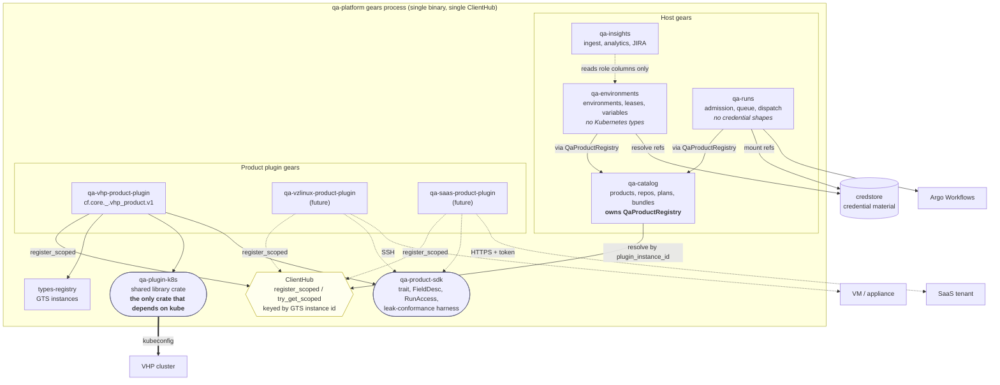
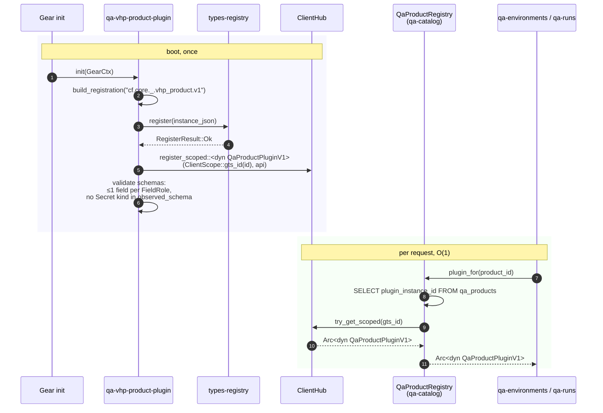
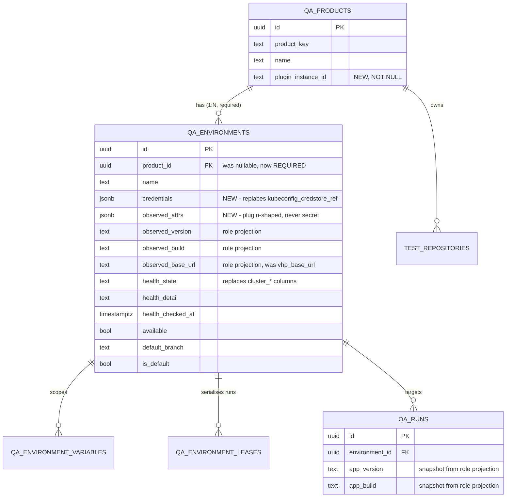
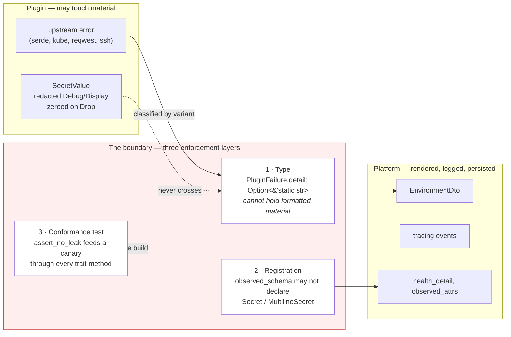

# Product Plugins for the QA Platform — Design

**Date:** 2026-09-03
**Status:** Design approved; implementation not started
**Amends:** ADR-0001 (serverless / Kubernetes containment)
**Scope:** `qa-catalog`, `qa-environments`, `qa-runs`, `qa-platform-ui`, new plugin crates

---

## 1. Problem

The QA platform models products as data — `qa_products` rows carrying
`{name, key, description, folder}` — but every *behaviour* a product implies is
welded into the gears themselves. Virtuozzo Hybrid Platform is not one product
among many in this subsystem; it is the only product the subsystem can express.

Onboarding a second product today means editing `qa-environments`,
`qa-runs` and the UI. The next products are not variations on VHP: they include
an on-prem product with its own control-plane API, an appliance reached over
SSH, a hosted SaaS tenant, and a second Kubernetes product with a different
install topology. Three of those four are not Kubernetes clusters at all, and
the environment abstraction currently *is* a Kubernetes cluster.

This design makes a product's behaviour an in-process Rust plugin, resolved per
product, following the mechanism this workspace already uses for
`postgres-credstore-plugin` and `ChatEngineBackendPlugin`.

---

## 2. Findings — where VHP is welded in

Measured against commit `3c14f7759` (`feat(qa-platform): the QA platform subsystem`).

### 2.1 Already product-agnostic

* `qa_products` is a first-class table; `Product` carries no behaviour.
* `test_repositories.product_id` is required — repository ownership is
  per-product already.
* `is_default` resolves "Default cluster" per product.
* `qa-catalog`'s `case_count.rs` already handles two ecosystems, pytest and
  Playwright.

The **data spine is multi-product**. What is single-product is everything
behavioural.

### 2.2 The seven coupling sites

| # | Site | VHP knowledge baked in |
|---|---|---|
| 1 | `qa-environments/src/domain/observation.rs` | `core-install-metadata` ConfigMap, `platformVersion` key, `vp-gateway-hostnames` + `visibility: external`, base-domain derivation |
| 2 | `qa-environments/src/domain/ports/platform_observer.rs` | `observe(kubeconfig, vpadm_namespace)` — the port signature names a VHP namespace, and the whole environment abstraction assumes cluster + kubeconfig |
| 3 | `TargetPlatform.vhp_base_url` | a product-named field threaded through SDK model → entity → mapper → six migrations → REST DTO → UI table and detail page → `qa-runs` dispatch |
| 4 | `qa-runs/src/domain/env_assembly.rs`, `params::RESERVED_NAMES` | fixed `E2E_VHP_BASE_URL`, `VPADM_BASE_DOMAIN`, `E2E_K8S_NAMESPACE`, `KUBECONFIG`, `VHP_COLLECT_URL`, `COLLECT_ONLY`; fixed 11-name reserved list |
| 5 | `qa-runs/src/config.rs` `argo.runner_image` | one global runner image for the whole deployment |
| 6 | `qa-catalog/src/domain/parsing/*` | pytest `TEST_META` regexes, frozen `plan.yaml` schema |
| 7 | `qa-insights` | pytest outcome vocabulary, `FAILURE_LABEL = "vhp-test-failure"` |

Plus `deploy/runner/` (pytest-only) and roughly fifteen UI strings.

### 2.3 What this design does *not* touch

Sites 6 and 7 stay shared platform code. `plan.yaml`, `TEST_META` and the
pytest outcome vocabulary remain the platform-wide contract with test authors,
for every product. This was an explicit scoping decision (D4) and it is what
keeps `qa-catalog` and `qa-insights` almost entirely out of the diff.

### 2.4 The enabling facts

* **All four QA gears run in one process.** The Helm chart deploys a single
  `gears` container; `config/qa-platform.yaml` lists `qa-catalog`,
  `qa-environments`, `qa-runs` and `qa-insights` as stanzas of one binary. One
  `ClientHub`, so **one plugin registration serves every consumer**.
* **The workspace already has the mechanism.** `postgres-credstore-plugin`
  registers a GTS instance and calls
  `client_hub.register_scoped::<dyn CredStorePluginClientV1>(ClientScope::gts_id(&id), api)`;
  `chat-engine`'s `PluginService::resolve` resolves the mirror image with
  `try_get_scoped`. This design adds no new mechanism.

---

## 3. Decisions

| ID | Decision | Rationale |
|----|----------|-----------|
| **D1** | Plugins are **in-process Rust gears**, registered via GTS and resolved through `ClientHub` | Matches `postgres-credstore-plugin` exactly; no new transport, no network on the run hot path, full type safety |
| **D2** | An environment may be **non-Kubernetes** | Three of the four named next products are not clusters; a k8s-with-a-hole abstraction would not hold them |
| **D3** | Observation is **fully plugin-defined and descriptor-driven** | Products differ in what is observable; the UI renders from `FieldDesc` rather than from hardcoded columns |
| **D4** | Test discovery and result parsing stay **platform-owned** | `plan.yaml` / `TEST_META` / pytest outcomes are the frozen contract with test authors and do not vary by product |
| **D5** | `TargetPlatform` is renamed **`Environment`** | "Platform" names the product in VHP's own name; products may be IaaS, PaaS, an OS or an appliance. Aligns the aggregate with its gear, `qa-environments` |
| **D6** | Every product **must** name a plugin; there is no fallback path | One code path. A nullable `plugin_instance_id` would preserve the k8s-specific code in `qa-environments` forever |
| **D7** | Ship a **generic k8s library crate** plus **`qa-vhp-product-plugin`** | With one environment per product a "generic Kubernetes product" is not a real product, so the shared k8s machinery is a library, not a registered plugin |
| **D8** | The plugin supplies **names and values**; the platform owns **precedence and the reserved floor** | Precedence inversions are silent and catastrophic; that ladder stays in one place |
| **D9** | An environment belongs to **exactly one product** | Two products on one cluster means two environment rows over the same credentials. Keeps plugin resolution unambiguous |
| **D10** | `observed_version` / `observed_build` / `observed_base_url` remain **real columns**, written as **role projections** from plugin output | Descriptor-driven *and* indexable; `qa-runs` snapshots `APP_VERSION`/`APP_BUILD` without a JSONB dig |
| **D11** | `RunnerSpec` varies **per product**, not per environment | A per-environment image makes a run's provenance unclear |
| **D12** | Plugin failure text is **classified, never formatted** | Preserves the invariant `qa-environments/src/infra/observer/errors.rs` exists to enforce, across a boundary a third party now owns |

---

## 4. Architecture after the rework

### 4.1 Component view

Everything inside the dashed box is one process, one binary, one `ClientHub`.



The two things to read off this diagram:

1. **`kube` has exactly one reverse dependency.** `qa-plugin-k8s` is the only
   crate in the workspace that names Kubernetes types, and only product plugins
   that target clusters link it. `qa-environments/src/infra/observer/` and the
   `platform-observation` Cargo feature are deleted. This is ADR-0001's
   containment made structural rather than conventional — strictly stronger
   than the feature gate, which is why this design *amends* ADR-0001 rather
   than superseding it.
2. **`qa-environments` and `qa-runs` never resolve plugins directly.** Both go
   through `QaProductRegistry` in `qa-catalog`, because products are
   `qa-catalog`'s aggregate and `plugin_instance_id` is a product column. One
   resolver, one error path, one place that knows GTS exists.

#### Correction, 2026-09-04 (Phase C closing batch): reading 1 overstates the count

The design above is unchanged and this is not a design change. One *factual*
claim in reading 1 is wrong, and it is wrong about the end state as well as the
present, so it is corrected here rather than silently edited — the original
sentence stays visible above, because what a corrected claim replaced is half
its value.

| Was | Is |
|-----|----|
| "**`kube` has exactly one reverse dependency.** `qa-plugin-k8s` is the only crate in the workspace that names Kubernetes types" | **`qa-plugin-k8s` is the only qa-platform crate that names `kube`/`k8s-openapi` *unconditionally*.** `qa-runs` also names them, behind its non-default `argo` feature (`qa-runs/qa-runs/Cargo.toml:89` — `argo = ["dep:kube", "dep:k8s-openapi", "dep:regex", "dep:base64"]`), and **this plan does not remove that**: Task 18 modifies `dispatch_spec.rs`, `runvars.rs` and `params.rs` only, and Task 19 modifies `qa-environments` and the app manifest. So the post-Task-19 state is **two** qa-platform crates naming those types — one unconditional, one feature-gated — not one. The diagram above already shows this, in the `RUN --> ARGO` edge. |

Why the original could not be true: the `argo` adapter is the subject of
ADR-0001's 2026-08-27 waiver and stays until the serverless runtime exists,
which is outside this plan's scope entirely. "In the workspace" was wider still
— `libs/toolkit-k8s-auth` names those types unconditionally, and
`chat-engine`/`mini-chat` name them behind their own `k8s` features. None of
those three is in ADR-0001's scope, but none of them is absent from the
workspace either.

What survives intact: the *containment* argument. One crate, no feature gate,
one edge in from a product plugin whose target is a cluster, and a reader who
can check the whole thing by reading two manifests. What does not survive is
"strictly stronger than the feature gate" as an unqualified claim — on the axis
ADR-0001's Decision Outcome names, *removing the Kubernetes dependency from the
product*, it is weaker, because after Task 19 there is no build of the
`qa-platform` feature without `kube` and before Phase C there was. ADR-0001's
2026-09-04 amendment records both directions with measured `cargo tree` output;
read it alongside reading 1 rather than instead of it.

This correction is the source fix for a claim that had propagated into three
manifests and module docs (`plugins/qa-plugin-k8s/Cargo.toml`,
`plugins/qa-plugin-k8s/src/lib.rs`, `apps/cf-gears-example-server/Cargo.toml`),
all corrected in the same batch.

### 4.2 Plugin resolution



Boot ordering follows `postgres-credstore-plugin`: plugin gears carry
`deps = [types_registry]` but **no** `deps` on the QA gears, because resolution
is lazy — the first request resolves, not `init`. A product whose plugin gear
is not linked into the binary fails at *use* with `NotFound`, not at boot. That
is deliberate: a missing plugin must not take down three healthy gears.

### 4.3 Observation, after

```mermaid
sequenceDiagram
    autonumber
    participant TICK as Observation ticker
    participant ENV as EnvironmentsService
    participant CAT as QaProductRegistry
    participant PLG as QaProductPluginV1
    participant CS as credstore
    participant DB as qa_environments

    TICK->>ENV: run_observation_cycle()
    ENV->>ENV: list_all_with_tenant(allow_all)
    loop per environment
        ENV->>ENV: mint tenant-bound SecurityContext
        ENV->>CAT: plugin_for(env.product_id)
        CAT-->>ENV: plugin
        ENV->>CS: resolve(env.credentials[*].credstore_ref)
        CS-->>ENV: Vec&lt;SecretValue&gt;
        ENV->>PLG: observe(EnvironmentHandle{slots, config})
        alt reachable
            PLG-->>ENV: Detected(ObservedAttrs)
            ENV->>ENV: project roles →<br/>observed_version / observed_build /<br/>observed_base_url / health_state
            ENV->>DB: write columns + observed_attrs JSONB
        else not reachable
            PLG-->>ENV: Failed(PluginFailure{class, detail: &'static str})
            ENV->>DB: write health_state + fixed text only
        end
    end
```

The role-projection step (D10) is the whole reason the UI, `qa-insights` and
`qa-runs` survive a fully descriptor-driven observation model. The plugin
returns an opaque attribute map; the platform copies the four *role-claimed*
attributes into real, indexable columns on every write.

### 4.4 Dispatch, after

```mermaid
sequenceDiagram
    autonumber
    participant DSP as DispatchService::build_spec
    participant CAT as QaProductRegistry
    participant ENVC as qa-environments client
    participant PLG as QaProductPluginV1
    participant VARS as runvars::assemble
    participant EX as ArgoExecutor

    DSP->>ENVC: get_environment(env_id)
    ENVC-->>DSP: Environment
    DSP->>CAT: plugin_for(env.product_id)
    CAT-->>DSP: plugin

    par access
        DSP->>PLG: prepare_run_access(handle)
        PLG-->>DSP: RunAccess{mounts, env, service_account}
    and shape
        DSP->>PLG: runner(Some(&observed))
        PLG-->>DSP: RunnerSpec{image, command, pull_policy}
    and names
        DSP->>PLG: env_contract()
        PLG-->>DSP: RunVarContract{reserved}
    end

    DSP->>ENVC: list_variables(env_id)
    ENVC-->>DSP: pipeline tier + environment tier

    DSP->>VARS: assemble(statics, tiers, access.env, params, mounts)
    note over VARS: precedence ladder is PLATFORM-owned<br/>1 statics · 2 pipeline vars · 3 env vars<br/>4 plugin access env · 5 run parameters<br/>6 mount-derived (last)
    VARS-->>DSP: BTreeMap&lt;String,String&gt;

    DSP->>EX: RunSpec{nodes, env, mounts, runner}
    EX->>EX: build Argo Workflow
```

`build_spec`'s current inline block — read `platform.vhp_base_url`, read
`platform.observed_namespace`, construct a `KubeconfigMount` — collapses into
the three parallel plugin calls above. Nothing else in `qa-runs` changes shape.

---

## 5. The plugin contract

New crate `qa-product-sdk`, depended on by the QA gears and by every plugin.

```rust
#[async_trait]
pub trait QaProductPluginV1: Send + Sync {
    // ── Declaration: drives the UI and the platform's semantic bindings ──
    fn credential_schema(&self) -> Vec<FieldDesc>;
    fn observed_schema(&self) -> Vec<FieldDesc>;

    // ── Environment lifecycle (qa-environments) ──
    async fn validate_credentials(
        &self,
        input: &CredentialInput,
    ) -> Result<Vec<CredentialClassification>, PluginFailure>;

    async fn observe(&self, env: &EnvironmentHandle<'_>) -> PluginObservation;

    /// Must work from `credstore_ref` alone — never `CredentialSlot::value`.
    async fn prepare_run_access(
        &self,
        env: &EnvironmentHandle<'_>,
    ) -> Result<RunAccess, PluginFailure>;

    // ── Dispatch (qa-runs) ──
    fn runner(&self, observed: Option<&ObservedAttrs>) -> RunnerSpec;
    fn env_contract(&self) -> RunVarContract;

    async fn health_check(&self) -> Result<HealthState, PluginFailure> {
        Ok(HealthState::Ok)
    }
}

/// What crosses into `validate_credentials`. Values are `SecretValue`, whose
/// `Debug` is `[REDACTED]`, so one `tracing::debug!(?input)` — in a plugin or
/// in the gear's own handler — cannot render a submitted secret. No
/// `PartialEq`/`Eq`: `==` on secret bytes is a timing footgun with no
/// consumer.
pub struct CredentialInput {
    pub fields: BTreeMap<String, SecretValue>,
}

/// What comes back out. Only what the plugin can actually determine.
pub struct CredentialClassification {
    pub key: String,
    pub is_secret: bool,
}

/// What a plugin call needs to reach an environment. The slots are lazy: a
/// caller resolves plaintext only for the methods that must read it.
pub struct EnvironmentHandle<'a> {
    pub slots: &'a [CredentialSlot],
    /// Operator-set, non-secret.
    pub config: &'a serde_json::Value,
    /// Machine-observed: `observed_attrs` as the plugin's own `observe`
    /// returned it. `None` on an environment nothing has observed yet, which
    /// `prepare_run_access` must handle rather than fail. Read it through
    /// `observed_role(&self.observed_schema(), FieldRole::BaseUrl)`, the same
    /// `project_roles` the platform's columns are written from.
    pub observed: Option<&'a ObservedAttrs>,
}

pub struct CredentialSlot {
    pub key: String,
    pub credstore_ref: String,
    /// `Some` only when *this* caller resolved it. `observe` gets it;
    /// `prepare_run_access` must never require it.
    pub value: Option<SecretValue>,
}

/// The only door through which a plugin becomes usable: construction runs
/// `validate_schemas`, so §5.1's invariants cannot be skipped by a gear's
/// `init` forgetting to call a free function. `Deref`s to the plugin.
pub struct RegisteredPlugin(Arc<dyn QaProductPluginV1>);
```

### 5.1 `FieldDesc` — the descriptor

```rust
pub struct FieldDesc {
    pub key: String,             // "core_install_metadata.platformVersion"
    pub label: String,           // "Platform version"
    pub kind: FieldKind,         // Text|Url|Secret|MultilineSecret|Enum|Bool|Int
    pub required: bool,
    pub role: Option<FieldRole>, // Version|Build|BaseUrl|Namespace
    pub in_table: bool,          // renders as an EnvironmentsTable column
    pub in_detail: bool,
    pub help: Option<String>,
}
```

Three registration-time invariants, all boot failures:

* **At most one field may claim each `FieldRole`.** Ambiguity here would make
  `APP_VERSION` non-deterministic.
* **`observed_schema()` may not declare `Secret` or `MultilineSecret`.**
  `observed_attrs` is rendered on the environment page; nothing secret can
  reach it by construction. See §9.
* **No key may appear in both schemas.** Tasks 21/22 render the credential
  form and the detail page from these two lists side by side; one key
  declared twice, differently, makes what gets rendered depend on lookup
  order — and with a `MultilineSecret` credential and a `Text` observation
  under one key, the wrong answer renders a secret.

There is **no `Health` role**, despite the enumeration above once listing
one. Health does not arrive through the attribute map at all: it has its own
`HealthOutcome` channel, returned alongside the attributes by the same
`observe` call, because the two fail independently and because a role is a
projection of a *string attribute* into a column while health is a closed
enum with its own `health_detail`/`health_checked_at` columns. A `Health`
role would give one fact two sources of truth that could disagree.

### 5.2 Access and execution types

```rust
// Neither of the next two is `Clone`: nothing needs a copy and a clone of a
// `ConfigValue` doubles the live plaintext.
pub struct RunAccess {
    pub mounts: Vec<MountSpec>,
    pub env: Vec<RunVar>,
    pub service_account: Option<String>,
}

pub enum MountSpec {
    Secret { credstore_ref: String, path: String, mode: Option<i32> },
    ConfigValue { value: SecretValue, path: String, mode: Option<i32> },
}

pub struct RunnerSpec {
    /// `None` inherits the deployment-wide `qa-runs.argo.runner_image`.
    pub image: Option<String>,
    pub command: Vec<String>,
    pub image_pull_policy: Option<String>,
}

pub struct RunVarContract {
    /// Names a run parameter may not override, on top of the platform floor.
    pub reserved: BTreeSet<String>,
}
```

`qa-runs.argo.runner_image` survives as a **deployment-wide default** a plugin
may inherit, so a plugin indifferent to its image declares nothing.

### 5.3 Amendments from the 2026-09-03 whole-branch review

Phase A built §5 as written above; a review of the branch found several of the
original shapes could not do the job the later tasks need. Each row records
what changed and why the original could not work.

The last three rows are later than the rest: Task C0 added them on 2026-09-04,
from the Phase C pre-flight scan (which found Task 10 structurally blocked) and
the user's rulings U1 and C4 on two holes in the leak harness. They are
recorded here because they amend the same interface for the same reason.

| Was | Is | Why the original shape could not work |
|-----|----|----------------------------------------|
| `CredentialInput { fields: BTreeMap<String, String> }`, `#[derive(Debug, PartialEq, Eq)]` | `BTreeMap<String, SecretValue>`, no `PartialEq`/`Eq` | This type carries a freshly pasted kubeconfig; a derived `Debug` over `String` renders every submitted secret in the clear from one `tracing::debug!(?input)`, in the plugin *or* in the gear's handler, which no plugin-side layer covers. `==` on secret bytes is a timing footgun with no consumer. |
| `validate_credentials -> Vec<StoredField { key, credstore_ref }>` | `Vec<CredentialClassification { key, is_secret }>` | The plugin runs *before* the gear writes credstore, so a `credstore_ref` is not a thing it can know — the field's own doc comment said it was "the reference the *gear* wrote it to". The signature asked the plugin to invent a value it does not have. |
| `EnvironmentHandle { credentials: &[ResolvedCredential { key, value: SecretValue }] }` | `EnvironmentHandle { slots: &[CredentialSlot { key, credstore_ref, value: Option<SecretValue> }] }` | Two failures at once. There was no credstore reference on the handle at all, so Task 10's `MountSpec::Secret { credstore_ref, .. }` had no source for that string. And a non-optional resolved value would force Task 18's `build_spec` to resolve every credential to plaintext purely to satisfy the type — pulling plaintext kubeconfigs into a process that today passes only a `SecretRef`. |
| `observe -> ObservationOutcome`, `health_check -> HealthStatus` | `observe -> PluginObservation` (attributes **and** health), `HealthState` | One client and one handshake serve both halves, and the two fail independently, so a single outcome could not express "version detected, health forbidden". |
| `RunnerSpec { image: String, extra_volumes: Vec<VolumeSpec> }` | `RunnerSpec { image: Option<String> }`; `VolumeSpec` deleted | `image: String` had no way to say "inherit the deployment default". `VolumeSpec { name, mount_path }` said where a volume mounts but not what backs it, and no task in the 22-task plan populates it — a speculative field with a knowably-wrong shape on a `V1` trait invites a plugin author to fill it in and be silently dropped. Adding a field back later is not a breaking change here. |
| `RunVarContract { names, reserved }`, keyed by a `RunVarName` newtype | `RunVarContract { reserved: BTreeSet<String> }` | Nothing reads `names`: Task 18 takes a plugin's variables from what `RunAccess::env` actually returns, so a parallel declaration is a second source of truth nothing keeps honest. The `RunVarName` newtype is deferred deliberately — `String` plus `union_with_floor`'s uppercasing is adequate. |
| Layer 2 was `validate_schemas`, a free function a gear's `init` had to remember to call | `RegisteredPlugin::new` is the only constructor, and `assert_no_leak` calls `validate_schemas` itself | Nothing made registration go through the check, and a check that can be forgotten eventually is. |
| Layer 2 constrained only the *declared* `observed_schema` | plus `retain_declared(schema, attrs) -> ObservedAttrs`, which the gear applies before persisting (Task 15) | A plugin with a spotless schema could still `attrs.set("kubeconfig_echo", ..)`; Task 15 persists that map to JSONB and publishes it on `EnvironmentDto` — the persist → DTO → page chain of the 2026-08-28 incident, straight through the door layer 2 exists to close. |
| `EnvironmentHandle { slots, config }` | plus `observed: Option<&ObservedAttrs>` and `observed_role(schema, role)` | Task 10's `prepare_run_access` must emit `E2E_VHP_BASE_URL`, `VPADM_BASE_DOMAIN` and `E2E_K8S_NAMESPACE`, whose values are the `BaseUrl`/`Namespace` role projections over `ObservedAttrs`. Neither channel on the handle could supply them, so the method could not be written at all. Having the gear merge observed values into `config` was rejected: `config` is operator-set and these are machine-observed, and conflating them leaves the environment page unable to say which of two values a human may correct — the distinction `observed_attrs` exists as its own column to keep. `Option` because dispatch reaches environments nothing has observed yet; `observed_role` reuses `project_roles`, so a run variable and the `observed_base_url` column cannot disagree about which attribute a role means. |
| `assert_no_leak` scanned `MountSpec::ConfigValue`'s `.path` | it scans the mounted `.value` too, via `SecretValue::as_bytes`, and a leak report redacts a secret-derived surface's text | Only where the mount landed was checked, never what it carried — and `MountSpec`'s `Debug` redacts the value, so the aggregate `Debug` rendering the harness also collects could not see it either. The scan was blind here by construction: a plugin could move credential plaintext into a container mount and the harness raised nothing, which matters most because `ConfigValue` is the *sanctioned* carrier for a value a plugin resolved itself. Surfaces became `Surface { label, text, from_secret }` in the same change: the old panic interpolated the offending text, correct for a path and a reproduction of the 2026-08-28 leak for a mounted secret, so a secret-derived surface now reports its label and the marker's name and redacts the text. |
| §4.4's ladder had **six** tiers, the sixth "mount-derived (last)", and `assemble(statics, tiers, access.env, params, mounts)` took the mounts | **five tiers, and no `mounts` argument** (Task 18) | The sixth tier existed to re-derive `KUBECONFIG` from the mount and push it after the run parameters, which is how the source system makes it win outright (`argo.rs:504-521`). A product-agnostic ladder cannot do it: `runvars` would have to know *which* mount is the one a variable should be named after, what to call the variable, and that the product has such a mount at all — none of which is true for a product with no kubeconfig, and all of which the plugin already answers by returning `KUBECONFIG` in `RunAccess::env`. Re-deriving it here as well would be the "second source of truth nothing keeps honest" this table rejects twice above, and the two could disagree. **The cost is real and is recorded rather than absorbed**: `KUBECONFIG` sits in tier 4 with the plugin's other variables, so at the ladder a run parameter beats it, and the platform's reserved floor is now the only thing refusing that parameter — where before, ordering and the floor each refused it independently. `runvars`' module header and `the_reserved_floor_is_what_holds_kubeconfig_up` say so in the code. Added at the Phase E review (finding I-1), which found the tier missing with no row here. |
| `validate_credentials` is the only channel that classifies a submitted credential | material is classified by the **plugin**; a submitted **credstore reference** is classified by the **gear** from `credential_schema()` and never resolved (Task 18b) | Task 18b's first version resolved a submitted reference from credstore so the plugin could see bytes for it. An existing test falsified that: `an_environment_whose_kubeconfig_cannot_be_resolved_says_so_on_its_row` proved that **creating an environment against a not-yet-provisioned reference is a designed, self-healing state**, not an error — `KUBECONFIG_UNRESOLVED` is written to `version_detect_error`, rendered on the environment page, and its text spells out the recovery ("Re-save the environment with its kubeconfig to provision it"). Resolving at write time deletes that whole affordance and makes create depend on credstore availability for a path that never needed it. So a reference is not resolved and not validated: the plugin has no opinion on an out-of-band credstore binding and could not form one without the bytes, and `validate_credentials` is called only when at least one **material** submission exists. The consequence is the one this design cares most about — **the write path pulls no credential plaintext into the process at all**, which is strictly stronger than the original shape, whose own justification was "`materialise_runner_secret` already does it". What the plugin loses is the ability to refuse a reference-only submission, so the platform keeps a floor of its own: every field the plugin declares `required` and secret must end up **stored** (`require_declared_secrets`). Counting *submitted* keys instead was a defect — a reference under a key the plugin does not declare is dropped, so one transposed character produced a credential-less row with `credentials = []` and `kubeconfig_credstore_ref = ""`, the exact state §6.2's contract migration cannot repair. Recorded here on the precedent `sole_required_secret_key` set below: a derivation of this weight gets a row. |
| `sole_required_secret_key` was a private helper in `qa-environments` | `qa_product_sdk::descriptor::sole_required_secret_key` (Task 18) | It is a derivation over `FieldDesc` and nothing else, and **two gears need the same answer**: `qa-environments` to resolve a slot for `observe`, `qa-runs` to name one for `prepare_run_access`. The platform's single-reference column (`kubeconfig_credstore_ref`) is what both are keying, and a plugin that renames its credential field must rename the slot in both gears in one release. Two private copies of one rule is the coupling class that produced five defects in Phase B; `qa-environments` now imports it, and every test that called the private function still calls this one. |
| `RunAccess` derived only `Debug` | plus `Default` (Task 17) | "No access" — no mounts, no variables, no service account — is a *state*, not an absence: a run with no target environment has it, and the source system mounts nothing in exactly that case (`argo.rs:504`). `qa-runs`' `RunSpec` therefore carries a `RunAccess` rather than an `Option<RunAccess>`, and every construction site that means "nothing to mount" spells it once as `RunAccess::default()` instead of re-assembling three empty fields. `Clone` was **not** added: Task 17 was the task §5.2 said might need it, and it did not — `MockRunExecutor` records submissions behind an `Arc`, so no plaintext is duplicated. |
| The reference-only rule fired only when `run_access.is_ok() && ref_access.is_err()` | the reference-only drive must return `Ok`, **and** the two drives' access must match | Making an unconditional rule conditional on the *resolved* drive having succeeded meant a plugin whose `prepare_run_access` never succeeds at all was reported clean, because the first conjunct was false. Asserting `Ok` flatly fixes that half and no more: a plugin that prefers plaintext and *degrades quietly* — a dropped mount, an empty env, a placeholder value — still returns `Ok` from both drives. So the drives are also compared: run-variable names and values, each mount's variant/path/mode/`credstore_ref`, and `service_account`, as sets, because order is not part of the contract. Every other input to the two calls is identical, so an output that moves was built from the plaintext — this is the checkable form of "must work from `credstore_ref` alone", not a second rule. `SecretValue` bytes are never compared (the canary scan covers them) and a divergence report quotes **neither** side's value: the plugin is one object that was handed plaintext before both drives ran, so a cached, encoded or hashed derivation can appear on either side, and the canary scan that runs first cannot see one. Naming the field is the report. |

---

## 6. Data model

### 6.1 The rename (D5)

`TargetPlatform` → `Environment` throughout. Measured surface: ~2,130
identifier occurrences and ~4,400 doc-comment mentions.

| before | after |
|--------|-------|
| `TargetPlatform` | `Environment` |
| `platform_id`, `target_platform_id` | `environment_id` |
| `qa_platforms` | `qa_environments` |
| `qa_platform_variables` | `qa_environment_variables` |
| `qa_platform_leases` | `qa_environment_leases` |
| `PlatformsService` / `PlatformsRepository` | `EnvironmentsService` / `EnvironmentsRepository` |
| `PlatformDto`, `NewPlatform`, `PlatformPatch` | `EnvironmentDto`, `NewEnvironment`, `EnvironmentPatch` |
| `GET /qa/v1/platforms` | `GET /qa/v1/environments` |

The word "environment" then collides with `qa-runs`' runner-variable
vocabulary. The **smaller side moves** — 82 identifiers across 8 files:

| before | after |
|--------|-------|
| `EnvInputs` | `RunVarInputs` |
| `EnvVar` | `RunVar` (later re-exported from `qa-product-sdk`) |
| `env_assembly.rs` | `runvars.rs` |
| `assemble_collect_env` | `assemble_collect_vars` |

**The gear name, database name, config stanza and Helm values are unchanged.**
`qa-environments` was always the right gear name; only its aggregate was
misnamed.

> **Hazard.** A large share of the 4,400 doc mentions are *citations of the
> legacy system* — `platforms_meta`, `manager/src/services/platforms.rs`,
> `argo.rs` line references. Those must survive untouched or the parity record
> this subsystem is built on is corrupted. Identifiers rename mechanically;
> doc prose renames **by review, never by `sed`**. `doc_citations_tests.rs` is
> the guard.

### 6.2 Schema



Field-by-field on `qa-environments`:

| today | becomes | why |
|---|---|---|
| `kubeconfig_credstore_ref: String` (required) | `credentials: Vec<CredentialSlot>` — `{key, credstore_ref, value: None}` | D2: kubeconfig is one credential kind among several |
| `vhp_base_url` | `observed_base_url`, fed by `FieldRole::BaseUrl` | product-neutral name, plugin-supplied value |
| `observed_namespace` | `observed_attrs`, surfaced via `FieldRole::Namespace` | only k8s products have one |
| `cluster_*` health columns | `health_state`, `health_detail`, `health_checked_at` | "nodes ready" is not health for a SaaS tenant |
| — | `observed_attrs: JSONB` | plugin-shaped, rendered as a descriptor-driven list |
| `product_id: Option<Uuid>` | **required** | it is how the plugin resolves (D6, D9) |

`health_state` and `product_id` keep first-class column status because the
platform itself queries them — the health card, admission's availability check,
and plugin resolution respectively.

---

## 7. Dispatch

Only `qa-runs` changes, and only at one seam. `KubeconfigMount` in
`domain/ports/run_executor.rs` generalises to `RunAccess` (§5.2), returned by
`prepare_run_access`.

**What deliberately does not change (D8):**

* The **precedence ladder** in `runvars.rs` stays platform-owned. The plugin
  supplies names and values; it does not get to reorder tiers. Precedence
  inversions are silent and, per that module's own docs, catastrophic.
* `RESERVED_NAMES` becomes the platform's transport-critical floor,
  **unioned** with `RunVarContract::reserved`. A plugin can only ever *add* to
  the floor, never shrink it (`RunVarContract::union_with_floor`).

  The floor is the eleven names already in `qa_runs::domain::params::RESERVED_NAMES`,
  and this branch does not change its membership. An earlier draft of this
  section listed `COLLECT_ONLY` and the collect/progress URLs
  (`VHP_COLLECT_URL`, `VHP_PROGRESS_URL`) as part of it. **They are not, and
  never were.** Leaving them out is a deliberate, documented inheritance from
  the source system. Two documents carry it, and between them all three names:
  the SECURITY NOTE on `RESERVED_NAMES` (`params.rs`, plan decision D3,
  verified 2026-08-13) names `VHP_PROGRESS_URL` and `E2E_VHP_BASE_URL` and
  states the mechanism — the source system's merge is retain-then-push, so a
  launch parameter of one of those names replaces the platform-supplied value;
  `runvars.rs`' module doc lists all three (`COLLECT_ONLY`, `VHP_COLLECT_URL`,
  `VHP_PROGRESS_URL`) as the only statics a pipeline variable can shadow, with
  "last wins" as source-system parity. The goal was to preserve that behaviour
  and adapt only the architecture.
  `api/rest/dto.rs`' `collect` arm rests on exactly that fact when it argues it
  grants no new capability.

  Closing the exposure is a PRD amendment against `cpt-cf-qa-fr-runs-params`,
  not a plugin-contract change, and it is larger than three strings: adding
  those names breaks any deployment already passing a variable so named, and
  two of the three are themselves VHP-spelled on a branch whose purpose is to
  unname VHP — so it wants new spellings decided first. Tracked as a follow-up;
  this section states what the floor **is** so a reader checking the property
  is not told something false. (Whole-branch review, E-20/E-22; ruling F-23.)
* `PRODUCT_KEY`, `APP_VERSION` and `APP_BUILD` remain platform statics. They
  are product-independent facts about the run, not product-specific naming.

---

## 8. UI

| today | after |
|---|---|
| `PlatformsTable` with hardcoded columns incl. "VHP URL" | `EnvironmentsTable`: fixed leading columns (name, product, health, availability) then one column per `in_table` descriptor |
| `PlatformDetailPage` hardcoded fields | `EnvironmentDetailPage`, rendering `in_detail` descriptors |
| create/edit form with a kubeconfig textarea | form generated from `credential_schema()`; `FieldKind::MultilineSecret` renders that same textarea, so VHP's form is visually unchanged |
| `AnalyticsDashboard` defaults to `key === 'VHP'` | first product, or the remembered selection |
| `vhp.selectedProduct`, `vhp.selectedBranch`, `vhp-theme`, `vhp:fql:saved:*` | `qa.*`, with a one-time read-through migration so saved filters survive |
| "VHP Test Manager v1.0.0" | product-neutral |

The single new endpoint the UI needs is `GET /qa/v1/product-plugins`, returning
each registered instance with its `credential_schema` and `observed_schema`.
Both the product form and the environment form read it.

---

## 9. Secret containment across the plugin boundary

`qa-environments/src/infra/observer/errors.rs` records a **measured** leak: on
2026-08-28, pasting a PEM private key into the kubeconfig field produced a
serde error quoting the whole document, which was persisted to
`version_detect_error`, published on the DTO, and rendered on the page. The
rule that file implements is *classification, not sanitisation*: no value
derived from credential material is ever formatted, and each failure gets a
fixed `&'static str` chosen by variant.

That invariant currently holds because one team owns one module. Once a plugin
author returns failure text, it must hold across a boundary they own.



**Layer 1 — make the leak inexpressible.**

```rust
pub enum ObservationOutcome {
    Detected(ObservedAttrs),
    Failed(PluginFailure),
}

pub struct PluginFailure {
    pub class: FailureClass,             // Unreachable|AuthRejected|NotFound|
                                         // Malformed|Timeout|Internal
    pub detail: Option<&'static str>,    // NOT String
    pub remote_message: Option<String>,  // text the REMOTE sent; never
                                         // credential-derived
}
```

`&'static str` cannot be produced from runtime bytes without `Box::leak`, which
is greppable and lintable. `remote_message` is the one documented exception and
it preserves the behaviour `kube_observer`'s header defends: "namespaces
virtuozzo not found" is what makes a broken environment fixable rather than
merely broken.

**Layer 2 — forbid secrets in observed output structurally.** Two halves,
because the declaration and the return are different things:

* `validate_schemas` constrains what a plugin *declares*, and is enforced at
  registration through `RegisteredPlugin::new` — the only constructor — so a
  violating plugin fails boot rather than leaking at render time. It is no
  longer a free function a gear's `init` has to remember to call.
* `retain_declared(schema, attrs)` constrains what a plugin *returns*, and
  the gear applies it before persisting (Task 15). Without it, a plugin with
  a spotless schema could still set `kubeconfig_echo` and have the platform
  persist it to JSONB and publish it on `EnvironmentDto`.

**Layer 3 — a conformance harness every plugin crate must run.**
`qa_product_sdk::testing::assert_no_leak(plugin, canary)` feeds a canary — a
real PEM block, a bearer token, a password — through every trait method, then
asserts the canary appears in no returned string, no `Debug` rendering, no
captured `tracing` event, and no serialised `observed_attrs`. It also runs
layer 2's `validate_schemas` itself, so layer 3 enforces layer 2 for free.
This generalises `postgres-credstore-plugin`'s `leak_tests.rs` and
`sea_orm_trace_exposure.rs` into a reusable obligation.

The scan covers what a mount *carries*, not only where it lands: a
`MountSpec::ConfigValue`'s value is read through `SecretValue::as_bytes` and
compared, and a report naming that surface redacts the text rather than
quoting it. `prepare_run_access` is driven a second time from credstore
references alone; that drive must return `Ok`, and the access it returns must
match the resolved drive's — names, paths, modes and references, never secret
bytes — because a plugin whose output moves when plaintext is available read
the plaintext.

The plant is derived from the plugin's own `credential_schema()` keys, with
`pem`/`token`/`password` kept as extras, and the `config` is synthesised from
the declared non-secret fields. A fixed plant asserted nothing for any real
plugin: VHP declares `kubeconfig` and `vpadm_namespace`, so it would look up
`"kubeconfig"`, find nothing, return on its first line, and the harness would
assert three markers absent from surfaces they never reached.

Two limits of layer 3 are recorded in `testing.rs`'s own header rather than
left to be rediscovered: coverage is **per driven path** — one call per
method, happy-path-shaped, so the *error* branch where the 2026-08-28 leak
actually lived is not exercised — and the `tracing` capture uses a
thread-local subscriber, which a library gating on the process-global level
filter can slip past.

---

## 10. Rollout

Eight ordered steps. The ordering exists to keep the enormous mechanical diff
separate from every behavioural one, and to keep **every commit green**.

> **Corrected 2026-09-03, before planning.** This section originally had seven
> steps with a single "flip" at step 5 that changed the `qa-environments`
> schema *and* the SDK model, followed by a step 6 that moved `qa-runs` onto
> the new shape. That ordering cannot compile. `qa-runs`' `build_spec` reads
> `platform.vhp_base_url` and `platform.kubeconfig_credstore_ref` directly off
> `qa_environments_sdk::TargetPlatform`; removing those fields breaks `qa-runs`
> in the same commit that changes the model. The flip is therefore split into
> **expand** and **contract**, with the `qa-runs` migration between them — the
> standard expand/contract shape, and the only one where each step builds.

| # | Step | Behaviour change? |
|---|------|-------------------|
| 1 | `qa-product-sdk` crate: trait, `FieldDesc`, `RunAccess`, conformance harness | none — nothing consumes it yet |
| 2 | **Rename `TargetPlatform` → `Environment`** everywhere, incl. `runvars.rs` collision clearing | none — pure rename, own commit |
| 3 | `qa-plugin-k8s` library crate: today's observer lifted verbatim | none — old path still active |
| 4 | `qa-vhp-product-plugin`: `core-install-metadata`, `vp-gateway-hostnames`, `E2E_VHP_BASE_URL` naming | none — not yet resolved |
| 5 | **EXPAND** — add `plugin_instance_id`, `credentials`, `observed_attrs` and the role columns *alongside* the existing ones; observation writes both | additive; old readers unaffected |
| 6 | `qa-runs`: `RunAccess` / `RunnerSpec` replace the inline kubeconfig block, reading the **new** fields | behavioural, VHP-identical |
| 7 | **CONTRACT** — drop `kubeconfig_credstore_ref`, `vhp_base_url`, `observed_namespace`, `cluster_*`; delete `infra/observer/` and the `platform-observation` feature | **the one-way door** |
| 8 | UI: descriptor-driven table/detail/forms, `vhp.*` → `qa.*` storage keys | cosmetic + generated forms |

Step 2 is the risky one, and not for the reason it looks: ~4,400 doc-comment
mentions, of which a large share are **citations of the legacy system**
(`platforms_meta`, `manager/src/services/platforms.rs`, `argo.rs` line refs).
Those must survive untouched or the parity record this subsystem is built on is
corrupted. So step 2 renames identifiers mechanically and doc prose by review,
never by `sed`.

Steps 1–6 are all reversible. Step 7 is the one-way door, and the golden
`RunSpec` test from §11 must exist and pass before it is walked through.

---

## 11. Proving VHP did not move

The subsystem already owns the assertions; they change owner, not content.

| assertion set | today | after |
|---|---|---|
| `E2E_VHP_BASE_URL` precedence, `VPADM_BASE_DOMAIN` derivation, the `COLLECT_ONLY`/`VHP_COLLECT_URL` pair | `env_assembly.rs` tests | move into `qa-vhp-product-plugin`, asserting the same outputs |
| `core-install-metadata` / `vp-gateway-hostnames` detection rules | `platforms_observation_tests.rs` | become the VHP plugin's observation suite |
| legacy citation integrity | `doc_citations_tests.rs` | the guard for step 2's doc-prose rename |
| end-to-end dispatch shape | `dispatch_tests.rs` | **new golden test**: freeze a `RunSpec` built for a VHP run on pre-change code; assert byte-equality after step 6 |
| leak containment | `observer/errors.rs` tests | `assert_no_leak` conformance, run by every plugin crate |

The golden `RunSpec` test is the single most important artefact of this work:
it is what makes step 7's one-way door safe to walk through, and it must exist and pass **before** step 6 changes `build_spec`.

---

## 12. Open items

These are recorded rather than resolved, and none blocks implementation:

1. **`deploy/runner/`** stays pytest-only. A product whose tests are not pytest
   needs its own runner image; `RunnerSpec` makes that expressible, but no
   second image is designed here.
2. **`qa-insights` `FAILURE_LABEL = "vhp-test-failure"`** stays hardcoded. It
   is deliberately frozen for legacy dedupe parity; making it per-product is a
   separate decision with a migration cost of its own.
3. **Per-product JIRA project mapping** is untouched; `qa-insights` remains
   tenant-scoped, not product-scoped.
4. **Lease semantics** are unchanged. Exclusivity is per environment, which
   under D9 is also per product.
